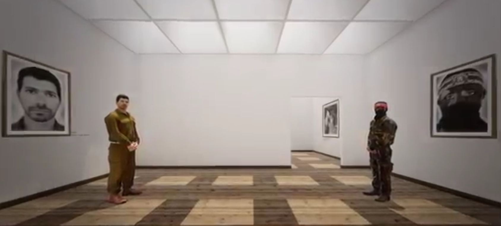
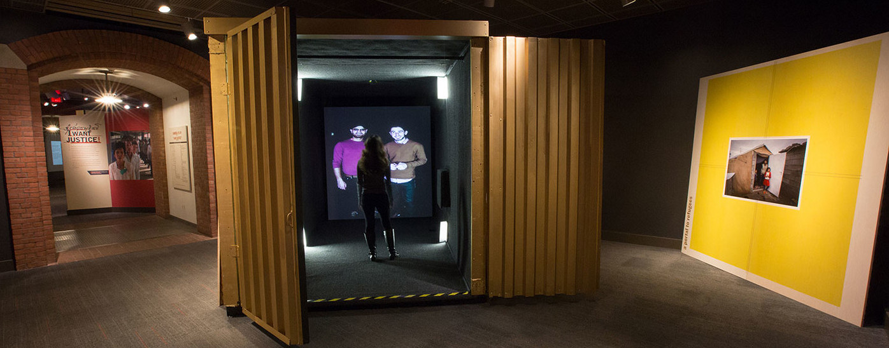
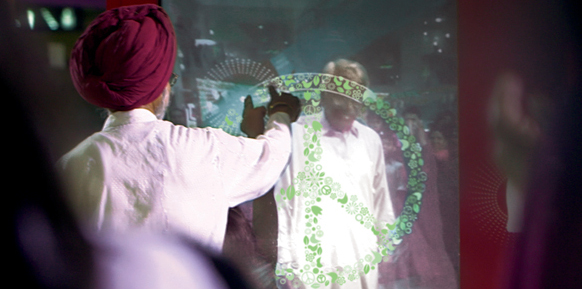
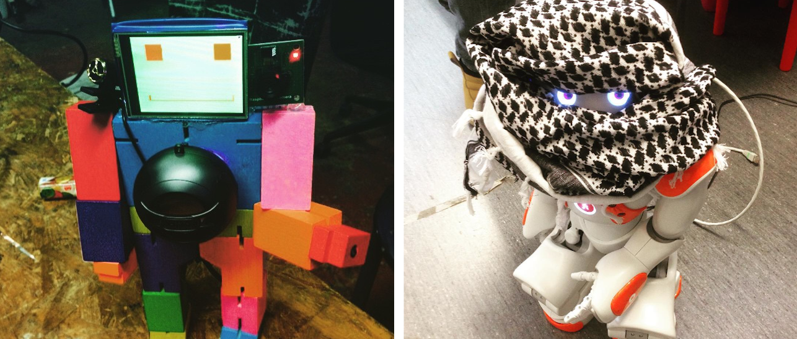
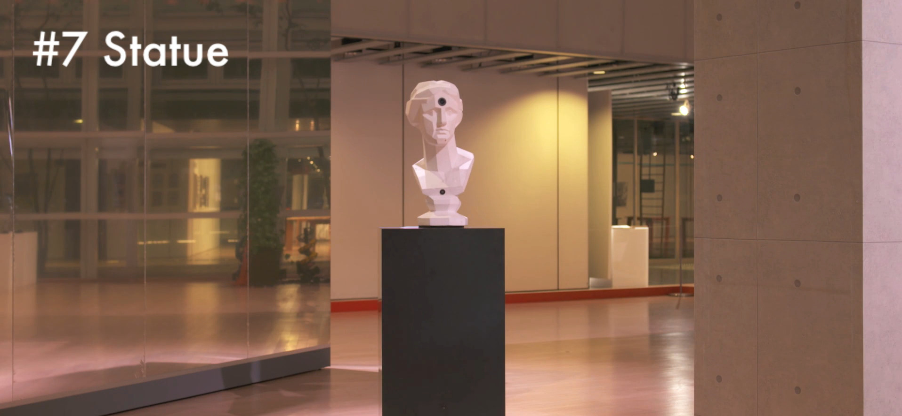
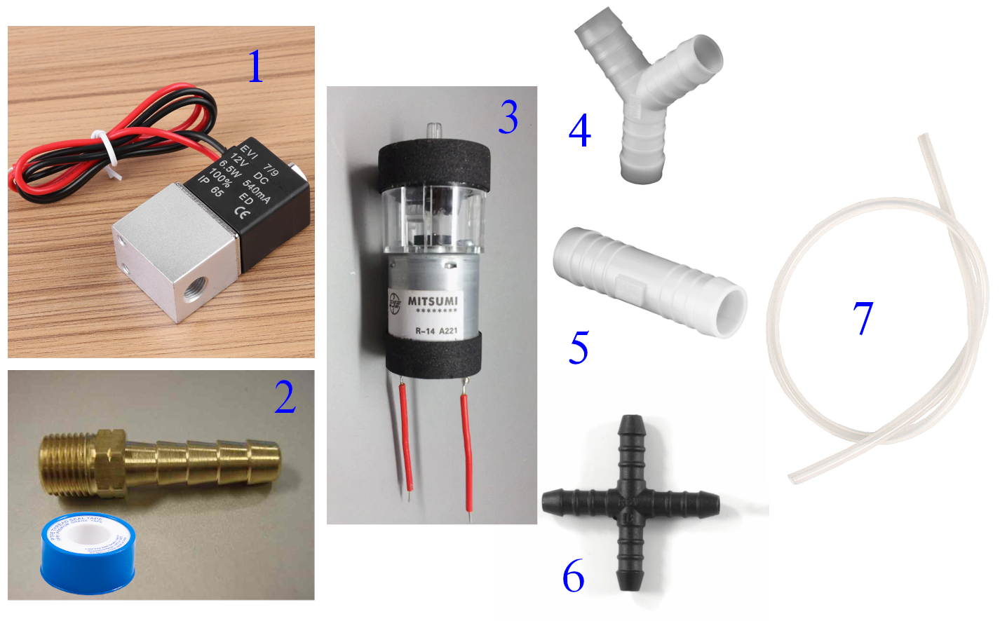
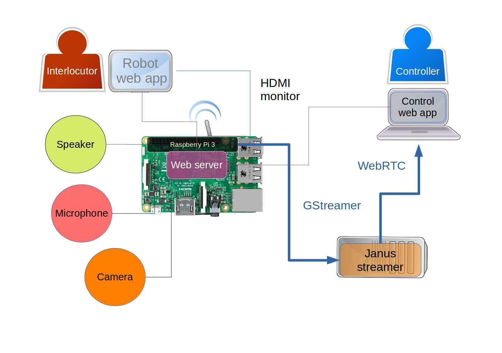
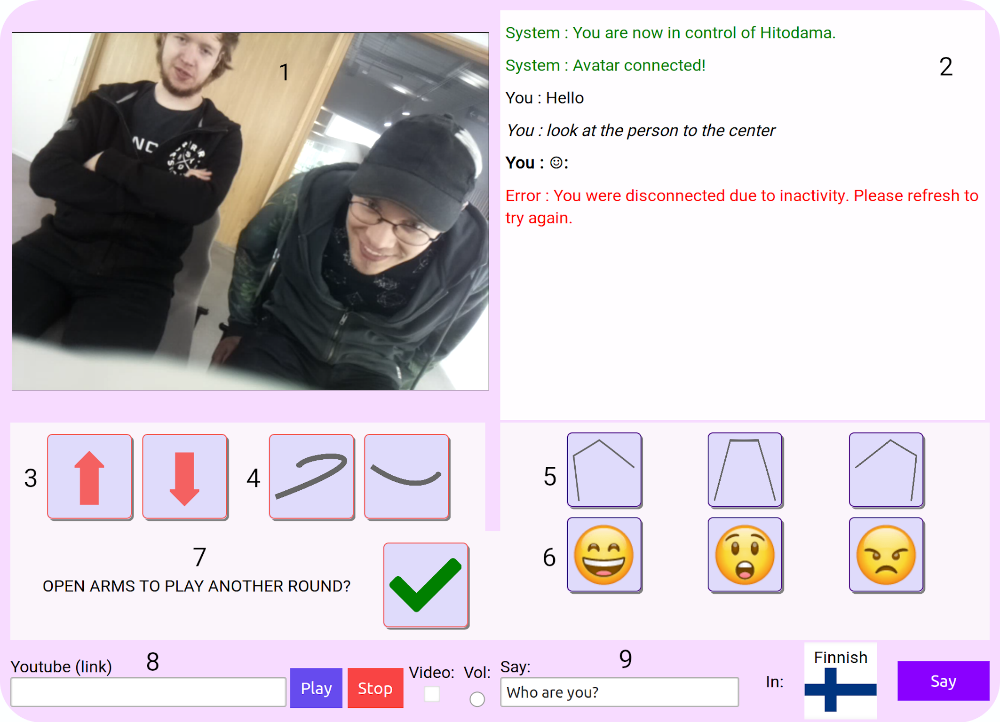

\maketitle
\newpage
\tableofcontents
\pagebreak

# Introduction

## Manifesto

“Man has to perform an act of incarnation, for he is dis-embodied (désincarné) by his imagination. What comes to us from Satan is our imagination” [@weil_gravity_2002, p.54]. This intuition by the French philosopher and political activist Simone Weil captures the core of this thesis and the underlying motives for the production of HITODAMA - A soft robot for a mediated incarnation. My guiding principle is and has always been since I was discharged from my military duty, the use of cutting-edge technology for social well-being. Throughout my evolution as a developer, I slowly drifted away from paths of algorithmic rationality and abstract, alienated coding and into questions of meaning and existence. Following my Bachelor's degree in Philosophy of mind and Neurobiology, I have sought ways to transcend my institutionalized role of a programmer and apply the knowledge I have gained to challenge pressing issues of our society, and in particular, my own society in Israel.

Ever since its formation, Israel has been divided between two nations, Jews and Palestinians. Due to the events of the 1967 “six-day war,” and until this very day, most of the Palestinians reside under Israeli military occupation. Access restrictions enforced by the Israeli government prohibit the crossing of populations between the nations and inhibit the Palestinians’ mobility. A 700-kilometer-long concrete barrier surrounds the “Green Line” that separates Israel from the West Bank: the area that currently holds the largest population of Palestinians within the former mandatory Palestine that lies between the Mediterranean sea and the Jordan River. While the crossing of Israelis to the other side is, at best, frowned upon, and at worst institutionalized and encouraged in the case of settlements; the Palestinians endure strict restrictions, not only across the West Bank but also within it. Multiple checkpoints divide different areas of the land and force the Palestinians to face military control on a daily basis. 

Growing up in a middle-class, liberal Israeli family, in Tel-Aviv of the 90s is a self-conflicting experience. The discourse constantly oscillates between hope for peace and prosperity to the despondence of war and carnage. The surrounding scenery changes quickly from a decadent lifestyle of beaches and high-tech offices to life amidst a war zone of missiles and suicide bombings. Throughout these changes, people are constantly immersed in media spectacles of tragedies that provoke our sense of social unity; a sense that is reinforced by the nation-wide military conscription and the omnipresent memory of the holocaust. From an Israeli liberal point of view, the conflict is associated both with guilt and resentment for the injustices toward the Palestinians, but also with necessity and justification of self-defense against a lethal threat to the body of our nation. As a result of this strange mesh of emotions, one develops a self-contradictory and somewhat post-traumatic image of the Palestinians: They represent, on the one hand, a source of danger, and on the other, a marginalized and abused population. Their behavior is both condemned and justified; they are both terrorists and freedom fighters. They are to be reconciled with, but could not be fully trusted. 	

A phase transition in my life occurred in the summer of 2012 when I landed on an opportunity to join a two-week conflict resolution workshop in Germany. The initiative, as started by an Israeli and a Palestinian who formed a relationship through mutual work, grouped young adults from both sides, carrying with them their hopes and doubts, to sit and talk together in one shared space. The participants lived no more than a hundred kilometers away from each other, and yet, they were so infinitely apart in practical terms that the most reasonable place for them to meet was in a separate continent, 4000 kilometers away. Moreover, the two groups could not even meet during the journey to Germany, because movement restrictions compelled the Palestinians in our group to take a detour through Jordan, rather than taking the shortest path through Israel’s airport. 

Since the conflict between the nations is very much situated in the land of Israel/Palestine, meeting at a relatively neutral and distant location was also constructive. As noted by Nietzsche: "Egoism is the perspectival law of feeling according to which what is closest appears large and heavy, while in the distance everything decreases in size and weight" [ -@nietzsche_gay_2001, p.134 ]. Albeit Germany plays a significant role in the conflict with its great effect on the historical processes that lead to the formation of Israel as the home of the Jewish people, it was, nevertheless, easier for the parties to bridge the gaps without the unnerving presence of soldiers and the affect of this blood-soaked land. 

Up until then, the closest encounter I have had with a Palestinian was an occasional crossing with a nearby “Israeli-Arab.” This controversial term can be accounted for an attempt to sequester the national aspirations of the  Palestinians that ended up under Israeli jurisdiction during the 1948 war for its independence [@peleg_israels_2011, p.26]. To this day, the 1948 war marks both a national holiday for Israelis and a monumental catastrophe or “al-Nakbah,” for Palestinians, due to hundreds of thousands of them being driven out from their homes and becoming refugees in the neighboring countries. As for 1967 Palestinians that found themselves out of Israel’s borders after its formation – they are currently living under either siege in Gaza or under military occupation in the West Bank. Naturally, my encounter with them has been strictly imaginative or digital – this was about to be my first physical encounter with the _Other_.

I remember the anticipation I felt as we arrived, in the pouring rain, to our host institution "Jugendakademie Walberberg," a youth center and hostel in a remote village close to Cologne. The Palestinians were already waiting for us at the rendezvous point, waving their national flags, demonstrating unity. Upon meeting the embodied strangers face to face, I experienced what could be described not only as an emotional turmoil but also to some extent, a spiritual event.  A vertical motion in which transcendental forces and ideas sedimented within a body, only so that they can get once more coiled up within themselves, and transcend along their historical contingency to emerge a true-found _Logos_ – the voice and ideas of the strangers in their corporeality. The _Other_ was no longer a fetishized stranger, but a verified existence - Weil’s intuition of incarnation was validated. After this event, I felt grounded, more open to difficult discussions, and was able to obtain a sense of pain relief. It was as if the intercorporeal presence of the Palestinian in front of me had untangled and mended short-circuits that existed in my mind, and from then on, everything felt more natural.

At the end of the workshop in Germany, we were asked to think about how we can utilize what we had gained toward the upcoming future. At that moment, I felt a great sense of duty –  I was to use my software engineering skills to bring about this event that I experienced to a massive scale, to enable conflict resolution for the masses until a critical point of the nonlinear system that is society is reached, and the democratic process is shifted toward peace-making. I did not consider at first that corporeity as such, is a crucial ingredient for this process. I simply aimed toward a free and expressive virtual encounter between conflicted strangers; whether through games, music, chatting, or other forms of online communication. Now, however, I would like to contend that the virtual reality is insufficient for a true determination of history, and for a true transformation of the individual. Through the Merleau-Ponty's phenomenology and post-colonial theories of Sarah Ahmed, I would argue that a biomimetic embodiment is necessary for intersubjective dialectics that determine the style of our social existence. The physical flesh of our subjectivity in time and space and our physical interaction with the other demarcates our being in this world and form our social identity. This realization led me to pursue the technological solution for an efficient, mobile and expressive re-embodiment, a _techno-flesh_; one that can cross borders, separation barriers and facilitate events of incarnation when a physical encounter is not possible. I found the answer in the form of a soft Robotic re-embodiment, a modern-day incarnation, an Avatar for pain relief. 

In this thesis, I establish a theorem regarding the importance of embodiment in social transformation; I then ask the question of whether a remote re-embodiment, a techno-flesh, could exhibit the same power for social dialectics as a direct encounter, and if not, how can we bring it as close as possible to the actual thing. I will outline my journey for constructing a telepresent soft robot that can serve as a mediator between subjects in conflict, knowing that I will first and foremost test it in the land of Israel and Palestine, but hoping that it can be applicable to any situation of conflict or other situations of social and physical gaps. The implementation is put to preliminary testing and is evaluated for future work. I invite the reader to join me on this journey of transcendent hope and intercorporeal suffering.

## Thesis goals and method 

The core question of this thesis is that of technological mediation. Despite the famous saying by postphenomenoligst Don Ihde that "human activity from immemorial time and across the diversity of cultures has always been technologically embedded" [-@ihde_technology_1990, p.20], there is a vast spectrum of experiences that branch out of different technologies and different use cases of mediation. The saying is perhaps true in the broad sense of mediation since always perceive the world through matter, but it is not only the presence of the medium that matters; it is also its _style_. The style that is interrogated in this thesis is that of soft telerobotics, that is, remotely controlled robots that are made from, and actuate using soft materials.

In any mediated interaction that is not a direct encounter in a shared physical space, a symmetry-break occurs. The two conversing subjects are no longer sharing the same medium of communication as they would be if they were simply standing in front of each other; an experience gap is opened. The conditions of the two interlocutors can be quite similar, for example when two people have a Skype call through their laptops, but in many other cases the situation can vary; for example, when one person is controlling a robot using their phone while the other is physically interacting with it. Thusly, if we want to consider the right medium for a particular use case, we must look at the experience from three different perspectives: (1) In regards to the _receivers_  of communication at any given moment: how do they experience the presence of the _transmitter_ with them in the same space? How much of the other side's corporeality is being perceived through the medium? For our use case, we would like the transmitter to be incarnated, such that it could reliably represent its _logos_ and free the receiver of any fetish, prejudice, and bias. This aspect is discussed in the chapter titled **"Phenomenology of Incarnation"**. (2) In regards to the _transmitters_ of communication at a given moment, how much do they feel present in the remote location in their flesh? Do they have a sense of agency and ownership of their actions, and do they feel free to express their core values? For our use case, the transmitter should feel comfortable discussing more intimate and even conflicted subjects to generate empathy and obtain relief. This aspect is discussed in the chapter **"Phenomenology of re-embodiment"**. (3) In regard to the mutual perspective of intercorporeality and multimodal communication, are there sufficient ways of expression for a meaningful encounter? Are there mechanisms of interaction and dialog that allow the interlocutors to bypass the hurdles of the medium and flow freely into a conversation? This aspect is discussed in the chapter **"Intercorporeality"**. 

Once those aspects are determined, and a variety of related work is presented, the soft robot HITODAMA is outlined as a solution that seeks to fulfill the phenomenological requirements. The design choices and production methods are detailed, along with preliminary qualitative user test analysis.

# Phenomenology of Incarnation

## Stranger Fetishism and the Circulation of Emotions

We begin with further investigation of the conditions that led to the above event of incarnation. As noted, prior to the encounter, I had nothing but an image of a Palestinian: the so-called _Other_. An image that was fed by media, by conversations, by my own internal processes, none of which originated directly by a Palestinian, co-inhabiting my own time and space. I have developed a milieu of emotions toward that image; emotions that were by definition generalized and prejudiced since they were oriented toward an abstract entity. Moreover, these emotions tended to be posited on more extreme ends of the emotional spectrum, either being strongly negative or strongly positive. 

This phenomenon is symptomatic to what is described by Sara Ahmed as “Stranger Fetishism.” In her book _Strange encounters_,  she defines it as “fetishism of figures: it invests the figure of the stranger with a life of its own insofar as it cuts ‘the stranger’ off from the histories of its determination.” [@ahmed_strange_2000, p.5]. The epistemological gap of the stranger in its corporeality leaves an opening for an over-representation; a figure of our imagination that we endow with deep emotional value. Ahmed borrows the term “fetishism,” both from a Marxist perspective of “commodity fetishism” and from a Freudian perspective of a phantasmic substitution.

Let us first examine the Marxist perspective. In _Capital: Vol I_, Marx explains his notion of commodity fetishism [@marx_capital_2015, p.47]. The fetishism lies in the Bourgeois's inability to discriminate between the commodity item's inherent and physical history, such as labor time, materiality and use, and its abstract value that is determined by the social relations of exchange: "A commodity is therefore a mysterious thing, simply because in it the social character of men’s labour appears to them as an objective character stamped upon the product of that labour" [@marx_capital_2015, p.47]. When we assign a monetary value to a certain item, we conceal the fact that this value is a result of a social and historical process and it appears as if the value is an objective property of that item. The concept of commodity fetishism was later expanded by Georg Lukács to the term _reification_ [-@lukacs_history_1971, p.83]: a general phenomenon that gradually sinks into human consciousness in which all spiritual and immaterial relations become atomized and quantified as things.  Ahmed juxtaposes reification with the fetishization of the figure of the stranger. In this case, the 'commodity object' that is tied to a material basis would be a corporeal person of some social identity, while the immaterial value that we assign to it is the abstract figure of the stranger, containing all prejudice and bias. 

The analogy becomes even more compelling when we examine the economic circulation of emotions that are associated with the stranger. In her later book, _Cultural Politics of Emotion_, Ahmed identifies a relationship between the circulation of abstract monetary value during commerce and the circulation of affect involving strangers in society [@ahmed_cultural_2014, p.45]. In his discussion about the general formula of capital [@marx_capital_2015, p.104], Marx explains the importance of the transition from the simpler form of trade: Commodity-Money-Commodity (C-M-C), to the more modern form of Money-Commodity-Money (M-C-M). In the former, simpler form, money is used only as an abstract mediator between two objects that are grounded in their materiality and use-value. For example, one would sell their produced crop of corn to obtain money, which would then be used to buy clothes. However, in the latter form of M-C-M, the accumulation of abstract value is the end goal of the transaction, and since the only use of the money is to accrue it, the process is endless. Thus, value or circulated capital "suddenly presents itself as an independent substance, endowed with a motion of its own, passing through a life-substance of its own, in which money and commodities are mere forms which it assumes and casts off in turn" [@marx_capital_2015, p.107]. The same effect, Ahmed suggests, occurs when the imaginative figure of the stranger and its associated emotions are circulated throughout society. Ahmed provides as an example with the discourse surrounding asylum seekers in the UK. Leaders of the conservative party have created a frightening image of the asylum seeker, one that is not only "flooding" and "swamping" the nation but is also disingenuous in their intention; faking the need for asylum in order to be able to reside in the country. This discourse is passed around, from speech to speech, from media report to office conversations, all while breathing life into the imaginative figure and accumulating affect, intensifying the associated negative emotions. The reason for this intensification is exactly that which enables the accumulation of capital: its disassociation with anything physical that can set its bounds. According to Ahmed "The impossibility of reducing hate to a particular body allows hate to circulate in an economic sense, working to differentiate some others from other others, a differentiation that is never ‘over,’ as it awaits others who have not yet
arrived. Such a discourse of ‘waiting for the bogus’ is what justifies the repetition of violence against the bodies of others in the name of protecting the nation" [@ahmed_cultural_2014, p.47]. She notes that her analogy to Marx is limited since her "argument does not respect the important Marxian distinction between use value and exchange value" [@ahmed_cultural_2014, p. 45]", yet it is imperative to recognize the metaphysical similarity between the two notions of circulation. In both, a lack of access to the worldly _flesh_ of things, whether they are a stranger or a commodity, drives the emergence of an abstract image. The circulation of the image in society only intensifies its perceived reality, and the powers the projection of strong emotions toward that image. Once an individual of the targeted group, let us say a Muslim asylum seeker, is encountered, whether through media or in person, an event occurs which Ahmed refers to as "the ‘sticking’ of signs to bodies" [@ahmed_cultural_2014, p.13]. The accumulated imaginary value that is intensified by circulation _sticks_ to the body of the stranger and appears as if it is an inherent quality of that body.

The discussion on projection and stickiness leads us to the Freudian view of fetishism. Ahmed suggests that the "process of fetishisation involves, not only the displacement of social relations onto an object, but the transformation of fantasies into figures" [@ahmed_strange_2000, p.5], she slightly backtracks in the corresponding footnote [@ahmed_strange_2000, p.182], arguing that the Freudian model is less suitable, since it privileges the phallus (or lack thereof in women), as that which is being concealed and substituted by the fetishized object. It is, however, important to note that in Freud's account for fetishism, it is described as "habitually present in normal love, especially in those stages of it in which the normal sexual aim seems unattainable or its fulfillment prevented" [@freud_standard_1953, p.154]. Once more is the tendency to ascribe emotional value to an object, as a substitution for a physical state that is non-accessible. We can observe a similar notion at the other end of the emotional spectrum when dealing with the "uncanny." The term was first explored psychologically by Ernst Jentsch [-@jentschPsychologyUncanny19061997], defined as an uneasy feeling of "psychical uncertainty" [-@jentschPsychologyUncanny19061997, p. 5] that arises when something unknown and foreign is encountered in correlation to something old and familiar, for example when we are uncertain if a certain character is a human person or an automaton. Freud expanded on that notion, claiming that the "uncanny is in reality nothing new or alien, but something which is familiar and old-established in the mind and which has become alienated from it only through the process of repression", citing examples of repressed phenomena such as "animism, magic and sorcery, the omnipotence of thoughts, man's attitude to death, involuntary repetition and the castration complex" [@freud_standard_1955, p.241-242]. Nevertheless, there is a resemblance between the uncanny and fetishism. In both cases, inaccessibility to the true nature of an object, a certain gap, serves as an incubator for repressed desires or fears toward that object. The conviction that positive and negative emotions are in many occasions interchangeable is also supported by Ahmed [-@ahmed_cultural_2014, p.50]. She defines hate as a form of intimacy that is predicated by love, citing Gordon W. Allport’s classic account _The Nature of Prejudice_: "a symbiosis and a loving relation always precede hate. There can, in fact, be no hatred until there has been long-continued frustration and disappointment” [@allport_nature_1954, p.215]. This is all the more supported by neuropsychological studies such as the one performed by Zeki and Romaya [-@zeki_neural_2008], showing that hate and love share overlapping neuropsychological mechanisms. 

Whether it is fear, love, hate or any other emotion, the impossibility of truly knowing a subject may lead to figure abstraction and ultimately to fetishization: an emotionally attached relation between us and an imaginative figure. Such a relation, as any highly emotional attachment, is prone to addiction and obsessiveness. Moreover, as we've seen, the figure can gain a life of its own and intensify once it takes part in social circulation. Surely, this effect is not simply triggered on any subject that is only partially known; it requires a starting point, an initial value, the birth of a figure. It could be a reported incident involving an asylum seeker, or a mysterious encounter with an attractive individual. If our relation to the abstract figure remained in the transcendent realm, it wouldn't have been a major cause for concern, but the relation is naturally cast back into a living subject, resulting in peculiar behavior at best and violence at worst.  It remains to be asked, how does one "truly" know a subject? How do we "unfetishize" the stranger? As Marx's example suggests, there may exist a pivotal role to physicality, to corporeality. Thinking about today's virtual and digital methods of social interaction, how does a typical WhatsApp conversation contribute to social relations? It is known that indications of the users' status such as "typing" or "seen message," create a sense of intimacy [@oharaEverydayDwellingWhatsApp2014], and thus perhaps incubate the fetishized figure. More enigmatic ways of knowing individuals, such as through their social feeds, may have a similar effect. Yet, it seems that even a direct Skype conversation is somewhat lacking in information. The exact cause is elusive, and perhaps only manifests unconsciously, but a virtual encounter always leaves some room for interpretations regarding individuals and our relation to them. Is it body language that we are missing? Some nuance of speech that is not transmitted accurately over the fiber optic cables? Or is it something even more fundamental? To illuminate the significance of the intercorporeal interaction, we turn to the phenomenology of Maurice Merleau-Ponty.

## Flesh and Intercorporeality

How does the "physical" differ from the "virtual"? How is "real" different from "imaginary"? Those kinds of questions quickly evolve into the most fundamental questions of _being_ and consciousness. Queries that have troubled man-kind in both east and west since the beginning of history. However, we are not simply looking for any perspective on the meaning of life and existence; we are looking for one that bestows special status to the physicality and embodiment of the human connection. One that investigates into the corporeality of the _Other_ as a medium and a foundation of affect and knowledge that incorporates the _Other_ into _Being_. There is no better place to look than the phenomenology of Maurice Merleau-Ponty. 

Phenomenology is a discipline of philosophy that is first attributed to Edmund Husserl but spans a wide range of thinkers and methods [@smith_phenomenology_2018]. Husserl defines it as a "science of essence," pertaining to the a priori intuitions of consciousness and experience [@husserl_general_1982, p.XXII]. The discipline of phenomenology can be seen as a historical development which stems from the intuitions of the greatest thinkers of western philosophy such as Descartes and Kant; the intuition that if we are to know anything about the world, it has to start with our conscious experience and its intuitive structures. Merleau-Ponty joins this project with his most widely acclaimed work _Phenomenology of Perception_ [@merleau-ponty_phenomenology_2013
]. In this work, he reminds us that any pure conscious experience is nevertheless an act of the body, that perception is a bi-directional interaction of our body with the world, inhabiting time and space. This implies that "learning," and even "thinking" are all intentional bodily actions upon the world, and should be investigated as such. According to Merleau-Ponty, insofar as we develop as a body, the range of possibilities is gradually "sedimented" into our physiology, and we become habituated, adjusted to the world that surrounds us. This is not a solipsistic act since we always co-develop our social identity in concordance with other inhabitants of the world. Despite being written in the 1940s, this approach is relevant today even in regards to modern neuroscience, especially to researchers that inspect the brain as a self-organized non-linear dynamic system that dissipates into the open environment. One of those researches was Walter J. Freeman, a scientist of _Neurodynamics_. In his book _How Brains Make Up their Mind_, Freeman argued that the brain operates as a self-organized complex system of nerve cells, that is arranging its "attractor landscape" in concordance with the outside world. Input from the outside environment triggers this dynamic system into a trajectory of patterns that determines our behavior. Freeman cites Merleau-Ponty numerous times, asserting his intuition of bodily perception and assimilation of the world's structures. [@freeman_how_2000, p.125-127]. An even more radical scientific manifestation of Merleau-Ponty's theories can be found in theories of _Quantum Neurodynamics_, that portray the brain as a dissipative quantum field that melds with the external world. Quantum neuroscience researcher Giuseppe Vitiello refers to the "openness of the brain to the external world" as dissipation [@vitiello_quantum_2007]; Merleau-Ponty uses very similar phrasings in his theories, maintaining his focus on the entire body, rather than just the brain. Such thought is linked to even more modern theories, for example, regarding the roles that gut microbes play in shaping our behavior [@dinan_collective_2015]. The intuitive investigations of Merleau-Ponty are proven to be scientifically sound even decades after they were written.

In final published works of Merleau-Ponty: _The visible and the Invisible_ [-@merleau-ponty_visible_1968], a work that is incomplete due to his untimely death at the age of 53 and was published posthumously, and _Eye and Mind_ [-@merleau-ponty_primacy_1964, 159], an essay about aesthetics and metaphysics, Merleau-Ponty starts laying down his own ontology: the ontology of _flesh_. He critiques previous ontological interrogations of existence and begins to divulges his own theory, placing a great emphasis on how our relationship with the _Other_ is crucial to our understanding of metaphysics; after-all, it is the basis for our existence as social beings. The underlying question, however, is still one of _knowing_. What exists? What is true? How do we make the logical leap from being immersed in a vivid experience of life, to devising positive facts about our world, ourselves and others? Merleau is critical of "philosophies of reflection," primarily referring to those of Descartes and Kant that could be considered as forms of idealism. The proverbial _Cogito_ - "I think therefore I am," intuitively shifts our attention to the world of _thought_. We cannot directly know and access the world outside of our body, except through the mediator of thought. Through reflection and logical analysis, we deduce whether our experience is that of perceiving the real outside world, or that of imagining. By examining the consistency of change in our inner world, in relation to our actions and our body, we assert the geometrical rules of the world. Our interaction with the world is passive; we consume light that is coming from things and organize them according to our logical structures. What does that suggest regarding our relation to others? "If then the others are thoughts, as such they are not behind their body which I see — they are, like myself, nowhere; they are, like myself, coextensive with being, and there is no problem of incarnation." Reflection is thus "the simple transposition of the incarnate subject into a transcendental subject and of the reality of the world into an ideality" [@merleau-ponty_visible_1968, p.31]. Hence, intuitively we disregard the others in their physicality: "there is no intermundane space, there is only a signification 'world'" [@merleau-ponty_visible_1968, p.53]. In _Eye and Mind_  Merleau-Ponty argues that painting is the ultimate manifestation of _Being_ in all its depth. A Cartesian view of vision, however, is insufficient in its understanding of the world around us: "A Cartesian does not see himself in the mirror; he sees a dummy, an 'outside,' which, he has every reason to believe, other people see in the very same way but which, no more for himself than for others, is not a body in the flesh." [-@merleau-ponty_primacy_1964, 170]. From these writings, it is clear that this form of idealism is perilous because it encourages the reduction of individuals to thoughts, of actions to signs and of bodies to images. Such a view may lead Sarah Ahmed's notion of fetishization of the _Other_.

Idealism has another fundamental flaw in its logic, and that is its circularity - the fact that the rules of perception and the relation between subject and object, are defined using the same logical constructs that they induce. How could we formulate the relation between ideas and things, when all we have is our pure experience that has no inherent logic of subject and object? What is the primal a priori basis for the notion of space? Who is the circumscribed "I" that thinks therefore it exists? These logical loops sprouted other philosophies of experience, such as _Being and Nothingness_, the title of Jean-Paul Sartre's essay on ontology [@sartre_being_2012]. Sartre recognizes that our subjective experience is, in fact, all there is. This _Being_ that we endure encompasses everything and leaves no room for a subject or object. What then remains to our subjectivity is merely a vessel for _Being_ -  a _Nothing_, a negation of everything. We are solely a "fissure that deepens in the exact measure that it is filled" [@merleau-ponty_visible_1968, 53]. Sartre states that "man is the being through whom nothingness comes to the world" [@sartre_being_2012, p. 24], referring in fact to our freedom of choice. The ability of the human consciousness to create a distance from the totality of _Being_, to "secrete a nothingness which isolates it" [@sartre_being_2012, p.24] and to act for itself, is Sartre's idea of freedom. Nevertheless, Merleau-Ponty reminds us that our concrete body, our thoughts, our subjectiveness, those are all still parts of a _Being_ that lies at a close distance to the nullified self. Where, then, is the place of the _Other_ in such _Being_? It is clear that if _Being_ is everything, then my body and situation share the same _Being_ as the _Other_'s body and situation, an intermundane space is emerging. But the interaction with the _Other_ is a vortex that drains into my nothingness: "The experience of the other's gaze upon me only prolongs my inward conviction of being nothing, of living only as a parasite on the world, of inhabiting a body and situation" [@merleau-ponty_visible_1968, 62]. The _Other_ is there, reaching me, touching me, but I cannot reach its essence, it is transcendent. For me, there is only one nothingness, and that is my own, my own freedom. I can only view the _Other_ as a superficial clone of myself. This type of analysis, Merleau-Ponty states, "makes of the other an anonymous, faceless obsession, an other in general" [@merleau-ponty_visible_1968, 72]. As explained by Jack Reynolds [-@reynolds_understanding_2014, 134], Sartre is accused of ignoring "the way in which otherness is always intertwined with subjectivity." This inscrutable gap between the _Other_'s will and the flesh of the world pushes us once again into the chasm of fetishism. In one of the footnotes in _The Visible and the Invisible_ [@merleau-ponty_visible_1968, 81], Merleau-Ponty notes a more general problem in what he names "philosophies of the negative", such as the one posed by Sartre: they tend to refer to the problem of _the_ other and not _an_ other; "a non-I in general". This generality is exactly the type of abstraction that Sarah Ahmed is problematizing in her work. The connecting thread between _Stranger Fetishism_ and the philosophical critique of Merleau-Ponty is our ability to view the _Other_ as a subjectivity in the flesh, as a body whose consciousness is interconnected to our body, perhaps only then we can truly respect the other's alterity, inspect its nuances and perceive our interactions without prejudice. Merleau-Ponty defines this as _intercorporeality_.

The final chapter in _The Visible and the Invisible_, titled _The Intertwining-The Chiasm_, is Merleau-Ponty's last and only attempt to devise a positive ontology of the world, the ontology of _flesh_. Albeit the thoughts end abruptly, this chapter and its surrounding notes and essays lay a foundation to a vast array of contemporary philosophy. Ironically, as a prerequisite to the ontology Merleau-Ponty asks us to give away our primal need for absolute logical truth, for a _thesis_. To retreat the Bird's eye view of idealized logic, to live in the moment. Any attempt for logical truth would be sucked into an enveloping _Being_, leaving only a void _Nothingness_ at the core. Instead, he proposes a dialectic that is an endless interrogation, void of significations "We are not asking ourselves if the world exists; we are asking what it is for it to exist" [@merleau-ponty_visible_1968, 96]. It is futile to try and freeze the notion of _Being_ because we are an inseparable part of it. The world that we are trying to resolve is perceived only by us, a body that is part of that world. "The effective, present, ultimate and primary being...offer themselves therefore only to someone who wishes not to have them but to see them, not to hold them as with forceps, or to immobilize them as under the objective of a microscope, but to let them be and to witness their continued being" [-@merleau-ponty_visible_1968, 101].

Our recognition of the world stems from the fact that we are of it, the seer is also visible. Our body perceives under the same rules that the universe operates, all made of the same _flesh_. Of course, we maintain our _invisible_ state, our private experience of colors, sounds and feelings, but that experience is directly attached to the same flesh and is a direct result of our body's openness to the world. Then, every action we take or idea we conceive is a physical response of our body to the world. The conception of an idea is nothing but "coiling up or redoubling" [-@merleau-ponty_visible_1968, 114] of the bodily experience. It is out body sensing, then modifying itself, learning something new, only to once again open up and interact with the physical world, whether it is by speaking out or any other act. This appears as a generalization of John Dewey's "Learning by Doing" [-@dewey_democracy_1923] insofar as learning is not even possible without acting. According to the theory of _flesh_, even reading a book would be an active physical movement upon the world in which our eyes touch the pages of the book as we sense reactive force with our entire body: "between my body looked at and my body looking, my body touched and my body touching, there is overlapping or encroachment, so that we must say that the things pass into us as well we into the things" [@merleau-ponty_visible_1968, p.123]. Could an increased exertion of the body lead to an increased capacity of learning? A 2012 study by the Finnish national board of education reviewed the recent research on the subject and concluded that this is indeed the case, noting that "motor and cognitive skills would appear to develop hand in hand, because the same mechanisms of the central nervous system are responsible for controlling both motor and cognitive skills in parallel" [@syvaoja_liikunta_2012]. We are interested, however, not only in the learning and assimilation of simple facts such as Newton's law of mechanics but also in the internalization of social meanings such as the image of the stranger or the acquisition of new behavioral patterns in society. 

For Merleau-Ponty, our interaction with another human being is what validates our existence in this world, in the _flesh_. It provides us the recognition that we are visible as much as we are seeing. This recognition is based, according to Merleau-Ponty on a primordial intuition that we are all of the same _flesh_ in the same universe, that our actions are undeniably seen by another as much they are seen by us.  He makes the bold statement that the subjective experience of another is not completely hidden from us, because it is physically manifested in our shared space: "it suffices that I look at a landscape, that I speak of it with someone. Then, through the concordant operation of his body and my own, what I see passes into him, this individual green of the meadow under my eyes invades his vision without quitting my own, I recognize in my green his green" [@merleau-ponty_visible_1968, p.142]. This recognition opens before us the entire universe of intersubjective being, since by transitivity we are all seen and touched by one another: "What is open to us, therefore, with the reversibility of the visible and the tangible, is— if not yet the incorporeal— at least an intercorporeal being, a presumptive domain of the visible and the tangible, which extends further than the things I touch and see at present." [@merleau-ponty_visible_1968, p.143].

This conviction could be interpreted in a weaker or a stronger sense. In the weaker sense, it lays the foundation to social aspects of contemporary cognitive science disciplines such as enactivism and embodied cognition, as well as philosophical concepts as Performativity. Research in those fields asserts that we define and express our social identity through bodily interactions with others - Through acting, reenacting, and resonating to the physical actions of others. For example, the phenomenon of _mirror neurons_, although much more complex than the popularized interpretation of its name, is still being researched today and is exemplifying models of how the perception of bodily actions by another resonates within the correlating areas of our own motor cortex [@craighero_role_2014]. Another notable example comes from a phenomenon known as social rhythmic entrainment - It describes how people bond through synchronized movements, whether they are dancing together to the rhythm of music or even walking at the same pace [@stupacher_synchrony_2017]. In the stronger sense, however, intercorporeality is not only our social, epistemic backbone but our metaphysical one as well. It is constitutive to our sense of existence and our faculty of perceiving reality. This notion might explain why losing our social meaning may feel like a violation of our own existence. It also deepens the role of physicality in our own subject of matter, the encounter with the fetishized stranger. If the bodily interaction with another is so significant that it reaches into the core of our being, it must be necessary for any kind of transformation to occur in our belief systems. In an interview with Dr. Yael Berda, an Israeli sociologist and political activist who focuses her work on the intrinsic social mechanisms of the West Bank occupation, she described her experience of crossing the separation barrier [@litman_haaretz_2018]. According to Dr. Berda, in order to relieve ourselves from our instinctive fear of the Palestinians, we must undergo a physical experience of crossing to the other side, because the fear is in the body. This sentiment is affirmed by Sarah Ahmed, who analyzes fear as dynamics of shrinkage and expansion of bodies: "fear works to restrict some bodies through the movement or expansion of others." [@ahmed_cultural_2014, p. 69]. For Ahmed, fear has an element of demarcation, effectively determining which bodies pose a threat and which bodies are under threat. It is then no surprise that Dr. Berda and myself included experienced such a transformation and relief simply through physical movement. The movement in itself was an act of liberation.

Now that we have determined the importance of corporeity for a transformative and meaningful social encounter, we must ask the question of whether an event of incarnation, i.e., the physical grounding of an encounter with a body that previously existed only as a fetishized image of the stranger, can be mediated using technology. Such a mediation would clearly cause attenuation - A reduction and an abstraction of the subject's corporeality into a different set of signals. On the flip side, it would allow us to increase the accessibility of encounters, to perform them on larger scales and perhaps even to grant more freedom to the interlocutors as a result of the mediating layer serving as a protective shield. In essence, we wish to try and replicate as much as possible of Merleau-Ponty's concept of _flesh_ when it is mediated by technology. The term _techno-flesh_ was coined by Peter-Paul Verbeek, one of the pioneers of postphenomenology, as part a keynote he presented at Tel Aviv University [@verbeek_techno-flesh_2016]. Postphenomenology, a discipline originally founded by American philosopher Don Ihde, seeks to explore the relations between humans and technology from a phenomenological perspective. We would turn our focus now to research in this field that may help in our quest for achieving techno-flesh.

## Postphenomenology and techno flesh

In work by Aud Sissel Hoel and Annamaria Carusi Merleau-Ponty's writings are analyzed in an attempt to extract his views on technology in relation to his ontology of flesh [@rosenberger_postphenomenological_2015, p. 73]. According to Hoel and Carusi, the basis for Merleau-Ponty's view on technology lies within his general critique of what he refers to as an operationalist view on science, as outlined in "Eye and Mind" [@merleau-ponty_primacy_1964]. Merleau-Ponty denotes the mistake in viewing the products of science as a representational reality, external to the things themselves and isolated from the perceptive and bodily processes that conceived them. He compares that to painting, which he asserts is a direct manifestation of our intertwined experience of perception. The incorrect view on science is traced back to Descartes, "whose theory of vision fails to recognize the internal complicity between vision and world" [@rosenberger_postphenomenological_2015, p.78]. However, Merleau-Ponty does not criticize Descartes' theory of a virtual mathematical space in itself, but only the operational way of thinking about that space as an ontological truth. His solution through flesh, according to Hoel and Carusi, is what differentiates the theory postulated in _Phenomenology of Perception_ and his later writings. In _Phenomenology of Perception_, Merleau-Ponty articulated the role of the body in raw sensory perception but was unable to account for the creation of conceptual meanings, leaving us with a withstanding dualism of body and thought. With flesh, however, ideas, concepts, perception, and matter are all acting under the same fleshy medium. For this, Hoel and Carusi have coined the term “measuring body,” emphasizing the “in-each-otherness” (Ineinander) of the material and ideational aspects of mediation" [@rosenberger_postphenomenological_2015, p. 79]. A measuring body is thus anything that participates in a system of interaction in the shared space of our universe. Since it operates within the same flesh, it exhibits what Merleau-Ponty refers to as a "general style of being" [@merleau-ponty_visible_1968, p.109] that can be recognized by any and intertwined with any fleshy agency. This includes both perception and ideation, but Hoel and Carusi accentuate that in accordance with Jakob von Uexküll’s notion of _Umwelt_ [@von_uexkull_theory_1982], one that was also favored by Merleau-Ponty, each measuring body exists, operates, and transforms under its own world of meaning while still participating as a part of a bigger whole _interworld_ [@hoel_merleau-ponty_2018, p.16]. The metaphor of _circuit_ is also used to describe the "space of mutual and co-constitutive interactions" [@hoel_merleau-ponty_2018, p.11]. 

How do tools and technologies participate in this fleshy circuit? Hoel and Carusi refer us to Merleau-Ponty's discussion on 'technical objects' in _Eye and Mind_ [@hoel_merleau-ponty_2018, p.20]. While Merleau-Ponty's discussion focuses on the mediating and reflexive properties of paintings, he mentions them to be at the same category of tools and other techniques of the body that "outline and amplify the metaphysical structure of our flesh" [@merleau-ponty_primacy_1964, p.168]. For Merleau-Ponty, a painting is not observed passively by a viewer. A painting contains the embedded carnality of the painter and is constantly enacting the private experience of its creator in a dialog with the viewer. Nevertheless, we cannot overlook the fact the creator's body is seen as a point of origin, albeit being an ever-changing body schema that is in dialog with its environment, it is still recognized is the agency of the painting. It is there where Hoel and Carusi wish to take it further: "We further develop his idea of the body as a ‘measure’ of things by granting symbolisms and tools the status of ‘measures’ in their own right, that is, as ‘agencies’ with their own relative autonomy" [@hoel_merleau-ponty_2018, p.23]. Technology is seen as a "generative mediator" operating within and producing its own contingent dimensions: "For each modification new dimensions of the world open up, new ranges of possible modes
of measuring and being measured" [@hoel_merleau-ponty_2018, p.21].

Thus, this goes beyond the decentralization of agency and into the decentralization of observation; the tools and technologies we create manipulate a shared space of perception. Hoel and Carusi recognize this approach resonates with contemporary posthumanist and new materialist approaches such as those of Karen Barad [-@barad_meeting_2007] and Rosi Braidotti [-@braidotti_posthuman_2017]. Such approaches open up the possibility of a mediated flesh, insofar as they recognize the interconnectedness of bodies and thoughts and the capacity for corporeality, and thus also intercorporeality, to be manifested remotely. However, they also risk the flattening of any experience to a variation of flesh, losing the meaning of a difference in form and function. We require a deeper investigation into mediation to determine its nature in social interactions.

Let us take a step back from the expanded conclusion regarding measuring bodies and focus on our scenario of mediated encounters between people. Clearly, not all mediations are the same, and not all technological tools are utilized in a similar fashion. We are looking for a solution to a re-embodiment of the fetishized stranger; an incarnation that could carry the fleshy nature of the subject's body, along with its mediating measures, facilitating relief from prejudice. It would be worthwhile to return to Merleau-Ponty's analysis of painting in _Eye and Mind_ since this would be his most highly regarded example of mediated corporeality. Merleau-Ponty refers to an epitomizing discussion with French artist Auguste Rodin [@auguste_rodin_rodin_2012, p.34], analyzing the movement of a galloping horse in a painting by Théodore Géricault (see [@fig:derby]).

{#fig:derby}

Merleau-Ponty asks the following question: "When a horse is photographed at that instant when he is completely off the ground, with his legs almost folded under him—an instant, therefore, when he must be moving—why does he look as if he were leaping in place? Then why do Géricault's horses really run on canvas, in a posture impossible for a real horse at the gallop?" [@merleau-ponty_primacy_1964, p.185]. The answer is provided by Rodin: "It is the artist who is truthful, while the photograph is mendacious; for, in reality, time never stops cold." Even though the horse is painted in a position that is illogical, the movement is well transmitted from the artist's expression into the painting. Not only the movement but also the intention of the artist; Merleau-Ponty concludes: "Painting searches not for the outside of movement but for its secret ciphers, of which there are some still more subtle than those of which Rodin spoke. All flesh, and even that of the world, radiates beyond itself" [@merleau-ponty_primacy_1964, p.186]. It becomes clearer that an accurate mediation of flesh should embody not only the source's movements but also their inner intentions, their creation, and experience of the world. 

For example, compare a Skype call to a collaborative music jam. The Skype video transmission undeniably incorporates communicative features of the transmitter such as their voice and facial expressions, but it also loses part of the flesh. One difference between a digitally sensed representation and a painting or a musical composition is the passivity of the medium. With a camera, the transmitters are not actively involved in the creation of the resulting image, they are sensed by it, but the image forms on its own. It does not emerge from their flesh. Indeed, from a perspective of new materialism and measuring bodies, the camera sensor is very much intertwined with the source's flesh and should capture all of its qualities, but the difference lies in what Hoel and Carusi ascribe to flesh as "its formative role as productive negativity", alluding to Sartre's notion of secreted nothingness. Productive negativity is the reversible quality of flesh - the power to shift between phases as when one hand is touching the other, and we shift between the perception of touching and the perception of being touched. The gestalt effect of our consciousness as a willful phase shift occurs and makes Noboyuki Kayahara's spinning dancer change direction [@parker-pope_truth_2008]. In short, it is the emergence of meaning that is actively created by a subject's will.

At this moment we are faced with a crossroads: We need to choose one of two strategies. Do we a) Focus on producing better and greater sensors that are able to not only catch the most intrinsic and subtle fleshy qualities of the subject, but also represent them in an authentic manner, or b) Create more expressive tools that allow the subject to consciously and willfully express their own flesh, as artists do with painting. Granted, option (b) requires more effort from the interlocutors to be in touch with their inner qualities and to learn new and creative forms of expression, while option (a) defers the work to the technology, allowing the users to be more passive in communication. Being more attentive to our inner state and more expressive of our wants could be achieved by practicing _Mindfulness_. Numerous researchers have shown that mindfulness could have health and social benefits such as stress reduction [@grossman_mindfulness-based_2004], greater empathy [@walker_exploration_2016], and success in education [@leland_mindfulness_2015]. It is then apparent that opting for (b) could be beneficial for society while option (a) has a risk of doing the opposite. Moreover, in option (b) the expressing subjects have a direct and controlled connection to the communication medium, allowing them to learn and adapt to it, while in option (a) there is an inherent barrier between the productive negativity of the subject and the medium, making adaption harder and more reliant on the technology. With this in mind, we can move forward to considerations of the materiality and form for the medium of incarnation.

## Materiality of Flesh
Merleau-Ponty describes flesh as a "certain manner of being" [-@merleau-ponty_visible_1968, p.115], as well as an essence or style of existence in time and space. This does not refer to some objective science of the universe, such as the laws of quantum physics and general relativity. Instead, it is the essence of nature as it appears through our bodies; the laws of the universe as they are experienced, only later to be abstracted and induced through the ideation of math and physics, a pronounced physical act on its own right. In the previous chapter, we have determined that an optimal medium for the transfer of corporeality has to be expressive, but what about the materiality of that medium? While a painting may be best for capturing the visual corporeity of a subject, it is clear that Merleau-Ponty's concept of flesh encapsulates other senses as well, and in fact he sees vision and all other senses as a particular type of touching: "We must habituate ourselves to think that every visible is cut out in the tangible, every tactile being in some manner promised to visibility, and that there is encroachment, infringement, not only between the touched and the touching, but also between the tangible and the visible" [-@merleau-ponty_visible_1968, p.134]. Moreover, in his description of flesh, and in particular the description of intercorporeality, Merleau-Ponty assigns a special status to tactile sensing. He articulates the difference between touching a thing, experiencing it from the standpoint of our body, and touching another, which we pre-reflectively recognize to be another sensing body: "For the first time also, my movements no longer proceed unto the things to be seen, to be touched, or unto my own body occupied in seeing and touching them, but they address themselves to the body in general and for itself (whether it be my own or that of another)...the body no longer couples itself up with the world, it clasps another body, applying [itself to it] carefully with its whole extension, forming tirelessly with its hands the strange statue which in its turn gives everything it receives" [-@merleau-ponty_visible_1968, p.144].

There is immediate reciprocity that is associated with touch and bodily gestures. It is when our actions and intentions toward another are met with a direct response; when our physical presence and its affect on other bodies is most accentuated. Numerous researchers have shown a correlation between physical contact and the cognitive development of sociality. It was shown that maternal-newborn contact has a long-term effect over a child's physiological organization and cognition [@feldmanMaternalPretermSkintoSkinContact2014] and that tactile interactions are constitutive to all of our social bonds [@goodwin_haptic_2017]. However, before going deeper into the intercorporeality of touch, let us consider its materiality. In our context, the term _materiality_ is in accordance with N. Katherine Hayle's definition of “physical qualities that present themselves to us” [@haylesSpeculativeAestheticsObjectoriented2014]. We can regard materiality as phenomenological, rather than a scientific, analysis on the properties of matter. Archaeologist Lambros Malafouris follows the footsteps of phenomenology and new materialism; his vocational perspective introduces a comprehensive framework for a body and matter based cognition dubbed the "Material Engagement Theory" or MET [@malafouris_how_2013]. While Malafouris does not directly address notions such as telepresence and re-embodiment, he does refer to the essential role of material properties in the emergence of meaning when using tools, focusing on activities such as clay making and knapping: "form is not imposed from the outside; it is, rather, brought forth or revealed from the inside. What we call 'form' exists as a surface property rather than a static mental event. It exists where the projective mind meets the material at hand (stone, clay, or metal). More important, 'form' is always 'informed' by the properties of the material to which it gives shape." [-@malafouris_how_2013, p.177]. This view on tools and technology bodes well with postphenomenology, and indeed Malafouris and Don Ihde have produced a joint publication discussing the role of material cognition in creative processes [@ihde_homo_2018].   

Despite the intuitive interface between MET and postphenomenology, a scant amount of research in those disciplines was dedicated to the understanding of how different material properties in modern technologies affect our cognition and modes of engagement. Perhaps this is due to the fact that the vast majority of our engagement with contemporary technologies of mediation involves gazing on flat display and interacting with them using limited touch gestures. One study by Blazquez Cano et al. [-@blazquez_cano_influence_2017] found increased user engagement on a touch display when shopping for fashion, but there have not been extensive inquiries into the dialectics between the human body and our devices for daily use. However, when seeking a technologically mediated experience that is more physical and involves ample material engagement, it is apparent that the field of robotics could provide an answer. Robots come in different shapes, forms, and materials; our interaction with them has physical depth. When considering the difference between the Cartesian view on reality and the richer, more corporeal notion of flesh, it is clear that interactive displays fall in the former category while robots have the potential to deliver a fleshy experience of mediation. It is left to inquire about the various materialities of robots and their efficacy for a medium of incarnation. 

While in industrial roots, the only consideration for material properties has been the capacity of the material to perform the desired function. Three emerging technological fields are placing more emphasis on materiality: Firstly, the field of _wearable electronics_, consisting of functional garments, clothes, and accessories that blend textile-based materials with electronic circuits. Secondly, the field of _social robots_, that aspires to conduct intimate and harmonious interaction between humans and robots, and thirdly, the field of _bio robotics_ that uses robotic actuators to perform medical operations on the human or animal body. As emphasized by Fortunati [-@fortunati_real_2003] and Katz [-@katz_machines_2017], the underlying thread between these two trends is an attempt to unify the human body with information and communication technologies, or ICTs; to bring them closer and closer until the borderlines between the artificial and the organic vanish completely. As an umbrella term for robotics that uses soft materials, the term _soft robotics_ is now widely accepted [@baoSoftRoboticsAcademic2018]. Elda Danese studies the cultural implications of the appearance of such "soft machines" [@daneseSoftMachine2003]. She notes how the elasticity of wearable electronics allows them to conform and adjust to underlying structures, granting the capability of the machines to adapt to the environment and the human body. She also notes how the use of soft materials in android robots is "altering their metallic and geometric qualities to achieve more empathetic, naturalistic form" [-@danese_fashion_2015, p.130]. Soft material technologies are being used not only to produce devices that try to mimic biological mechanisms and appear organic, but they are also producing futuristic forms, that while exhibiting flexible properties, still carry a post-human or non-human form. This is apparent not only in fashion-tech as noted by Danese [@danese_fashion_2015, p.137] but also in media art, as exemplified by Jonas Jørgensen, who both studies and utilizes soft robotic technology for artistic purposes [@jorgensenConstructingSoftRobot2019]. He notes that "soft robots are more often bio-inspired than biomimetic. That is, rather than being copies or technical remediations of biological mechanisms aimed at exact replication they extrapolate these, following their virtual lines of flight" [-@jorgensen_prolegomena_2017, p.5].

When considering soft robots through the perspective of flesh, it is evident that soft materials have a better capacity to interact and synchronize with the human body and the environment. They are ontologically closer to the material properties of the human body and are more receptive to its intentionality and expression. Furthermore, in the context of flesh, it is critical to consider the soft robotics style of movement. In a paper by Guy Hoffman of the Media Innovation Lab at IDC, Israel [-@hoffman_designing_2014], a convincing argument is outlined as to why we should pay more attention to movement, rather than just form, when designing robots. Hoffman cites a body of research concerning non-verbal acts and gestures in humans to support his argument. From the point of view of phenomenology, this appears natural: movement of the body is at the core of perception and perhaps even of consciousness [@carmanBodyHusserlMerleauponty1999]. We would dedicate more thought to matters of body language in the chapter about intercorporeality, but let us consider the role of materiality in movement.   

Why is it that some materials seem to move in a style that appears more organic and more lifelike than others? Machines could have an astoundingly complex inner mechanism with plenty of degrees of freedom, yet in our view, they still do not portray the same materiality as organic entities. The answer may present itself when we consider the _linearity_ of movement. If there is one repeating quality in natural processes, it is the self-organization of fractal-like patterns that emerge out of a complex dynamic of inter-connections [@strogatzNonlinearDynamicsChaos1994, p.9]. If there is one quality that defines those patterns, it is their nonlinearity. Organic systems and processes, such as the formation of mountains, rivers, and flora, move in a style that exhibits predictable patterns but is nonlinear at its core. In animal kinetics, the neuromuscular system itself exhibits nonlinear properties [@brezinaNeuromuscularTransformDynamic2000]. In the world of robots, even if an android's arm is covered with a soft material, when the android moves its joints, the linearity of the underlying servo motor is apparent. The software could even try to imitate nonlinearity by shifting the speed of the motor between steps, but the underlying discrete and linear materiality would uncover itself from beneath the flesh. That is not the case with soft robots made of silicone rubbers, textiles, and other stretchable materials. Those materials have an inherent nonlinear dynamic style of movement. Even the most basic form of soft movement, a pneumatic system controlling the inflation of a party balloon, the movement seems more organic than that of the most expensive android robot. We should now consider however the caveat of a seemingly organic incarnation, the uncanny valley.

## The Uncanny Valley
When working with robotic mediation and the study of incarnation, one could not proceed without considering the implications of the uncanny valley. In a seminal work by from 1970, Masahiro Mori articulates his intuition about the human attitude toward robots that become increasingly more human-like [@moriUncannyValleyField2012]. The intuition is fairly simple (see [@fig:uncanny-valley]): As a robot gradually becomes closer to a human's form, our affinity to that robot increases, but only until it reaches a certain point where it becomes too similar to a human, yet obviously not human - then our affinity drops into the so-called valley. When the object continues to get closer to human until the differences are indistinguishable, our affinity grows again. The graph, therefore, has two peaks of positive affection: (1) When the robot exhibits some human-like qualities but does not pretend to be human, and (2) When we are so immersed in the experience that we imagine the object to be human, not noticing the differences. For the second peak, Hiro describes the experience of a Bunraku puppet (see [@fig:bunraku]). According to Hiro, we become so immersed in the puppet theatre that we do not pay attention to the difference between the puppet and a human.

However, Mori does not recommend designers to pursue the second peak and instead formulates a strategy for conquering the first peak: "Because of the risk inherent in trying to increase their degree of human likeness to scale the second peak, I recommend that designers instead take the first peak as their goal...I predict that it is possible to create a safe level of affinity by deliberately pursuing a nonhuman design. I ask designers to ponder this. To illustrate the principle, consider eyeglasses. Eyeglasses do not resemble real eyeballs, but one could say that their design has created a charming pair of new eyes" [@moriUncannyValleyField2012]. According to Mori, both the valley and the first peak become steeper when considering not only human-like form but also human-like movement. In this case, the most extreme feeling of uncanniness would rise from a moving corpse, i.e., a zombie.

{#fig:uncanny-valley width=100%}

{#fig:bunraku width=100%}

\newpage

When we look down at the uncanny valley within the scenery of incarnation, the resulting topography is intuitively different. A new proposition is added at the foundation - regardless of the robot's form, we now assume that a human spirit rests inside the robotic body. Now when encountering a toy robot, a furry animal or a life-like moving worm, our perception knows that this form represents a human nonetheless. This might increase the level of uncanniness even at earlier stages of human likeness. Additionally, we are looking to form a perception of the human behind the robot; perceiving the human as a worm might make us regard it as inferior or weak. The uncanny valley graph, therefore, becomes three-dimensional -  we not only care about the affinity toward the robot, the incarnation; but also toward the controller, the spirit.

We should then find a form and function that rests on the peaks of the uncanny valley but also pays its respect to the controller; a form that goes beyond human but preserves the human spirit. If robots that appear to take the shape of a human are called _Humanoids_, perhaps we should be looking at the _Posthumanoid_: a form that does not erase the human, but instead blurs the lines between the human and nonhuman and reimagines the humanoid form. We can now formulate the final goal of incarnation, the actualization of _Logos_.

## The Logos of Incarnation
The events of reification and incarnation are somewhat similar in nature; both of them pertain to the embodiment of immaterial properties in a physical entity. Their quality, however, is radically different. While in reification we fetishize the object (or person) by endowing it with spiritual aspects that travelled from far away in the mazes of our collective mind, in an event of incarnation we imagine the true spiritual essence of the subject that was previously invisible, materializing into physical form, open for all, sensible and accessible. In fact, the forces of incarnation ideally defeat those of reification. They relieve us of our prejudice and biases and confront us with the true spirit. In political theory, we might think of incarnation as an actualization of _Logos_.

In Aristotle's _Rhetoric_, logos is the logical reasoning behind one's rhetorical argument, as part of the three modes of persuasion: logos, ethos, and pathos [@matsenReadingsClassicalRhetoric1990]. In modern political theory, Jacques Rancière uses the word logos to attest to a person's political voice; a voice that should not be taken for granted: "Politics exists because the logos is never simply speech, because it is always indissolubly the account by which a sonorous emission is understood as speech, capable of enunciating what is just, whereas some other emission is merely perceived as a noise signaling pleasure or pain, consent or revolt" [@ranciereDisagreementPoliticsPhilosophy1999, p.22]. Thusly, logos is acquired or deprived in a social context. Rancière brings up the story of the plebs, a group of citizens in ancient Rome who revolted against the patrician elite. Their opposition was not on the count of poverty or hunger, but of speech, a common stage in which the plebeians and patricians could debate: "The position of the intransigent patricians is straightforward: there is no place for discussion with the plebs for the simple reason that plebs do not speak. They do not speak because they are beings without a name, deprived of logos - meaning, of symbolic enrollment in the city" [@ranciereDisagreementPoliticsPhilosophy1999, p.23]. Without logos, the voice of people is reduced to the voice of an animal, expressing only primal emotions of pleasure and pain. In one occasion, Israel's P.M Benjamin Netanyahu has referred to Muslim combatants within and around Israel as "animal predators", when speaking about the need for a border wall between Israel and Jordan^[http://www.aljazeera.com/news/2016/02/netanyahu-jordan-border-wall-predators-160210055942587.html]. In another occasion, Netanyahu has warned of Israeli Palestinian Arabs "flocking in droves to the polling stations"^[https://www.haaretz.com/israel-news/elections/.premium-netanyahu-is-scaring-out-the-vote-using-his-most-reliable-weapon-1.7803150]. The use of such rhetoric clearly implies the denial of logos from Palestinian citizens and adversaries.

How does one then ensure the authenticity of a person's logos through a mediated encounter? Edgar Orion draws a direct line between Merleau-Ponty's ontology of flesh, the notion of incarnation, and the recognition of logos [@edgarThingsSeenUnseen2012]. According to Orion, the Christian notion of incarnation is not far from Merleau-Ponty's assertion that the imaginary boundary between mind and body can and should be erased: "the religion of God incarnate, of the logos made flesh, has a long tradition of thinking of the intertwining of thought and action, of soul and body" [@edgarThingsSeenUnseen2012, p.7]. Orion argues that "the transcendence of depth reveals a logos in things, a God 'on the other side of things...a conception of nature as the ‘soil’ which gives rises to this logos." This depth is transcended through what Simone Weil recognized as "vertical movement," symbolized by the cross [@weil_gravity_2002, p.88]. Through enactive perception, we uncover the invisible style of the flesh, and when perceiving a human body, the flesh uncovers logos, the physical movement of that body that actualizes the essence of consciousness.

When analyzing the differences between the real world and cyberspace, Borgmann also encounters the vertical dimension. He compares between two types of richness that he claims are missing from the virtual world: richness in width and richness in depth [@borgmann_information_2000, p.95]. Richness in width is defined as _continuity_: It is the difference between the discrete, divided nature of pixels and bytes and the continuous, infinite bandwidth of the raw material that we perceive in the real world. One may claim that as we increase the resolution of digital devices, we will eventually reach the resolution of the real world or at least a resolution that could deceive the human eye or ear. But perception is not an atomic sensing unit of a still image made from pixels; it is, as Merleau-Ponty asserts, a movement of our body and our eyes in the world. As our body and brain move, collect and process the vasts amount of information that is presented in the outside world, our conscious experience emerges. This incalculable amount of data is what Borgmann refers to as vertical depth: "As information theorists have remarked, reality is informationally inexhaustible. Things, events and situations display a depth of properties and relations that no amount of propositions can capture" [@borgmann_information_2000]; he defines vertical richness as _repletness_.

There is no escaping the fact that when performing physical mediation, for instance through a robot, while the interlocutors may experience the true logos of the robot medium, they will not be experiencing the true logos of the controller. Instead, it will be mediated through techno-flesh. The political voice and essence would still be restricted by the robot and may get abstracted by digital processes that occur in transmission. It is plausible, however, that a mediated physical logos, one that stays as close as possible to the free and active will of the controller and its fleshy qualities, will have more presence and meaning than a flat, virtual avatar. This is because of our pre-reflective capacity to recognize a voice in the flesh and pay our attention to it. This can be investigated mostly through trial and personal experience. Before, however, we must shift our perspective to that of the controller and consider the various phenomenological aspects of re-embodiment.

# Phenomenology of Re-embodiment

## Agency and Ownership
The term _re-embodiment_ is used by postphenomenoligists such as Besmer [@rosenberger_postphenomenological_2015, p. 55] and Dolezal [-@dolezal_remote_2009] to denote a mediated experience in which a subject assumes another body, physical or virtual, in a remote location. A previous term used for similar experiences was _telepresence_, first coined by in 1980 by Marvin Minsky, who applied it to remote object manipulation applications and their teleoperation systems [@campanella_eden_2000]. However, as Dolezal notes, telepresence is normally used to describe a functional scenario in which the remotely manipulated environment is real and does not apply to virtual environments. Insofar as the experiences of virtual reality, avatar gaming, and robotic telepresence have a common phenomenological nature of assuming control over another body, they can be grouped together under the term of re-embodiment. How about a Skype conversation? We would be inclined to assume that this is not a form of re-embodiment since although the users assume a form in a remote location (on somebody else's computer screen), they have no control over that environment and cannot manipulate it; they have no _agency_. But is that true? Imagine I was to shout so loudly during a Skype call that my voice broke a wine glass in a remote location, or that time the creators of South Park had trolled everyone's Alexa devices using remove TV screens [@lockett_last_2017]. A sense of agency could be achieved even with a minimal effect on the remote environment. A more clear example of a Skype call that adds agency would be wheel based telepresence robots such as the ones produced by Beam [@patel_benefits_nodate]. In a virtual reality game, despite the fact that the environment I am manipulating is completely virtual, I still have a sense of agency in that environment which contains my remote body.

The nuances of re-embodiment are even more intricate when considering the notion of _ownership_. Galagher [@gallagher_philosophical_2000, p.15] distinguishes between agency and ownership such that agency is the "sense that I am one who is causing or generating an action, for example, the sense that I am the one who is causing something to move," while ownership is the "sense that I am the one who is undergoing an experience." A lack of ownership could have moral implications for re-embodiment. According to Dolezal "Dissociation from ownership, induced by a lack of presence, has many ethical and epistemological implications and, furthermore, has phenomenological consequences in which the subject feels alienated from the actions he or she is performing" [-@dolezal_remote_2009, p.218]. Dolezal denotes an artwork titled "Legal Tender" [@paulos_legal_1996] as the "first publicly accessible telerobotic website, where users, after agreeing to take full responsibility for their actions, could destroy or deface two allegedly real 100USD notes." [-@dolezal_remote_2009, p.210]. This action is criminal activity in the United States, yet In a study done by Dreyfus it was found that "most participants in the experiment responded that they did not believe that the notes and the experiment were real, and hence did not feel as though they were placing themselves under any risk" [@dreyfus_telepistemology_2000]. This poses major concerns for more serious telepresence applications such as telesurgery, where a doctor uses a remotely controlled robot to operate on a patient's body. If a doctor does not feel present during the operation, their sense of accountability could be hindered, risking the patient's health [@dolezal_remote_2009, p.211]. An even more terrifying example comes from the world of remotely operated war drones. One study of drone killing in Pakistan between the years 2004 and 2009 found an unusual amount of civilians that were killed by drones, citing the emotional and physical distance as one cause: "A 20-something Christian Air Force pilot living with her two children in suburban Las Vegas who views a monitor to locate her targets would seem to be as distant as a one can be from targets in rural, Muslim Pakistan. Television and YouTube videos of drone pilots on the job reveal a set-up that looks very much like a video game. These factors and others likely contribute to the high death rate among unintended targets" [@oconnell_unlawful_2009, p. 9].

According to Dolezal, the key factor that enables a sense of ownership is _proprioception_: the "kinesthetic and somatic sensations that permeate the body and give information regarding position, posture and movement" [-@dolezal_remote_2009, p.219]. Proprioception constitutes our _body schema_, a pre-reflective subconscious mapping of our body that allows us to act in the environment without explicitly thinking of each step and being aware of every movement. An emblematic highlighting the significance of proprioception is the case of IW, a man who has lost his of proprioceptive feedback due to injury [@gallagher_body_1995]. Despite the loss of this inner sense of the body, IW was not paralyzed and was able to re-learn how to operate in the world, however this learning was in a painstaking process in which IW had to remap his intentions bodily movements; he had "lost the experience of body invisibility, which characterizes the normal and healthy experience of movement" [@dolezal_remote_2009, p. 219]. Such an experience naturally entails a sense of detachment and alienation from one's own actions.

Phenomenologists have shown how in the normal situation when the proprioceptive system is intact, tools and technology could also be incorporated directly into our body schema.  Merleau-Ponty's famous example of the blind man's stick defines the stick as "an extension of the bodily synthesis" [@merleau-ponty_phenomenology_2013, p.176] and Don Ihde provides the examples of the eyeglasses: a relation in which "the technology becomes maximally 'transparent.' It is, as it were, taken into my own perceptual-bodily self experience thus: (I-glasses)-world" [@ihde_technology_1990, p.73]. However, as enunciated by postphenomenoligists, the experiences of telerobotics, avatar-based gaming, and virtual reality are notably different from closely integrated tools and technologies such as the blind man's stick and eyeglasses. Firstly, it is a matter of feedback: in order for the tools to be integrated into our body schema, there needs to be an immediate and consistent sensory feedback between the actions of our 'original' body and the mediated environment. Dolezal argues that the "coincidence of proprioceptive sensations to visual feedback of motion is the mechanism that induces a sense of ownership of action" [-@dolezal_remote_2009, p. 219], citing research by Martin [-@martin_bodily_1995] and an experiment by Cole, Sacks, and Waterman [-@cole_immunity_2000]. In the latter experiment, participants were controlling a robot from the driver's seat in a mixed reality environment at the Johnson Space Center in Texas, experiencing immersive visual feedback to their actions from the robot's camera. At one point, the sense of ownership was sufficiently high to make participants worry when a heavy object was about to fall on the robot's leg [@cole_immunity_2000, p.167].

While visual feedback that is concomitant to bodily proprioception is important for a sense of ownership, it may not be enough. Besmer argues the following regarding the transparent withdrawal of the controlling interface in robotic re-embodiment: "this second withdrawal is distantly different from the way in which bodily co-located tools and equipment—such as the blind man’s cane—recede from focal awareness to become integrated into the body schema. There is a decisive difference here, for bodily co-located tools become integrated into the body schema by offering robust tactile feedback and thereby participating in somatic proprioception. This is often not the case with remote robotic machinery" [@rosenberger_postphenomenological_2015, p.61]. Besmer suggests that the experience of robotic re-embodiment is more similar to IW's case of a lack of proprioception than to the usage of the blind man's stick. Besmer argues that the same problem applies for virtual avatars in a simulated game: While the controlling technology may become transparent, especially in immersive environments, without proper haptic feedback that sufficiently transmits the sense of tactile nature of the remote environment, the avatar would always be at an infinite distance from the body.

Let us assume that mixed reality and telerobotics technology would eventually advance to the degree that they could transmit a high-resolution experience to all senses of the controller. Dolezal's intuition is that "even the most seamless experience of high-fidelity telepresence will remain qualitatively different from that of engagement with one’s immediate surroundings" [-@dolezal_remote_2009, p.221]. However, despite Dolezal's claims, if we consider the difference between different mediums, it is apparent that there is a fundamental gap between a complete virtual reality experience and telepresence in a remote environment. If we consider the possibility of techno flesh, there is an incommensurable difference in the dialog between the remote body and the environment. In the case of a virtual space, the environment is entirely simulated by software, while in the case of remote presence, the environment is of this world. Notwithstanding the fact that the effect of the environment is eventually sensed and transmitted by an apparatus, a sensor that is placed in the world is still far more immersed in the flesh than a simulation. Having said that, there have been arguments, most notably the one by Bostrom [@bostrom_are_2003], that we are likely to be already living in a universe that is simulated, but insofar as scientists are still struggling to grapple with the question in light of infinite micro and macro scale of the universe [@beane_constraints_2014], and insofar as we might not even be capable of dealing with that question because we are subjected to our own cognition of the world, the gap between the universe and our current knowledge of simulation holds firmly. A virtual reality experience takes us one step closer to the dualistic Cartesian-Lockean model of representational knowledge that is separated from our body, and such a model would have a greater risk of reifying our contrived images of one another, turning them into reality.

## Re-embodied imagery
In Donna Haraway's seminal work _A manifesto for cyborgs, science and technology_ [-@haraway_cyborg_2006], she depicts a utopic techno-feminist vision of cyborgs: machine/organism hybrids that are freed not only of their military-capitalist creators, but also from sociological and biological constraints such as gender, race, sex and a need for reproduction. She wants us to transition from _body imagery_ - An embodied conceptual cage that determines our world view and our political language, into _cyborg imagery_ - A reconstitution of bodies and discourse "on the basis of seizing the tools to mark the world that marked them as other" [-@haraway_cyborg_2006, 33]. Nowadays, one might say that this vision is slowly realizing, with the advent of social media as the de facto form of communication, virtual realities as a standard space for gatherings and technological modifications for the body becoming more and more prevalent. However, as Haraway noted, the confusion of boundaries with the help of technology calls for a skillful responsibility in their reconstitution: "is it not just that science and technology are possible means of great human satisfaction, as well as a matrix of complex dominations [-@haraway_cyborg_2006, p.39]. Phenomenons such as cyber-bullying, public-shaming, and virtual sexual harassment prove that point exactly. We can now start to think not only about body imagery but also on _re-embodied_ imagery: The effect that re-embodiment has on our world view and dispositions. This effect could be divided into two main categories: (a) The effect on our social cognition that is due to the disassociation of agency and ownership. (b) The effect of avatar's nature on our image of self and in turn our cognition.

As the previous section suggests, and as most likely, anyone of us has experienced, reduced ownership in re-embodiment allows us to not feel as accountable for our actions as in face-to-face communication. On the one hand, this could increase the risk of offending an individual during an interaction, but on the other hand, it allows people to express themselves more freely and say things that they might have been embarrassed to say face-to-face. Research by Ho and McLeod has shown that the fear to express an option is "significantly attenuated by computer-mediated discussion" [-@ho2008social]. On the other side of the coin, while we might be more inclined to express our opinion through a medium, that opinion has less of a chance to influence others [@sassenberg2005attitude]. It is plausible, however, that an asymmetrical interaction in which one side is behind the medium while the other side is undergoing a physical interaction would be a middle-ground on the expression-influence spectrum.

The form of our remote avatar may also have double-sided effects on our re-embodied experience. Research has shown that when our avatar form in virtual reality matches that of a human, it increases the level of immersion [@murray1999corporeal]. However, becoming an avatar that is notably different from us may also free us from biases toward our body imagery. For example, assuming the form of a different gender, or even a different species, could facilitate a sort of role-playing in which we relieve ourselves from society's sensibilities and explore new behaviors. Once again, the challenge is in finding the balance between immersion and ownership and freedom of expression and bias. We can now consider the dimension in which the experiences of incarnation and re-embodiment are reciprocating, the intercorporeal dimension.

# Intercorporeality

## Multimodality
We would not be doing justice to phenomenology if we analyzed the experience of technological mediation between humans merely from the fixed perspectives of each side. While it may be true that every communication act ultimately funnels into the individual, subjective experience of the interlocutors, some aspects of the experience cannot be defined by a simple one-directional relation between the environment and the subject. Instead, it is a dialectical process in which the final experience emerges from the modes of dyadic interaction. In face to face communication, the majority of meanings are created using common language and through bodily gestures. When using a technological medium, however, some modes are of communication are no longer available, some morph into different styles, while other completely new modes of interaction appear. An analytical framework that is useful for investigating various modes of communication and their role in social meaning-making is the framework of _multimodality_, particularly in the light of social semiotics. As defined by Gunther Kress [-@kress_multimodality_2009], multimodality analyzes the different modes of interaction that are in play, while social semiotics deals with the specific meanings that emerge in specific situations. In-line with phenomenology, Kress suggests that we move away from more virtual definitions of communication such as language and grammar and focus on the materiality of meaning-making: the specific modes and affordances of our body and senses: "the focus on materiality offers the possibility of seeing meaning making as embodied - as in our bodies: a means of getting beyond separations of those other abstractions, mind and body, or affect and cognition" [-@kress_multimodality_2009, p.83].

However, the robustness of mediated and re-embodied intercorporeal relations and their potential to exist through technology has been doubted by researches such as Dolezal [-@dolezal_remote_2009, p.222], Dreyfus [-@dreyfus_telepistemology_2000] and Stone [-@stone_will_1991]. Insofar as the experience one feels when communicating with a remote or incarnated medium is that of disassociation and alienation, that feeling becomes two-fold when applied to the most delicate and significant aspects of intercorporeality. Dolezal argues that "Physical contact and proximity between human subjects constitutes an important qualitative aspect of intersubjective relations that may never be obviated by technological mediums" [-@dolezal_remote_2009, p.222]. Dreyfus makes an even stronger argument, declaring "tele-intimacy" as an oxymoron - "because any sense of intimacy must draw on the sense of security and well being each of us presumably experienced as babies in our caretaker’s arms. Such claim is affirmed by research such as that of Ruth Feldman, showing that skin-to-skin touch between a mother and her newborn baby over 14 days could have cognitive influences on social dynamics for the first ten years of the child's life [@feldmanMaternalPretermSkintoSkinContact2014]. If such claims are true, even the most sophisticated forms of telepresence may well seem remote and abstract if they are not in some way connected with our sense of the warm, embodied nearness of a flesh-and-blood human being" [-@dreyfus_telepistemology_2000, 16]. Both Dreyfus and Stone [-@stone_will_1991, p.13] refer to the fact that a re-embodied body does not withstand physical risk to its composition and therefore loses depth in the mediated interaction.

There indeed is no denying the potency of immediate and imminent physical interaction. However, we could try to defer the feelings of romanticism, and without forgetting the Cartesian risk of losing our bodies in virtual flatness, consider the multimodalities of mediated intercorporeality and the affordances of various mediums.

## Verbal Language and Voice
In a popular research by Albert Mehrabian in 1971 [@mehrabian_silent_1971], it was stated that in determining the credibility of a salesperson during verbal interaction, only 7% of the impression accounts to the actual content that is uttered by that person; 55% accounts to body language, and 38% accounts to the tone of voice. This paradigm has since been challenged by researches such as Phillip Yaffe [@yaffe_7_2011] who pointed out numerous flaws in Mehrabian's research method. While the important auxiliary role of bodily signals during verbal communication is unquestionable, it would be wrong to underestimate the verbal modality, not only as a force of meaning on its own but also as a cooperating and mediating force when other modalities such as body language are impaired. 

Elizabeth Keating has studied various groups that are using different forms of telepresence as their daily means of communication [-@keating_challenges_2017]. She met with engineers who had to cooperate with people living in different locations around the world to achieve a single task, and also with gamers who were actually sitting together in one physical space, but operating in a separate virtual environment where the avatars only shared an inter-virtual space, as opposed to the intermundane. As Keating notes, in situations where interlocutors are mediated by a technology "no shared metalanguage exists for them to talk about the role of bodies and how they mean in interaction (the engineers use the shorthand descriptor “face-face” to mean the whole body). The movement and contrastive properties of eyes, the flexibility of the face to convey attitudes and emotions, the mobility of the hands to organize talk and manipulate objects, the sense of touch, the seemingly “natural” attitudinal displays of the limbs, and the body’s relation to others’ bodies" [-@keating_challenges_2017 p.305]. However, technology also opens up new modalities and possibilities of communication, some of which may be used to mediate over the gaps that were initially opened in exchange for the increased range and mobility.

In Keating's study of the engineers' group, she found that they adapted to the lack of bodily interaction by "shifting to other modalities...they used spoken or written language instead of embodied signals" [-@keating_challenges_2017, p.313]. However, the use of language was not always constructive; when the engineers used language to describe more of their internal and logical state, such as the sentence "Are you ready to start", or "Do you want", more clashes and misunderstandings emerged, but when they used language in a more descriptive matter as in "I've got it open" the conversation flowed more easily. Additionally, when the engineers used language to query for feedback that is normally captured by gestures such as nodding, gaze, and facial expressions, as in asking the other engineers by name whether they were following the discussion, they were able to facilitate better [-@keating_challenges_2017, p.315]. In the case of the gamers, similar adaptions were observed by Keating, despite the fact that the mediated environment was completely virtual. The gamers adapted to technological challenges by "carrying on a constant narration to others about aspects of embodied behaviors happening on screen that cannot be seen by all players" [-@keating_challenges_2017, p.316]. Using a constant flow of action-perception utterances such as "I see it," "I hear it," and "I'm doing it," as well as more specific descriptions of bodily states such as "I'm asleep" or "I'm immobilized." Albeit the situation of the gamers is qualitatively different from that of the engineers, insofar as the gamers were using language to describe their own mediated subjective state in a virtual environment, the shared element between the two scenarios is the use of different modalities through technology to make up for ones that are lost. While we may assume that nothing could beat the directness of the gaze and the touch, it is not to be ruled out that other active, expressive modalities as a substitute.

As the power of language in mediated situations is now stated, we could examine the current modalities of language and voice that are enabled by contemporary technology. In regards to speech, there are three main scenarios in which a synthesized speech could be beneficial in a dyadic conversation where no autonomous artificial intelligence entities are involved: (a) As previously mentioned, voice alteration technologies allow us to alter our embodied imagery, such as having a gender-neutral voice or an alternative avatar from a fantasy world, (b) Speech synthesis allows a person to be able to speak even in cases when a certain physical impairment hinders their natural voice, or (c) Real-time translation technology allows us to augment our verbal cognition and speak in languages that we've never actually acquired. In cases (b) and (c) where we might opt for maintaining the original characteristics of our voice but augment it with certain capabilities, technology has the capacity to learn and mimic a personalized voice using recording data [@mills_towards_2014]. In case (a) we might opt for a completely new and fresh voice, and in that field, companies are now competing on creating the most expressive and natural sounding artificial voice [@xue_comparison_2018]. Most of the contemporary technologies for speech synthesis now use deep neural networks in one way or another, a technology that is growing rapidly, accelerating the development of speech synthesis to unimaginable levels. 

In addition to augmentation that grants our voice with modalities that did not previously exist, it is imperative to take note of voice modalities that are important in intercorporeal communication. It is widely known that voice characteristics such as pitch, rate, intensity, and timbre vary with the expression of emotions [@murraySimulationEmotionSynthetic1993] and when considering a mediation of speech, the medium should allow the controller to alter these characteristics. Moreover, in a study of intimate intercorporeality in US families, Goodwin remarks on altering voice qualities during intimate contact: "We find in intense moments of intercorporeality when bodies intertwine that voice quality changes to creaky voice, pitch is lowered, and faces become more dreamlike; a universe is constructed that is for just these individuals. A creaky voice quality at a low volume not only reverberates sound but also generates a catlike purring bodily sensation for those in close contact" [@goodwin_haptic_2017, p.96]. Once again, when trying to simulate these qualities, we are bound to come in contact with the uncanny valley; it may prove useful to employ the strategy of human-nonhuman liminality for voice modalities as well.

## Emojis
A more recent modality that is associated with language is the use of _Emojis_. Emojis are a set of icons for the use of text-based communication, standardized by the Unicode consortium^[https://unicode.org/emoji/index.html]. They allow us to express certain emotions or situations in text, adapting over the aforementioned gaps in mediated expression. Emojis were found to correlate with human sentiment [@novak_sentiment_2015], are studied by psychologists to analyze human behavior [@kaye_emojis_2017] and are even suggested to be used in scientific literature to add additional expressiveness to academic texts [@oreilly-shah_is_2018] 😲. The use of emojis is an accessible and open method for expressing elaborate meanings just by using text messaging; the medium could then translate the emoji to other modalities, whether by just displaying it on a screen or by appropriating sound, movement, and other physical elements. 

## Body Language
A profoundly meaningful, yet highly elusive element of intercorporeality comes from our body language: Meaningful because despite Merleau-Ponty's claim that speech and even ideation are acts of the body, the directness of bodily gestures provide a clear connection between social identity and the flesh that envelopes them, elusive because a large number of these acts are picked up only by our subconscious and because the line between the authentic and the uncanny is sometimes invisibly thin.

Due to its nonverbal nature, aside from modalities of sign language, body language is associated with expression of emotions rather than with structured, logical content. Its research dates back at least to the 19th century when Charles Darwin published his work _The Expression of the Emotions in Man and Animals_ [-@darwin_expression_1998]. Darwin followed the path of evolution and attempted to find reasons and common origins for behaviors representing certain emotions. Those findings could be of interest to mediated intercorporeality insofar as finding new forms of expressions that are not solely human, yet belong to a common ancestor and are recognized by humans, could help us find paths around the uncanny valley. For example, Darwin sites the trembling behavior in response to stress and fear, that "is common to man and to many, or most, of the lower animals" [-@darwin_expression_1998, p. 70]

Darwin's research may also inspire unique uses of materials for expression. In the case of soft robots that are based on pneumatics, inflation of the outer skin is a natural movement. Such action could also be inspired by certain animals, as Darwin notes: "Chameleons and some other lizards inflate themselves when angry...Several kinds of snakes likewise inflate themselves when irritated. The puff-adder {Glotlio arietans) is remarkable in this respect" [@darwin_expression_1998, p.111]. Darwin follows this observation with his hypothesis that "they do not act thus for the sake of increasing their apparent bulk, but simply for inhaling a large supply of air, so as to produce their surprisingly loud, harsh, and prolonged hissing sound." Current research suggests that animals use inflation mechanisms for a variety of reasons, some mechanical such as the pufferfish making itself harder to swallow [@brainerdPufferfishInflationFunctional1994] or toads inflating their bodies so that they can roll and escape predators [@marchisinStrategiesEmployedFrogs1978], but some animals inflate in a strictly expressive manner, such as the hooded seal (see [@fig:hooded-seal]) that inflates its nasal cavity to display aggression [@bishopBodySlapInnovative2014]. Perhaps the mammal equivalent of fish and amphibian inflation would be piloerection, or "goosebumps" in humans. Darwin has researched the phenomenon, often witnessed in cats and dogs, and concluded that despite it being an involuntary action, it is likely that it gained an advantage on the evolutionary continuum due to its ability to increase the "bulk of their bodies" [@darwin_expression_1998, p.109].

{#fig:hooded-seal}

While Darwin studied extensively about the reasons behind our various means of expression, the other part of the equation is the effect, or _affect_ as defined by Zajonc [-@zajoncFeelingThinkingPreferences1980]: our emotional reaction to stimuli. Affects and their relation to movements of the body are studied extensively in dance choreography and in particular that of modern dance. Dance could be seen as an attempt to extract elements of bodily interaction from our daily social lives, and present them in an accentuated, distilled form. Sevdalis and Keller summarize a range of research papers articulating the connections between modern dance movements and our social cognition [-@sevdalis_captured_2011].

A key figure in the study of expressive movements is Rudolf Laban, creator of LMA theory: Laban Movement Analysis. In what might be seen as antithetical to the abstract and free-flowing nature of modern dance, Laban meticulously dissected and categorized movement and space into key elements and then extrapolated the results into their emotional significance. The theory is mostly laid out in two influential books: _Choreutics_ [@vonlabanChoreutics1966] deals mostly with the concepts of _space_ and _shape_: how different arrangements of our body in space have different expressive qualities. _The Mastery of Movement_ [@laban_mastery_1971] deals mostly with the concept of _effort_: How the style and flow of our movement are affective, as we shape our body. Previous research in Japan has already experimented with using LMA for designing robotic movement [@nakataExpressionEmotionIntention1998].

Telerobotic mediation opens new modalities of shape and effort that are determined by the underlying robot structure, actuation, and materials, rather than our body. Since we are interested in soft robotics and new materialities for robots, let us look at the difference in affordances between soft and rigid robotics. In the case of shape, soft robots offer a clear advantage over rigid robots in their ability to exhibit curves (see [@fig:curved-actuator]). Curves are undoubtedly more prominent in nature than linear structures. This is due to the most fundamental properties of physics. First and foremost gravity, the force that governs all interactions between matter, causes matter to bend into spherical formations because only a sphere maintains the same distance from a center point. Moreover, according to the theory of general relativity, gravity is in itself is a curvature of space [@nicholsVisualizingSpacetimeCurvature2011] and that fact determines the basic dynamics of interaction between things. Second, the interconnectedness of nature, having it composed of a variety of atomic parts that interact with one another, induces non-linear system behaviors modeled after positive and negative feedback between parts [@deangelisPositiveFeedbackNatural2012]. When a positive feedback loop occurs, a process displays an exponential growth curve, and when a negative feedback loop is active, we will see a logarithmic decay or a sinusoidal oscillation pattern. 

{#fig:curved-actuator}

Rudolf Laban divided the shape forms that the human body could take into four different categories that define general outline and intention of the pose [@crimmensDramaTherapyStorymaking2006]: (1) Wall: a wide, flat extension of the body, (2) Ball: A curved and tucked form, (3) Pin: A narrow stretching of the body and (4) Twist: twisting the top half of the body. Out of those categories, the two latter forms are more relevant, and perhaps can only be achieved by soft robotic actuators. Although it is stated that different people could provide different emotional interpretations at different times, it is apparent that soft actuators add additional modalities over rigid ones. The curved shapes, however, may also induce an unwanted eerie effect. While the human and mammalian spine is a curved spiral shape, it is a subtle one, imbued with vertebrae. From afar, the human body appears fairly linear. A completely smooth curve is more associated with invertebrates such as insects and worms. One must be able to find the right constraints once presented with a fully flexible material. 

Curves are also prevalent when considering the pathways of movement, not only the final shape of the body. Laban distinguished between linear, direct pathways of movement and the curved, indirect pathways: "the straight line has a character of stillness, the bent line the character of movement. The curved line is oscillation, thus liable; it can be varied and differentiated...Strongly curved arcs appear to embody element of speed." [as cited in @bishopBodySlapInnovative2014, p. 63]. The motion curve pertains to changes in speed and in flow during movement. When expanded to the notion of effort, Laban was able to categorize the properties of movement into four categories: (1) Weight, (2) Time, (3) Space, and (4) Flow. Their properties are described in [@tbl:effort]. Laban discriminates between two polarities of emotion: fighting and yielding. It is apparent that rigid motor actuators such as servo and DC motors pertain to the expressions of fighting, while soft actuators are more associated with expressions of yielding. With strong enough force, it is possible to express a fiercer attitude using soft actuators but is extremely hard to design flexible, gentle, and fluid motion with rigid actuators. Because of their discrete, linear nature, one would have to increase the resolution of the motor to such a level where carefully crafted actuation appears fluid and continuous. In soft actuators such as silicone-based pneumatics, the actuation process in itself is nonlinear insofar as it depends on the dynamic properties of silicone and air pressure, and can be varied in a fluid manner using pressure regulation to express a range of emotions.

+----------------+------------+------------+-------------------+----------------------+
| Motion factors | (fighting) | (yielding) | Objective function| Movement sensation   |
+================+============+============+===================+======================+
| Weight         | firm       | gentle     | Resistance        | Levity               |
|                |            |            | (strong / weak)   | (light / heavy)      |
+----------------+------------+------------+-------------------+----------------------+
| Time           | sudden     | sustained  | Speed             | Duration             |
|                |            |            | (quick / slow)    | (long / short)       |
+----------------+------------+------------+-------------------+----------------------+
| Space          | direct     | flexible   | Direction         | Expansion            |
|                |            |            | (straight / wavy) | (pilant / threadlike)|
+----------------+------------+------------+-------------------+----------------------+
| Flow           | bound      | free       | Control           | Fluency              |
|                |            |            | (stopping /       | (fluid / pausing)    |
|                |            |            | releasing)        |                      |
+----------------+------------+------------+-------------------+----------------------+

: Rudolf Laban's motion factors of effort [adapted from @laban_mastery_1971]. {#tbl:effort}

In addition to emotional expression, body language maintains a pivotal role in gathering attention during face to face conversations. It was shown that a number of visual cues form coordination between people's attention, and most of them happen on a subconscious level [@keating_challenges_2017]. According to Kendon [-@kendonConductingInteractionPatterns1990, p.249], movement on the lower part of the body has the most influential role in capturing our attention. This finding is significant insofar as most of today's digital communication is done without any view on the lower part of the body. Other visual cues include culture-specific gestures and gazing. It seems plausible that such actions would be demonstrated more effectively in a physical space using telerobotics than with Skype-like communication. In particular, gazing is not transmitted well through a screen, when the users are focusing their gaze on a camera within their local space. Keating noted that people in remote working environments had difficulties in achieving coordination and synchronization during video conferencing [@keating_challenges_2017, p.309]. It is likely that even with telerobotics the lack of congruency between action, intention, and speech would result in attention difficulties./

As mentioned previously, the intimacy of the physical, intercorporeal experience is embedded in our cognition from childhood, and it is hard to imagine mediated modalities that could substitute for them. As Dreyfus writes: "Whatever hugs do to people, I'm quite sure tele-hugs won't do it. Any act of intimacy mediated by any sort of prosthesis would surely be equally grotesque if not obscene" [@dreyfus_telepistemology_2000]. Professor Ruth Feldman has been researching hugs and other physical reciprocal behaviors, especially in regards to their synergy with the hormone Oxytocin. In a study involving relationship and conflict dialog, the significance of Oxytocin was clearly asserted: "individuals whose partners had higher OT showed greater empathy" [@schneiderman_mutual_2014]. In another study, Feldman found a significant correlation between Oxytocin levels and what she referred to as "couples' interactive reciprocity" [@schneiderman_oxytocin_2012]. The findings compared Oxytocin levels with a quantitative measurement of reciprocity that is based on Feldman's Coding Interactive Behavioral Manual or CIB [@feldmanCodingInteractiveBehavior1998]. The manual itself is unpublished, but one could make presumptions about the studied behaviors by inspecting their code names: (1) positive affect, (2) interpersonal focus, (3) affectionate touch, (4) dyadic reciprocity and (5) matching emotional state. The term "interpersonal focus" was defined by Feldman as "gaze synchrony." It is plausible that certain primal and hormonal factors of dyadic interaction exist only within the shared mundane space of intercorporeality. Nevertheless, a more relaxed analysis of the above codes would identify factors such as synchrony and reciprocity as building blocks of empathy. Thus, when considering modalities offered by mediating agents, their affordances should allow the interlocutors to synchronize their movements, expressions, and gazes so that even though they do not share the same physical space, they still feel joined and reciprocal.

In her study of hugs in US families, Goodwin sheds more light on intimate intercorporeality, or "Haptic sociality" as she calls it [@goodwin_haptic_2017]. A hug in the United States, Goodwin articulates, is a "treated as a medium of exchange, something “needed” by a seeker of a hug, which can be reciprocated by the recipient of a request for a hug" [-@goodman_ideology_1992, p.96]. It can be used as an act of comfort, a congratulatory gesture or a reconciliation ritual after conflict. By nature, it is a joint orchestrated engagement that starts with the hug seeker stretching their arms forward and is reciprocated by the partner, or sometimes even rejected. Certainly, it has a great effect on our sociality, our social cognition, and the perception of ourselves in relation to others. We witness deep social meanings starting from the slightest physical gestures such as handshakes to the most extreme ones such as sexual encounter - perhaps the cusp of the intertwining between social relations and physical contact. According to research by Birnbaum et al. [@birnbaumWhenSexMore2006], sex and sexual fantasies often express our deepest and inner social desires: social avoidance would lead to more aggressive sex for empowering the self, while social anxiety leads to submissive sex in search of order in chaos. For the production of a mediating intercorporeality, we should consider placing emphasis on reciprocity and exchange. An intercorporeal physical interaction should strive to be an active sequence of reciprocating actions between the conversing partners and not a mere physical force exerted in a one-sided action. The interaction should then try to stay grounded,  holding into the incarnated logos of the controllers; refraining from sliding into the realm of fantasies and desires that are reified into the physical avatar.

\newpage

# Related Work and Benchmarking

Before introducing the design of HITODDAMA, related works that were found inspirational and/or can be used as a benchmark for the design are listed here. The works were reviewed and then categorized into different themes.

## Technology mediating conflict in the virtual space
In the summer of 2014, Israel has undergone a brutal conflict with the Gaza strip, also known as _Operation protective edge_. During the conflict, 1973 Palestinians were killed, including 459 children, as well as 64 Israeli soldiers and 3 Israeli civilians [@erakatHumanitarianLawOperation2014]. For Israeli citizens who were not situated close to the line of fire, the war was felt mostly as an inner civil war happening on social media. Hatred between supporters and opponents of the operation spread like wildfire through digital platforms such as Facebook and WhatsApp. Brothers Asaf and Eyal Geva noticed the deafening dissonance in digital echo chambers and decided to offer an alternative: **The website _Mishu lariv ito_, Hebrew for _Someone to fight with_ ^[https://web.archive.org/web/20140814230122/http://mishu.im/]** was a simple random chat interface where the users would select if they are either left-wing liberals are right-wing conservatives and would then get matched with the opposing side. I have personally used the app and have had numerous conversations with supporters of the operation; Some of them manifested into a pile of profanities, but some developed into honest and meaningful discussions. One of my conversations partners had even contacted me two years after our chat, and asked on my whereabouts, reminiscing about our political discussion. The app demonstrated the power of random encounters between opposing minds, even if they are text-based.

Another notable example is the **Games for Peace** initiative^[http://gamesforpeace.org/] that held weekly virtual meet-ups for middle-eastern gamers using the popular game _Minecraft_ (see [@fig:games-for-peace]). Although I did not have a chance to participate in one of the meet-ups, the idea supports my intuition of facilitating cross-culture and conflict resolution meetings in a virtual, playful manner.

{#fig:games-for-peace width=100%}

Finally, **The Enemy**^[http://theenemyishere.org/] is a VR and AR-based installation by Karim Ben Khelifa that confronts the user with combatants on both sides of three different conflict zones: the Maras in Salvador, the Democratic Republic of the Congo, and Israel and Palestine. The combatants were pre-recorded in interviews, and the users got to hear their side in a virtual face-to-face experiences (see [@fig:the-enemy]). One of primary motivations for _The Enemy_ was to tackle prejudice through direct encounters and indeed, the experience profoundly impacted the participants despite of its virtual and indirect nature.

{#fig:the-enemy width=100%}

## Technology mediating conflict in the public space
The company **_Shared Studios_** started off as a one time project named **_Portals_**. Gold painted shipping containers were placed in public squares, museums, and campuses and invited people to connect through video conferencing upon entering the enclosed container (see [@fig:portals]). The project was started by American artist Amar Bakshi who wanted "to connect people who wouldn't otherwise meet." [@kravarikThisGoldBox2017]. The first connection was between a gallery in New York and a contemporary art center in Tehran, Iran. Nowadays, the company runs portals in dozens of locations around the world, including inflatable portals, bus portals, and screen-based installations. Some of the installations also contain VR headsets for a more immersive experience.

{#fig:portals width=100%}

The **Coca-Cola Small World Machine**^[https://www.coca-colacompany.com/stories/happiness-without-borders] was a marketing project initiated by Coca-Cola in 2013. Machines were installed in shopping malls in Lahore, Pakistan, and New Delhi, India (see [@fig:coca-cola]). The modified Coca-Cola vending machine invited people to interact with their opposing country using video conferencing and touch-based interaction. According to the marketing footage, people were able to perform synchronized gestures such as drawing and touching and send drinks from one side to the other. The project portrays an image of conflict resolution and the common good; however, as presented by Casaqui and Riegel [@casaquiManagementHappinessProduction2016], it could also be viewed as a form of affective capitalism in which Coca-Cola performs reification of abstract values such as global happiness and well-being into a corporate-made soft drink product.

{#fig:coca-cola width=100%}

One recent example of low-tech mediation is an installation by Ronald Rael and Virginia San Fratello^[https://www.huffingtonpost.co.uk/entry/see-saws-us-mexico-border_uk_5d4023d4e4b0db8affae339e]. The two have installed see-saws that cross between gaps in the fence of the US-Mexican border, allowing passersby to play with each other through the fence (see [@fig:see-saw]). The project demonstrates how cross-border objects can produce new sensibilities in a state of conflict and estrangement.

{#fig:see-saw width=100%}

## Robotic avatar communication devices
Personal communication avatars are abundant in Japan, with the most extravagant products coming from Ishiguro labs of Professor Hiroshi Ishiguro^[http://www.geminoid.jp/en/robots.html]. Ishiguro is renowned for creating **Geminoid**, a robotic avatar in his own image (see [@fig:geminoid]). In the film _Mechanical Love_ [@amboMechanicalLove2009] Ishiguro divulged his vision for Geminoid: he aimed to produce a complete replacement for human social interaction that is remotely controlled. He was hoping that his wife and daughter would not be able to tell the difference between him and the avatar. After establishing fame and fortune, Ishiguro lab released three different telepresence prototypes that are not specific to one person (see [@fig:telenoid]). First was **Telenoid**, a child-size, fetus-like robot that was remotely controlled and could move its head and mouth. In acceptance research done by Ishiguro group with young or aged persons [@ogawaExploringNaturalReaction2011], it was shown that among the young "almost half of the interviewed visitors reported having negative feelings toward the Telenoid. But once they gave the Telenoid a hug, they changed their opinions from negative to positive", while among aged persons "the majority...reported having a positive opinion" and even "gave it a hug without any specific instruction". From my personal perspective, Telenoid produces uncanny emotions, partly due to its part-human part-fetus form with stubby limbs, but especially noticeable when moving its head. The movements are sharp and abrupt, giving the notion of broken neck joints. Although Telenoid is covered with a soft rubbery material that should be pleasant to touch, its underlying mechanics are rough and obtrusive; therefore, Telenoid is a good benchmark for uncanniness and materiality in post-human avatars.

After Telenoid, the company has moved to produce simpler products that are cheaper to produce and perhaps less uncanny as they have an increased their distance from human-likeness (see [@fig:telenoid]). The **_Elfoid_** is a minuscule version of Telenoid that does not move but has phone capabilities. Finally, the **_Hugvie_** is the most cost-effective solution: it is a colorful soft pillow, roughly the size of Telenoid, where users can insert their smartphone and communicate with their partners through the object while hugging it. Hugvie adds heartbeat-like vibrations to the conversation in response to the speaker's voice. While still maintaining the shape of Telenoid, Hugvie is not as uncanny insofar as it is first perceived as a colorful communicating pillow and not as a living, moving creature.

{#fig:telenoid width=100%}

{#fig:geminoid width=100%}

Another example of a communication robot made in Japan is **Bocco by Yukai Engineering**^[http://www.bocco.me/]. The small communication robot has a resemblance to Elfoid but does not carry any human characteristics. Instead, it has a cartoon typical robot look (see [@fig:bocco]). Bocco can transmit messages between partners when one side uses an app to send the message while the other side experiences a physical delivery while holding the robot.

I have also had prior endeavors for creating robotic avatars (see [@fig:avner]). In a project titled **Playbot**, I modified a wooden toy robot by replacing its head with a digitized screen. I could then control the digital facial expressions, type messages to be spoken and receive an audio-visual stream from the robot's camera and microphone. I have deployed the robot in two separate occasions: the Israeli _Midburn_ festival (a version of _Burning Man_) and a media art festival where the robot acted as a motivational guru. In both occasions I learned about the power of re-embodiment; The avatar was able to facilitate open expression and affection from both sides of the conversation. In a second attempt, I modified a _Nao_ robot^[https://www.softbankrobotics.com/emea/en/nao] so I could control its bodily movements using a Kinect depth camera. I have also added an Arab keffiyeh to examine people's reaction when mixing a neutral mechanical robot with a cultural trope. The psychological results of this experiments were not analyzed, but in one event the _Nao_ robot broke down due to over-heating that was likely caused by the keffiyeh covering up the robot's cooling vents. It was this event that led me to search for softer, more organic solutions for robots.

{#fig:bocco width=100%}

{#fig:avner width=100%}

## Robotic avatar exploratory experiences
In an exhibition titled **_Avatars_, by the Yamaguchi Center of Art and Media** in the south of Japan^[https://special.ycam.jp/avatars/], users from all over the world were invited to connect remotely, through a web page, to one of 16 objects situated at the exhibition space. Almost all objects had an audiovisual stream and some method for locomotion or actuation. The objects included were: Safety cone, telephone, signboard, plant, stepladder, fan, statue (see [@fig:ycam-avatars]), car, balloon light, moving light, iMac, Roomba, projector, inflatable sky dancer and ball pitching machine. The exhibition was a great inspiration for countless dimensions and modalities that could be opened through web-based mediated interaction. It was also a good benchmark for the experience of asymmetric interaction, in which the users are anonymous observers that cannot be seen by the interlocutors.

{#fig:ycam-avatars width=100%}

**The website _LetsRobot.TV_**^[https://letsrobot.tv/] expands on the notion of YCAM's _Avatars_, making it more open and community-based. Anyone can build their own robot and open its API to be controlled by anonymous users on the net. As in YCAM, people enroll a variety of objects into the system, ranging from claw machines (see [@fig:lets-robot]), to kitten cameras, race cars and so forth.

{#fig:lets-robot width=100%}

## Technology assiszted human avatar experiences
A unique genre of mediated experiences are ones that use telepresence technology to control a volunteering human subject, i.e. using another human for re-embodiment. Such experiences are relieved of the need to sacrifice some modalities of human interaction but introduce new challenges of balancing the agency between the controller and human vessel. Two notable examples are: (1) **Monitor Man by Yassine Khaled**^[http://prix2018.aec.at/prixwinner/30118/]: The human avatar wears a customized helmet that covers the lower part of their face and instead displays a video-conferencing stream of the controller (see [@fig:monitor-man]) and (2) **Omnipresenz AVATAR** ^[http://www.omnipresenz.com/homeavatar/]: Using a regular bike helmet with a camera attached, taking directions from a specialized control app (see [@fig:omnipresenz]).
 
{#fig:monitor-man width=100%}

{#fig:omnipresenz width=100%}

## Soft and affective robots
Affectivity in robots is at the focus of contemporary social robotics research, and the number of robots using softer materials and more fluid forms is rapidly increasing. Two notable examples come once again from Japan (see [@fig:paro-qoobo]): Firstly, **Paro by AIST**^[http://www.parorobots.com/]: a fury seal robot that was designed especially for hospital environments and elderly care. Research has shown positive results in long-term use of Paro in elderly homes [@sabanovicPARORobotAffects2013]. Secondly, Qoobo by Yuaki: a fury cushion with a tail that can wag back and forth. **Qoobo** is marketed as a "therapeutic robot". The perceptive effect of soft-covered actuators is immediately noticeable; upon touch, it is clear that there is strong reasoning behind research into the materiality of robots. One person who takes this to the extreme is musical performer **Reecard Farché, also known as "Anklepants"**^[https://reecardfarche.com]. Reecard has built a face mask with an electronically actuated male genitalia in place of a nose (see [@fig:anklepants]). Actuation is controlled from a handheld remote controller that Reecard uses during his musical performances.

{#fig:paro-qoobo width=100%}

{#fig:anklepants width=100%}

Nevertheless, when carefully examining all of the examples above, the actuation appears mechanical and unreal. The majority of affect-oriented robots are still using standard DC or servo motor actuation below the soft skin. Even Suzumori's micro actuators from 1991 [@suzumori_development_1991] exhibit far more organic motion than fury robots above, Anklepant's face mask and Ishiguro's Telenoid. I have confirmed this intuition myself when I built the first pneumatic avatar inspired by Suzuomri's actuators (see [@fig:fma]). Truly soft robotics are still used predominantly as prosthetics or completely abstract non-human form. This fact inspired me to try and create the first completely soft-actuated avatar, HITODAMA.

{#fig:fma width=100%}

\newpage

# HITODAMA Overview

The word "Hitodama" is Japanese for "Human spirit". HITODAMA is a post-humanoid, soft robotic avatar designed to contain a remotely controlling human consciousness and re-embody it in a non-human form while still maintaining some anthropomorphic features. The primary use case for HITODAMA is mediation between distant and/or conflicted cultures that normally do not encounter one another, such as the idiosyncratic case of Israel and Palestine.

The design of HITODAMA has undergone several iterations and modifications before reaching its final form (see [@fig:form;@fig:final]). Since the production had started over two years ago, before the writing of the theoretical part was done, not all of the theoretical ideas were put into practice. Nevertheless, the goal was to create a soft telerobot that can put as much of the outlined philosophical theory to the test, providing an intercorporeal experience and enabling multiple modalities, all while using a modular and flexible software and hardware platform. When working with limited resources, a modular approach ensures that as much knowledge and products could be reused later for future iterations and ensuing research. This chapter outlines the primary inspirations and aesthetic references for the design as well as an analysis of related work, followed by an overview of the main features: its physical properties and logical subsystems.

{#fig:form width=40%}

{#fig:final width=100%}

## Aesthetic references

### Shape: Hitodama (人魂)
The Kanji combination of the word "hitodama" is comprised of 1) 人 - Human and 2) 魂 - Soul or spirit. The term comes from ancient Japanese folk as part of Japan's vast folk culture of supernatural spirits and demons, also dubbed Yōkai (妖怪) [@goodman_ideology_1992, p.83]. The hitodama is the soul of a human as it leaves the body, much like re-embodiment could be seen as an act in which the human soul departs from its body and is then resituated in a new, robotic vessel.

The image of hitodama frequently appears in Japanese culture, ranging from 18th-century art in Toriyama Seiken's book of demons: _Konjaku Gazu Zoku Hyakki_ to the Nintendo game series _Yo-kai Watch_ that features fighter cats equipped with supernatural powers and bearing hitodama symbols (see [@fig:hitodama-folk]). The hitodama shape resembles a cloud-like fire and is accompanied by a swirling tail. It is believed that the source for this form could have come from observations of shooting stars or of gas clouds that emerge out of human corpses. The swirling, fluid shape of hitodama spirits suits the curling and nonlinear nature of soft robotics; thus, HITODAMA's shape is also inspired by this entity. A free vector icon of Hitodama by TopeconHeroes^[http://icooon-mono.com/11150-fire-icon/?lang=en] was chosen as the logo of the project (see [@fig:hitodama-icon]).
\
\

{#fig:hitodama-folk}

{#fig:hitodama-icon width=40%}

### Face: Kodama (木魅)
The Kodama is another form of Yōkai from old Japanese folk, described as a divine spirit that inhabits trees once they become more than a hundred years old [@papp_anime_2010, p.14]. The spirits may reside inside the tree without being seen, but may also present themselves in particular forms when encountered, such as the form of an old man in Toriyama Seiken's book of Yōkai (see [@fig:seiken-kodama]). In the Japanese classic _Tale of Genji_, the body of the princes Ukifune who attempted to drown herself magically appears in the forest and is likened to a Kodama by the prelate of Yokawa [@caddeau_tree_2004, p.11]. In modern Japan, old trees that are said to contain Kodamas are revered and must not be cut down. A ceremonial rope known as _shimenawa_ is tied around the tree to mark the presence of the spirit [@bigelow_technologies_2009, p.61]. 

{#fig:seiken-kodama width=100%}

\
\

Kodama was popularized, however, by anime director Hayao Miyazaki. In the feature film _Princess Mononoke_ [-@miyazaki_hayao_princess_1997], the protagonists encounter a group of small forest spirits with glowing white skin and grey eyes. The style diverges from the original depictions, but according to Papp "Miyazaki’s Kodama is a derivative of the yōkai Ninmenju (ே人面樹, Face Sap), which is another form of a tree spirit"  (see [@fig:jinmenju]). The Ninmenju (sometimes referred to as jinmenju) "do not talk but they tend to laugh and when they do, they fall off the tree" [-@papp_anime_2010, p. 14]. 

A distinctive characteristic of Kodama is the blend between the human, the natural, and the supernatural. Miyazaki's Kodama are abstract nonhuman beings, yet they possess a human-like face, making them more relatable than a completely nonhuman entity. The intertwining of tree, spirit, and human is an epitome to the Japanese culture of blending the human life force with nature. In one of the folk tales about Kodama, the tree spirit takes on a human form in order to meet a human it fell in love with [@katsumi_4_1990 p.335, as cited in Wikipedia]. This blend is something to be sought after when designing an avatar. Finding the balance between the posthuman freedom (or the cyborg imagery as Haraway puts it) and Merleau-Ponty's pre-reflective relatedness to another human is the challenge HITODAMA attempts to tackle. Thus, the design of HITODAMA's face is mainly inspired by Miyazaki's Kodama.

{#fig:jinmenju}

### Axolotl

The axolotl is a Salamander, native only to the freshwater lakes of Chalco and Xochimilco in Mexico and is considered an endangered species. It lives inside water, not above, and is characterized by short limbs, a somewhat anthropomorphic face and a unique set of fiery red-orange gills on its head (see [@fig:axolotl]). The axolotl is extensively studied by scientists due to its rare and exceptional biology: According to research the axolotl lives "perpetually in the embryonic state, a phenomenon called neoteny. It remains in the larval form even as it becomes a sexually mature adult. For this reason, it consists of embryonic cells that are capable of regenerating its feet, limbs, and even parts of its brain or spine. It does this without the production of scar tissue" [@tate_axolotl_2010].

{#fig:axolotl width=80%}

The axolotl is also a part of Aztec mythology in stories about the god Xolotl: the canine twin of Quetzalcoatl, the serpent god of wind and air [@tate_axolotl_2010, p.518]. Aptly, the story of the axolotl involves Xolotl's failed attempt to escape death. After it was decided that Xolotl and other gods would have to sacrifice themselves to bestow movement upon the sun, Xolotl tried to escape by transforming himself into different entities: First into types of canes and plants and finally into an axolotl, but all of the attempts failed, and Xolotl died. It is unclear what information the Aztec had on the axolotl, but they likely knew about its special regenerative abilities. It is also possible that the Aztec falsely believed the axolotl transforms itself into a tiger salamander because of their similar features, or because they were able to artificially induce the transformation as an extreme stress reaction (otherwise it does not happen) [@tate_axolotl_2010, p.514].

Undoubtedly, the axolotl was used as a symbol for the flow of life between different organisms on earth and the earth itself and its motifs such as the gill stalk seem to appear in various arts and crafts as early as the Ayotla phase of the Tlatilco culture of ancient Mexico in 1200BC [@tate_axolotl_2010, p. 524]. Even more so, Tate suggests that the ancient people of the Ayotla phase cleverly identified the connection between the regenerative, eternal larva form of the axolotl and the multipotent nature of the human embryo. Some symbols of the two co-appear in various crafts [-@tate_axolotl_2010, p.528] and it is believed the Olmec people have studied embryonic evolution through observations of human gestation [@tate_knowledge_2008]. Thanks to the theory of evolution, we now know that humans share plenty of genetic traits with other organisms, including amphibians, and that the early embryonic forms and larva embody those similarities insofar as they are visible before later differentiating into species-specific organs.

HITODAMA's body was not initially inspired by the axolotl and was designed solely according to the aforementioned Japanese cultural tropes of spirits and ghosts. However, once the first prototype came out, people began likening it to the axolotl, which motivated further research. Indeed, the properties and cultural heritage of the axolotl were found to be suitable for re-embodiment. The regenerative, almost immortal aspects of the axolotl allude to the eternal and transformative nature of a robotic re-embodiment. Furthermore, the resemblance of the axolotl to the human embryo, as well as to Kodama, suggests that a key enabler to the creation of a neutral yet anthropomorphic avatar may lie within the earlier stages of human evolution. In early development stages, some human traits are already recognizable, but some are not yet visible. Donna Haraway completes the final piece of the puzzle when she discusses the regenerative aspects of cyborgs: "I would suggest that cyborgs have more to do with regeneration and are suspicious of the reproductive matrix and of most birthing. For salamanders, regeneration after injury, such as the loss of a limb, involves regrowth of structure and restoration of function with the constant possibility of twinning or other odd topographical productions at the site of former injury. The regrown limb can be monstrous, duplicated, potent. We have all been injured, profoundly. We require regeneration, rebirth, and the possibilities for our reconstitution include the utopian dream of the hope for a monstrous world without gender" [@haraway_cyborg_2006, p.38].

## Material principles
HITODAMA is a soft robot made mostly from silicone. Silicone was chosen as the primary soft element due to its robustness in movement, durability, nonlinear actuation, and organic feel. However, HITODAMA also contains rigid materials such as a plastic backbone and metal screws. The material choices follow a simple governing principle: Any element of the body that **actuates movement** or **participates in tactile interaction** must be made from **soft materials**; movement and touch are the most critical modalities for an experience of intercorporeality. Other elements that act only as **structural support** are **made of plastic** and are connected either mechanically or with metal screws.

For the process of silicone casting, we have experimented with a variety of materials: including PLA, polyurethane, metal, metal, acrylic, and machineable wax. The molding materials are specified in detail in the corresponding sections for each component.

### Soft silicone
 Two types of silicone are used following a simple principle:

1. _Smooth-On Ecoflex 00-30_^[https://www.smooth-on.com/products/ecoflex-00-30/] : This softer material is used as outer skin that feel natural to touch and flexes easily. It is also used for actuation of facial expressions since they are based on simple surface level balloon-like inflation.
2. _Smooth-On Dragon Skin 30_^[https://www.smooth-on.com/products/dragon-skin-30/]: This material is more rigid and offers higher kinetic performance for pneumatic actuation while still maintaining silicone's organic nonlinear style. It is used to create the underlying artificial muscles in HITODAMA's body.

Additionally, the Smooth-On Sil-Poxy silicone glue^[https://www.smooth-on.com/products/sil-poxy/] was used for securing silicone tubes to actuators  
and fixing occasional wounds.

### Plastics
3D printed components were printed with PLA on consumer grade printers from Ultimaker and Lulzbot, while some components were printed with resin on a Formlab printer. Lasercut components used standard Acrylic glass.

## Subsystems

HITODAMA's features can be divided into three separate subsystems: 1) Motor subsystem. 2) Sensor subsystem. 3) Digital I/O subsystem. 

### Motor subsystem
HITODAMA is a pneumatics-based soft robot that operates on inflating silicone actuators. [@Tbl:actuators] provides an overview of the different actuators and their function, accompanied by a visual mapping of the actuators (see [@fig:hitodama-motor]). A more detailed specification of each actuation will be specified in dedicated sections.

+-----------+--------------------------------------+----------------------------+
| Body part | Type of actuator                     | Function                   |
+===========+======================================+============================+
| Neck      | Fiber reinforced : linearly extending  | Head yaw to the right      |
+-----------+--------------------------------------+----------------------------+
| Neck      | Fiber reinforced : linearly extending  | Head yaw to the left       | 
+-----------+--------------------------------------+----------------------------+
| Neck      | Fiber reinforced : linearly extending  | Head pitch upwards         | 
+-----------+--------------------------------------+----------------------------+
| Eyes      | Mounted inflatable actuator X 2 **   | Face inflation above eyes  |
+-----------+--------------------------------------+----------------------------+
| Cheeks    | Mounted inflatable actuator X 2 **)  | Face inflation below eyes  |
+-----------+--------------------------------------+----------------------------+
| Mouth     | Mounted inflatable actuator          | Face inflation in mouth    |
+-----------+--------------------------------------+----------------------------+
| Arms      | Fiber reinforced : bending X 2 **    | Arm bicep bend upwards     |
+-----------+--------------------------------------+----------------------------+
| Tail*     | Fiber reinforced : bending           | Tail curve upwards         |
+-----------+-------------------------------------------------------------------+

: Actuators in HITODAMA's motor subsystem {#tbl:actuators}

\* The tail was not fully implemented and was not incorporated into the final prototype.

\** Two separate actuators are joined as a single air chamber connected by a single splitting air tube.
\

Terminology wise, the term _Chamber_ is used to described a pneumatic cell guarded by one inlet valve and one outlet valve. Different _actuators_ could be joined using pneumatic splitters into one _chamber_.

{#fig:hitodama-motor width=30%}

### Sensor subsystem
HITODAMA uses pressure sensing embedded into the silicone body on three different locations (see [@fig:hitodama-sensor]): .

1. Left palm.
2. Right palm. 
3. Tip of the tail*

\* The tail actuator was not fully implemented and was not incorporated into the final prototype.
\

The sensor are able to detect when the body is being squeezed, as well as the amount of pressure exerted.

{#fig:hitodama-sensor width=30%}

### Digital I/O subsystem
HITODAMA employs web based digital I/O components that provide additional interaction functionality (see [@fig:hitodama-io]). They include:

1. Camera: vision input.
2. Touch display*: visual output.
3. Microphone: audio input.
4. Speaker: audio output.

\* The touch functionally of the display was not used in the final prototype.
\

{#fig:hitodama-io width=30%}

# Face and head

## Design

### Appearance

Based on the face of Kodama, HITODAMA's head was designed with the help of colleague Anderson Sudario in Kyushu University, Tomimatsu group (see [@fig:face-maya]).

{#fig:face-maya width=50%}

### Plastic Backbone

Following the general material principle, the head is supported by a plastic backbone (See [@fig:face-backbone]) that houses two types of soft components: 1) Facial skin that stretches along the circumference of the head. 2) Facial expression actuators that are housed inside the expression system. 

{#fig:face-backbone width=70%}

### Modular expression system
For the purpose of researching and testing bio-inspired and organically actuating facial expressions, we present a novel system. The system consists of a rigid base structure with multiple modular extensions that enclose the soft pneumatic actuators (see [@fig:expression-system]). The enclosures can be freely added, removed, and rotated within the upper 180-degree range of the face until the desired expression is achieved. Once inflated, the actuators are restricted by the enclosures such that they expand only toward the face and protrude a part of the skin, creating a facial expression (see [@fig:expression-example]). 

Additionally, an enclosure for a mouth actuator is added into the structure. The enclosure is printed using NinjaFlex flexible filament^[https://ninjatek.com/ninjaflex/] to further refine the movement of the mouth.

{#fig:expression-system width=70%}

{#fig:expression-example width=70%}

## Method

### Face skin
Casting the skin was performed by 3D printing a PLA mold consisting of both the negative and positive forms of the face, and pouring Ecoflex 00-30 silicone in between the two parts (see [@fig:face-mold]). The parts were then clamped together, allowing excess silicone to escape through the margins (see [@fig:face-mold-clamp]). Upon releasing the cured silicone, the mold had to be broken, possibly due to insufficient use of release agents during casting.

{#fig:face-mold width=70%}

{#fig:face-mold-clamp width=70%}

### Face actuators
Two types of face actuators were developed: (1) Modular actuator: an inflatable shaped that can be freely attached, detached, and rotated around the face. (2) Mouth actuator: an actuator that fits distinctively into the mouth area. Molds were printed for both types using PLA (see [@fig:face-actuators]). The actuators were then attached into the 3d printed head backbone; two actuators above the eyes, two below the eyes and one mouth actuator. The location of the modular actuators was continuously tested and refined to achieve different expressions. 

{#fig:face-actuators width=70%}

## Actuation

The face actuators were connected to the pneumatic system. Two actuators above the eyes share an inlet, as well as the two actuators below the eyes. Altogether, we used three different inlets for face actuation in the final prototype, namely "eyes", "cheeks", and "mouth".

# Neck

## Design

### Movement
The neck is designed to grant four degrees of freedom (pitch and yaw) to HITODAMA's head and was designed with the help of colleague Joaquin Aldunate. The neck also provides structural support for the head, making sure it does not spontaneously tip or tilt over when idle. The movement is carried out by three linearly extending silicone actuators that form a triangular structure. The actuators are gripped by the rigid backbone support structure, shifting it as they extend (see [@fig:neck-actuators]). When the right actuator extends, the head moves in the bottom-left direction, when the left actuator extends, the head moves in the bottom-right direction, and when the bottom actuator extends, the head moves upwards. The combination of these triangular movements is sufficient for obtaining four degrees of freedom.

{#fig:neck-actuators width=70%}

### Plastic backbone
The neck backbone is made out of four triangular grippers that enclose the silicone actuators. The grippers are loosely connected to one another, allowing them to freely move in all directions, dictated by the extension of the actuators, without tipping over altogether. The final gripper contains a handle that is attached to HITODAMA's head (see [@fig:neck-to-head]).

{#fig:neck-to-head width=70%}

## Method

### Fiber reinforced actuators
The linearly extending actuators are based mainly on the work of Kevin C. Galloway of the Wyss Institute in Harvard university [-@galloway_mechanically_2013], but fiber-reinforced actuators have been around since the early 90s, when they were presented by soft robotics pioneer Koichi Suzumori [-@suzumori_development_1991], now head of the Suzumori-Endo lab at the Tokyo Institute of Technology. The method was later disseminated by Harvard through the open source online toolkit: "Soft Robotics Toolkit" [@soft_robotics_toolkit_fiber-reinforced_2019], contributing a great deal to the popularity and accessibility of soft robotics. Several changes were made in the neck actuators compared the original method in Harvard, mainly: 1) We changed the shape of the actuator to a whole cylinder instead of a half-cylinder to increase the structural stability of the neck. 2) We modified the molds for easier release, as well as designed for an injection casting method instead of pouring, for minimizing the amount of bubbles.

The casting process follows a standard three primary step procedure:

1. Casting a Dragon Skin 30 muscle actuator tube around a metal cylinder. The spiral markings on the mold produce guiding notches for wrapping the fiber on the next step. 
2. Wrapping the cured muscle with expansion restricting kevlar fiber in a double-helical form and casting an Ecoflex 00-30 soft skin around the muscle.
3. Removing the metal cylinder, capping the actuator and inserting an air tube reinforced with silicone glue.

We designed and 3d printed a customized mold set for the procedure. A metal cylinder was prepared using a lathe machine. One mold creates a 1mm thick layer of Dragon Skin 30 around the metal cylinder (see [@fig:neck-mold-1]), while the second mold creates a 1mm thick layer of Ecoflex 00-30 around the Dragon Skin 30 tube (see [@fig:neck-mold-2]). We designed the molds with several mechanisms that aid in the release process. First, notches on both ends allow the insertion of a screwdriver to separate the parts. Second, holes for screws at the top enable the use of screws to pull out the top part.

{#fig:neck-mold-1 width=70%}

{#fig:neck-mold-2 width=70%}

For the casting procedure, we drilled two more holes into the molds, one on each side. The silicone is injected using a syringe, from bottom to top, while the mold is tilted upwards (see [@fig:neck-injection]). This method allows the bubbles to escape from the upper hole, leaving the remaining silicone bubble-free. For this procedure, it is important to prepare about two times as much silicone as the mold requires; excess silicone is used to drive the bubbles outside of the mold.

{#fig:neck-injection width=50%}

Once the second step is done and the outer skin silicone cures, the metal cylinder can be removed. As shown on the soft robotics toolkit [@soft_robotics_toolkit_35_2018], the best method is to have one edge of the cylinder in a clamp while injecting Isopropyl alcohol between the silicone and the cylinder; then the silicone can be smoothly removed from the rod by pulling it away gently. 

The final step is capping both ends of the actuator by placing the silicone tube inside a cup filled with 20g of Dragon Skin 30. The inserted edge is wrapped around in gaffer tape to prevent excess silicone from sticking to the edge of the tube. Once both ends are capped, one end is punctured using a screwdriver or drill-bit, a silicone tube is inserted and glued with Sil-Poxy silicone.

### Backbone
The backbone grippers are 3d printed, fit together, and then reinforced using zip-ties (see [@fig:neck-zip-ties]). One zip tie goes through the center of all grippers to reinforce the adhesion of one gripper to another; then, each gripping handle is fitted with a zip-tie that grabs hold of the actuator. 

{#fig:neck-zip-ties width=70%}

The backbone is then attached to head using the built-in connection. The neck does not hold by itself, extended forward without being connected to a body structure that pulls the weight back. The body structure is detailed in the final section.

## Actuation
All actuators have separate inlets and are operated individually (see [@fig:neck-test]). The rate and style of turn are controlled using control parameters to the release and inflation of air; this is detailed further in the section regarding the pneumatic system. A double spiral wrapping on the actuators with no restriction in the axial expansion direction ensures that the actuators only elongate, without changing their tubular form. 

{#fig:neck-test width=70%}

# Arms - Standard method for sensing soft body parts.

## Design

### Toward a standard method
The creation of HITODAMA's arms includes lessons learned from two years of experimenting with soft robotics and is an attempt to standardize the creation of high performing, durable, cost-efficient, and environmental friendly soft body parts, that can also sense tactile pressure. The method was designed with the help of colleague Joaquin Aldunate.

The design builds upon the three-step process used for the neck's fiber-reinforced, linearly extending actuators: (1) Casting of an elastic artificial muscle tube with high-performance silicone (Dragon Skin 30), (2) Wrapping the tube with restraining fibers and casting a soft skin around it (Ecoflex 00-30), and (3) Capping the actuator and attaching a silicone tube air inlet. The new design offers considerable improvements over the previous line of actuators: Firstly, the molds are now synthesized using subtractive manufacturing with CNC milling rather than 3d printed additive manufacturing. 3d printed molds that are produced layer by layer, however thin the layers may be and whatever coating materials are used, are unable to reach the level of surface smoothness that one may get in subtractive synthesis. Mold surface that is not smooth produces an uneven silicone product that is difficult to release and vulnerable to injury. Secondly, the skin mold now supports any custom shape, as long as it is not too big to be actuated by the inner muscle. This process allows us to design the form of the soft body part independently of the actuating muscle. Thirdly, the design takes into account the requirement of pressure-sensitive sensing built into the actuators and offers a simple method to embed pressure sensors into the silicone. Finally, the design aims for cost efficiency and sustainability by opting for a custom machineable wax material rather than expensive and potentially toxic rigid plastics.

### Movement

HITODAMA's arms act as the primary physical control interface between the controller and interlocutor; the signal is sent by squeezing the hands of the arms and can be used in a variety of applications. The soft movement offered by the arms is that of bending, giving the impression that the robot body is opening its arms toward the user or closing them in a way that the control becomes inaccessible (see [@fig:hitodama-arm-bend]). This gesture also gives the controllers some power over the interaction, allowing them to decide when the interface can or cannot be touched. 

{#fig:hitodama-arm-bend width=40%}

### Sensing
The sensing is centered on the arm's palm, allowing users to squeeze it to pass a signal (see [@fig:hitodama-arm-press]). A different signal can be sent when both palms are squeezed simultaneously or individually, and depending on the duration of the squeeze. Additionally, the amount of pressure exerted on the palm can be measured, allowing refined control over variable reactions. 

{#fig:hitodama-arm-press width=80%}

## Method

### Machineable wax

The method for producing machineable wax followed the one posted online by the Leeds hackerspace^[https://leedshackspace.org.uk/2016/05/09/making-machinable-wax/] and was done with the help of colleague Roy Cohen: we mixed paraffin wax with recycled LDPE plastic pellets in a 1:4 ration; four parts of plastic per one part of wax. The parts are mixed in a consumer-grade deep fryer, and wax-based crayon color is added for appearance (see [@fig:wax-mixing]). 

{#fig:wax-mixing width=80%}

Once the mixture was uniform, we poured it into a metal pan and left it to cool and dry for the day (see [@fig:wax-cooling]). It was then removed from the mold and used with the CNC milling machine (see [@fig:wax-ready;@fig:wax-molds]).

{#fig:wax-cooling width=80%}

{#fig:wax-ready width=80%}

{#fig:wax-molds width=60%}

While the machineable wax did not exhibit top-grade surface finish levels like those of expensive polyurethane compounds, it was certainly smoother than 3d printed parts and was very easy to mill. Machineable wax is more environmentally friendly than polyurethane since it is not only produced from recycled plastics, it can also be recycled: Once the molds are no longer of use, the wax can be melted back and cast into the pan for re-use. If the CNC machine is equipped with a vacuum that sucks off the scrap while cutting the part, close to zero-waste manufacturing can be achieved. 

For making the arms, we milled the first set of molds from machineable wax. After a round of testing and fixes, we milled the final set of molds from polyurethane to ensure the highest quality product.

### Step 1 mold: Artificial muscle actuator
The casting of the muscle actuator is the first step of the casting process. The mold for the muscle (see [@fig:arm-steps]) is composed of the following parts:

1. Central mold for producing the muscle tube (CNC milled).
2. Half-cylindrical metal piece for producing the air compartment (made using lathe).
3. Modular base piece for securing the metal part (CNC milled).
4. Bottom piece space filler (3d printed).
5. Transparent acrylic cover (laser-cut).

{#fig:arm-steps width=100%}

We milled the CNC parts from machineable wax while prototyping, and from polyurethane after achieving the final form. The mold is put together by inserting the metal piece into the bottom piece along with a small 3d printed filler and attaching the bottom piece to the main piece. A filler is required insofar as the same base pieces are used in both in step 1 and 2, with the second step requiring extra space on the bottom piece for securing the sensor cable. 

Dragon Skin 30 is injected to the molds using a syringe from bottom to top while the molds are clamped in an upright position and fastened with gaffer tape (see [@fig:step1-casting]). Through the transparent acrylic cover, it is possible to see any air bubbles forming during the injection process and follow their path as they depart from the top of the mold into the open air. We designed the mold in such way that a small reservoir pool of silicone remains at the top after injection; this pool maintains that if a small amount of silicone leaks out after injection, it is replaced from the reservoir pool and no material is lost in the final form.

{#fig:step1-casting width=100%}

### Step 2 mold: Artificial arm 

Once the first step was cured, we released the result from the mold. Before wrapping the Kevlar fiber in a double-helical form, a restricting layer should be added on one side to induce a bending motion instead of axial expansion. Usually, this is done by gluing non-stretchable fabric to the flat side of the half-cylinder. Fabric bends very easily but does not stretch axially, causing the actuator to bend instead of elongating when inflated. In our case, however, we used a six-end flat ribbon cable as the restrictive layer. We glued the ribbon cable to the flat side of the half-cylinder using Sil-Poxy glue; it conducts the sensing signal from the palm the other end of the arm, while at the same time restricting the axial expansion of the silicone. We then wrapped the Kevlar fiber around the actuator, laying on top of the ribbon cable (see [@fig:wrapped-fiber;@fig:step2-casting]). Once the mold was ready and situated, we injected Ecoflex 30 silicone, covering the muscle tube and creating the shape of the arm. The ends of the ribbon cable are protected by the mold so that the sensor and microcontroller could be connected later. Overall, the second step mold contains the following parts (see [@fig:arm-steps]):

1. Central mold for producing the arm shaped skin (CNC milled).
2. A sensor box, reserving space for the sensor and protecting one end of the ribbon cable.
3. Modular base piece for securing the muscle tube and for protecting the other end of the ribbon cable (CNC milled).
4. Transparent acrylic cover (laser-cut).

As with the first step, the mold is taped and clamped upright, and the silicone is injected from bottom to top as the bubbles are monitored through the acrylic glass (see [@fig:step2-casting]). As with the first step mold, the second step also contains a reservoir pool to protect from small leakages.

{#fig:wrapped-fiber width=70%}

{#fig:step2-casting width=80%}

### Barometric pressure sensor
The sensing approach in the arm follows the research done by Tenzer, Jentoft & Howe [-@tenzer_feel_2014]. In their search for tactile sensors that could easily be embedded in robotic arms, specifically organs made out of soft polymers, they found that low-cost MEMS-based barometric pressure sensors have the highest value. Those sensors are cheap, easy to install and provide much better readings than other low-cost solutions such as Flexi-Force sensors that "often provide limited accuracy and significant hysteresis" [-@tenzer_feel_2014, p.89]. Barometric MEMS sensors also work digitally via SPI or I2C and do not require analog to digital conversions and amplifications. The sensor chosen for the arms was BME280 by Bosch Sensortec [@bosch_bme280_2019]. 
    
Once the product of the second step was cured, we installed the sensor into the gap in the palm, created by the designated box that protected the area from silicone in the previous step. We then soldered the sensor into the ribbon cable and the other end of the cable into an extension cable that would be connected to a microcontroller. It is important to note that the SPI protocol works over limited distances and may introduce noise when more than one device is connected over more than one meter.

We then capped the arm with Dragon Skin 30 on both ends, having one end dipped into a cup with 20g of silicone and the other end resting flat while we pour Dragon Skin 30 on top of the sensor (see [@fig:arm-capping]).

{#fig:arm-capping width=80%}

## Actuation and sensing
Once attached to the control board and mounted on HITODAMA's body backbone, the arms could be individually actuated with separate inlets for a wide range of arm expressions. However, for the final HITODAMA prototype, the arms shared a single inlet since they were always operating in sync. Inflating the arms causes them to bend upwards in what appears to be a curling bicep motion.

The ribbon cable that comes out of the arm connects to the control board and sends a numeric signal of pressure exerted on the palm. These figures are later manually processed by the software and function as pressure-sensitive buttons.

# Body

## Design
The body backbone of HITODAMA was designed rapidly with the help of colleague Joaquin Aldunate in order to make the tight deadlines required by the prototyping and testing process of this Master's thesis. The backbone is entirely rigid, and its sole purpose is to provide structural support for other elements, primarily the head, arms, and electronic components (see [@fig:hitodama-body] ). Due to time constraints and a handful of failed attempts, the plan to produce a soft tail as part of HITODAMA's body had to be abandoned, as well as any plan for soft skin that would envelop the rigid body.

{#fig:hitodama-body width=100%}

The primary features of the body include:

1. A slit in which the neck is attached and adjusted into the right angle.
2. Two ports holding the arms in place.
3. A window where a 5-inch display is inserted, allocating enough space at the back for a Raspberry Pi and connection cables.

## Method
The body structure is composed both of laser-cut and 3d-printed parts. The parts consisting the primary frame are laser-cut, while the connector pieces are 3d printed. We used metal screws for fastening the connections. The connection to the neck is supported by a plastic arc that can be moved in order to adjust the angle of the neck (see [@fig:hitodama-body]). Once the desired angle is found, the screws are tightened.

The arms are inserted into the ports, allowing the cables to flow through the back. They are then secured by the top frame, which is also screwed into place and the 5-inch display screws into the designated window. The plastic frame contains enough holes to be able to pass all of the pneumatic and electronic cables through it; therefore it consolidates all of the that go in and out of the robot (see [@fig:body-assembled]).

{#fig:body-assembled  width=100%}

# Pneumatic control board

## Design
The pneumatic control board drives HITODAMA's motor subsystem and was designed with the help of colleague Joaquin Aldunate. As described in [@tbl:actuators], a total of seven air chambers are individually controlled, driving a total of ten silicone actuators (the arms, eyes, and cheeks all have two actuators that are fed by one inlet). For the entirety of the pneumatic system, we used only one pump motor. Air is routed from the single pump through the inlet and outlet valves, reaching the desired actuators.

The pneumatic system is situated entirely outside of the robot, i.e., only air tubes are connected to the robotic parts while full set of valves, the pumps and the connection hub components are externally located (see [@fig:boards-complete]).

{#fig:boards-complete width=100%}

A custom modular PCB array was designed for controlling the actuators, consisting of 3 types of boards: 1) Valve / motor board. 2) Intermediate board. 3) Teensy breakout board. The summary of the boards used is described in [@tbl:pcbs].

+---------------------+--------------------------------------------------------+-------------------------+
|PCB type             | Function                                               | Quantity                |
+=====================+========================================================+=========================+
| Valve / Motor       | Control actuation using two valves (inlet & outlet)    |                         |
|                     | and read pressure sensor values from the actuator.     | 8 (7 inlets + 1 pump)   |
+---------------------+--------------------------------------------------------+-------------------------+
| Intermediate        | Bridge between the teensy breakout and 3 valve boards  | 3                       | 
+---------------------+--------------------------------------------------------+-------------------------+
| Controller breakout | Connect the teensy to 3 intermediate boards            | 1                       |    
+---------------------+--------------------------------------------------------+-------------------------+

: PCB boards in the pneumatic control board {#tbl:pcbs}

The unit handling individual actuators is the valve board, which provisions two main functions: (1) PWM control of two 12V motors/solenoids. (2) Reading air pressure values. Essentially it is used to control an inlet valve and an outlet valve for every air chamber that needs to be individually inflated or deflated. At the same time, it provides pressure sensor readings for that air chamber to enable automatic regulation. Since the board is able to control any 12v motor, it is also used to control the single pump that drives the pneumatic system.

The operating principle for using the valve board is described in [@fig:valve-board-diagram] and [@tbl:actuator-states]. As mentioned, two valves are controlled using the board: An inlet valve and an outlet valve. The valves could be open, closed, or partially open using low PWM values; this controls the state of the actuator. [@Tbl:actuator-states] lists the different states of the actuator in relation to the state of the valve.

+-----------------+---------------------+-------------------------------------------------------+
|Inlet valve      | Outlet valve        | Actuator state                                        |
+=================+=====================+=======================================================+
| Closed          | Closed              | Idle. Pressure does not drop or rise.                 |
+-----------------+---------------------+-------------------------------------------------------+
| Open            | Closed              | Inflating when pump is open, pressure rises.          | 
+-----------------+---------------------+-------------------------------------------------------+
| Closed          | Open                | Deflating at full speed, pressure drops.              |    
+-----------------+---------------------+-------------------------------------------------------+
| Closed          | Partially open      | Deflating at a slower speed, depending on PWM value.  |    
+-----------------+---------------------+-------------------------------------------------------+
| Partially open  | Closed              | Inflating at a slower speed, depnding on PWM value.*  |
+-----------------+---------------------+-------------------------------------------------------+

: Actuator states in relation to valve states {#tbl:actuator-states}

Each valve is a two-way linear solenoid, meaning it has an in-port and out-port and it controls the flow of air between them. The in-port of the inlet valve connects to the pump in a hub like fashion; all of the inlet valves in the system connect to the same hub. The out-port of the inlet valve is connected to a 4-way splitter leading to: (1) The actuator itself, (2) The outlet valve, and (3) the pressure sensor which is housed back at the valve board. The outlet valve is not connected to anything on its out-port, meaning that the air escapes completely when the valve is open.

\* Was not used in the final prototype.

{#fig:valve-board-diagram width=100%}

{#fig:board-connection-diagram width=100%}

The connection between a valve and its control voltage goes through three boards: (1) The valve board, (2) The intermediate board and (3) The controller breakout board. There are several advantages for this separation of concerns: Firstly, having a modular approach allows us to theoretically add as many actuators as needed without changing most of the design. Currently, every intermediate board can host up to three valve boards, and the main controller board hosts three intermediate board, i.e., the controller board supports up to nine valve boards. If in the future we would like to support nine more, only the controller board needs to accommodate to the increased amount; the valve boards naturally remain the same, and the intermediates have no logic other than forwarding the valve boards to the main controller. Secondly, having intermediate boards allows us to easily distribute the physical space between the valve boards without having an overly sized controller board. Insofar as air tubes are going into each valve board, they require some space around them to accommodate the tubes. In this design, the intermediate connects to the controller breakout board by a ribbon cable, while the valve boards ease into the intermediate board using an edge connector mechanism. 

## Method

### Pneumatic components
[@tbl:pneumatic-components] describes the pneumatic components used on the system, their connection type, quantity, and function. Every table entry is associated with an image on [@fig:pneumatic-components].

+------+--------------------------------------+----------------+---------------+---------------------------------------+
| No.  | Component                            | Quantity       | Connection    | Function                              |
+======+======================================+================+===============+=======================================+
| 1    | 2-Way aluminum solenoid valve.       | 14 (7 * 2)     | 1/8" NPT      | Regulate air flow between the seven   |
|      | Normally close, 12v DC.              |                | female port   | air chambers.                         |
+------+--------------------------------------+----------------+---------------+---------------------------------------+
| 2    | NPT to barbed tube connector.        | 21 (7 * 2 + 7) | 1/8" NPT to   | Connect a valve to a silicone tube.   |
|      | Enforced with PTFE tape.             |                | 1/4" Tube     | Outlet valves require only one        |
|      |                                      |                |               | connector while inlet valves require  |
|      |                                      |                |               | two. PTFE tape is required to prevent |
|      |                                      |                |               | leaks.                                |
+------+--------------------------------------+----------------+---------------+---------------------------------------+
| 3    | Mitsumi R-14 A221 Micro air pump.    | 1              | 4mm outlet    | Pump air into the system.             |
+------+--------------------------------------+----------------+---------------+---------------------------------------+
| 4    | Plastic Y connector.                 | 3              | 4mm outlets   | Joins two tubes into one, combining   |
|      |                                      |                |               | the inlets of two arms, two cheeks and|
|      |                                      |                |               | two eyes.                             |
+------+--------------------------------------+----------------+---------------+---------------------------------------+
| 5    | Plastic Linear connector.            | 4              | 4mm outlets   | Acts as an adapater connection to     |
|      |                                      |                |               | actuators, so they can be easily      |
|      |                                      |                |               | extended with an additional tube.     |
+------+--------------------------------------+----------------+---------------+---------------------------------------+
| 6    | Plastic X connector.                 | 10 (7 + 3)     | 4mm outlets   | Every of the seven air chambers uses  |
|      |                                      |                |               | an x connector to split the incoming  |
|      |                                      |                |               | air between the outlet valve, pressure|
|      |                                      |                |               | sensor and actuator. 3 X connectors   |
|      |                                      |                |               | are also used to split the air from   |
|      |                                      |                |               | the pump into the 7 inlet valves.     |
+------+--------------------------------------+----------------+---------------+---------------------------------------+
| 7    | Silicone tube.                       | ~40            | 3mm inner /   | 3mm tubes are attached to actuators,  |
|      |                                      |                | 5mm outer +   | as it is easier to insert smaller     |
|      |                                      |                | 6mm inner /   | tubes, and to pressure sensors as to  |
|      |                                      |                | 8mm outer.    | maintain a tight connection. 6mm tubes|
|      |                                      |                |               | run between the valves and the air hub|
|      |                                      |                |               | from the pump (both diameters work    |
|      |                                      |                |               | well with 4mm connectors)             |
+------+--------------------------------------+----------------+---------------+---------------------------------------+

: Pneumatic components BOM {#tbl:pneumatic-components}

{#fig:pneumatic-components width=80%}

### Valve / motor board
The valve / motor board was designed with KiCad software (see [@fig:valve-board-kicad]) after the setup was tested on a breadboard. It includes two main features: 1) Motor driver control over two valves / motors. 2) Amplified pressure sensor circuit. 

{#fig:valve-board-kicad width=50%}

The motor driver circuit uses the **Pololu 713 TB6612FNG dual motor driver carrier**. It provides standard back EMF protection using **1N4001 diodes** and **bypass capacitors of 100u** in parallel to the voltage supply lines. The valves chosen for the pneumatic system are 

For pressure sensing, the **MPS20N0040D Pressure Sensor** was selected for its low cost and high availability. The pressure sensor requires amplification and normalization to the produced analog values. A standard **LM358N Op-Amp** was used; different resistor configurations were tested using an oscilloscope until the desired output was reached. [@Fig:pressure-sensor-circuit] describes the configuration used in the final prototype.  

{#fig:pressure-sensor-circuit width=70%}

### Valve board to intermediate board

We chose a modular slot-like arrangement for the connection between the valve boards and the intermediate boards. Three **TE Connectivity 5-5530843-3** edge connectors are soldered on the intermediate board, allowing the valve boards to be slotted in and out easily (see [@fig:slot-mechanism]).

{#fig:slot-mechanism width=70%}

### Intemediate board to controller breakout

A 20-pin ribbon cable connects the intermediate board to the controller breakout board (see [@fig:boards-ribbon-cable]). The intermediate board forwards all of the necessary pins to the microcontroller, allowing PWM control over three air chambers (six valves) and reading three pressure values.

{#fig:boards-ribbon-cable width=70%}

### Microcontroller breakout
Teensy 3.6 was selected as the microcontroller for the pneumatic circuit. It provides an Arduino compatible interface with exceptionally high performance and a large number of analog, digital and PWM enabled pins. Nevertheless, due to the high number of pneumatic components, several concessions had to be made to save pins:

1. All motor drivers share one "standby" pin which is indefinitely set to HIGH, i.e., keeping the motors always connected to power. Instead, the IN1 and IN2 pins are used to turn off the pump or valves (when both IN1 and IN2 are set to HIGH, the motor does not power).
2. Within each air chamber, the IN2 pin is shared between the inlet valve and outlet valve, the reason being that for every chamber either the inlet valve or outlet valve is open, never both at the same time.
3. For the same reason, the PWM pin within each air chamber is also shared between the inlet valve and outlet valve.

# Software to hardware interface

## Design
HITODAMA provides a simple web based programmable interface for controlling and interacting with the robot's hardware. The input and output signals travel through several stops before being accessible via javascript through the API. [@Fig:programmable-interface] outlines the high-level flow of input and output signals in the system.

{#fig:programmable-interface width=100%}

## Method
As described in the previous section, the pneumatic system sends and receives signals from the main Teensy controller breakout board. In addition to pneumatic control, the microcontroller can receive SPI input from up to 5 different sensors. In the final HITODAMA prototype, only two SPI connections are used to detect tactile pressure on the palms.

The web API for HITODAMA is powered by a Raspberry Pi 3, connected to the Teensy via a USB serial cable. At the core of the Raspberry PI, a Rust based web socket server mediates between a javascript programmable interface and the microcontroller. Detailed software architecture is described in the dedicated section.

# Digital I/O

## Design
HITODAMA's digital I/O subsystem (see [@fig:hitodama-io]) provides audio-visual interaction functionalities that are all accessible through a web-based interface (see [@fig:digital-io]).

{#fig:digital-io width=100%}

An open web-based design enables developers to easily build interaction apps for HITODAMA, and ensures that anyone with a web browser on a phone or desktop could connect and control the robot. In its most minimal and inclusive form, no other special hardware is required by a controller to interact through the robot; a web-capable device with typing ability and a speaker is sufficient, allowing the controller to type utterances while viewing and hearing the robot's surrounding environment. Nonetheless, an application may request additional input from the controller, such as webcam and microphone, location and so forth.

## Method

### Audio/Video streaming
The subsystem makes use of a WebRTC gateway to stream audio and video from the robot to the controller. There are numerous advantages to using a gateway rather than streaming directly from the robot: (1) This makes it possible to offload the network processing to a stronger server in case multiple clients are consuming the stream. (2) It enables easy recording and storing of videos on a separate server without consuming resources on the robot's Raspberry Pi. The free and open-source Janus gateway was chosen for this purpose [@janus_janus_2019], along with the open-source GStreamer client library. A standard **Raspberry Pi camera** was used for video streaming, while a **Rusee Lapel  Omnidirectional Microphone** connected to a  **UGREEN External USB Sound Card** was used for audio. The following GStreamer command streams VP8 video with Opus audio at 640x480 resolution to a designated server denounced by the bash argument (All modern browsers are supported): 

~~~~~~~ 
gst-launch-1.0 alsasrc ! queue ! opusenc ! rtpopuspay ! udpsink
host=$1 port=8003 rpicamsrc preview=false ! videoconvert !
video/x-raw, framerate=30/1, width=640, height=480 ! 
vp8enc cpu-used=0 threads=1 end-usage=vbr min-quantizer=1
deadline=1 ! rtpvp8pay ! udpsink host=$1 port=8004 sync=false
~~~~~~~

The controller's web client then uses the Janus client library to obtain a reference to a standard WebRTC video resource containing the stream.

### Display
A 5-inch LCD display by Waveshare is connected to the Raspberry Pi via the HDMI port and supports a resolution of up to 800x480. The display runs a full screen web browser (web software is detailed in the next sections).

### Speech
HITODAMA can receive text sentences and transform them into speech using cloud services. A Bluetooth speaker was used to output audio. The voice module attempts to portray gender neutrality by applying downward pitch modification on a female text-to-speech model using the Tone.js library^[https://tonejs.github.io/].

# Systems and software architecture

## Overview

[@Fig:architecture] describes the overall systems architecture offered by HITODAMA, separated across three different physical locations: (1) The controller's whereabouts, (2) The robot's location, and (3) An external gateway server operating online. At the front, two web applications are operating the experience: One control application running on the controller's device (phone or desktop) and one web application running on the robot and displayed on the HDMI screen. At the backend, several different components are integrated. The following sections describe each of them in detail.

{#fig:architecture width=80%}

## Buildroot & WPE
Web infrastructure is suited for interaction app development due to its openness and accessibility. However, there are still many challenges in running web applications on small and cheap embedded hardware such as the Raspberry Pi. Several projects are tackling those challenges with web platforms that are designed with embedded devices in mind, such as the Chromium project ^[https://www.chromium.org/Home] and Mozilla Servo ^[https://servo.org/]. One project that stands out above the rest is WPE: Webkit for embedded ^[https://webkit.org/wpe/]. WPE is built on the foundation of WebKit: an open source web framework started by Apple that serves as the basis for a variety of web browsers and frameworks, including Google's Blink engine; particularly, WPE is based on WebKitGTK, a web framework for the Linux-Gnome ecosystem. According to its stated mission, the WPE project is "designed from the ground-up with performance, small footprint, accelerated content rendering, and simplicity of deployment in mind" [@wpe_wpe_2019].

The Raspberry Pi is indeed one of WPE's target reference boards, and in order to run it natively, one must cross-compile the release to the Pi's architecture. Cross-compilation is usually done on a custom modular Linux OS platform that can be managed on desktop machines. The two most common platforms for embedded hardware are the Yocto project ^[https://www.yoctoproject.org/] and Buildroot ^[https://buildroot.org/]. While Yocto shines in its ability to install and remove packages after image generation, Buildroot is more lightweight and simple to use and was recommended by one of the WPE developers on the #webkit IRC channel; therefore the chosen solution for running web applications on the Raspberry Pi is WPE on Buildroot. The configuration used for generating the Buildroot image is published on Github ^[https://github.com/Avnerus/softbot-buildroot/blob/softbot/configs/raspberrypi3_softbot_defconfig]. In addition to WPE, Buildroot was compiled with support for the Rust language, GStreamer multimedia, and Nginx server. Several scripts were added for quick activation of the robot's facilities; the main WPE browser is started with the following code, enabling media extensions, mouse support, and a remote debugging facility. The chosen web page is then loaded and displayed in full screen on the robot's display:

~~~~~~~ {.bash}
#!/bin/sh
export WEBKIT_INSPECTOR_SERVER=0.0.0.0:1234
export WPE_BCMRPI_CURSOR=1
cog --set-permissions=all --enable-webaudio=true --enable-mediasource=true 
--enable-media-stream=true --media-playback-allows-inline=true
--enable-media-capabilities=true $1
~~~~~~~

## Rust web socket server
Rust is a relatively new yet highly mature programming language with a rapidly growing community. It was started at Mozilla research ^[https://www.rust-lang.org/] as part of an effort to build faster and safer internet browser foundations and has since then been adopted by the community with at least nine dedicated conferences in 2019 ^[https://blog.rust-lang.org/2019/05/20/The-2019-Rust-Event-Lineup.html]. Rust focuses on memory safety and concurrency without a performance overhead as well as on interoperability and portability, making it a perfect candidate for embedded hardware applications ^[https://www.rust-lang.org/what/embedded]. 

### Thread overview

In HITODAMA, the Rust web server is at the center, mediating between the hardware, software and the network. [@Fig:rust-threads] displays an overview of the simultaneous threads running on the server core. In Rust, the threads communicate safely and asynchronously through _channels_, passing data messages from one thread to another rather than sharing a piece of memory which could pose issues such as race conditions and dereferenced variables. However, data of the web socket client state is still shared between threads, using Rust's builtin mutex locks that force the developer to work safely with shared data. In the future, the shared state could be removed and replaced by an immutable state that passes between threads.

{#fig:rust-threads width=100%}

### Binary protocol
We implemented a simple binary protocol for passing messages between the controller, robot, and hardware. [@Tbl:rust-protocol] describes the message types, formats, and functionality. When communicating through the serial port, the special characters '>' and '<' are used to signal the start and end of transmissions; this is due to the serial protocol's lacking reliability in comparison to web socket messages. It is worth noting that authentication and authorization security has not yet been implemented on the protocol, and would be required feature for further development. Nevertheless, the web socket server supports end-to-end encryption by making sure all messages are channeled through NGINX^[https://www.nginx.com/] proxy's SSL module. In addition to message passing, the server also sends a JSON formatted state object to all clients when changes in the server state occur, such as client registration and disconnection.

+---------------------------+--------------------------------+---------------------------------------+
| Source                    | Format                         | Function                              |
+===========================+================================+=======================================+             
| Any client                | R{Role ID}                     |  Register as one of three client      |           
|                           |                                |  roles: controller, avatar (robot)    |           
|                           |                                |  or admin console.                    |           
+---------------------------+--------------------------------+---------------------------------------+
| Avatar or controller      | C{JSON string}                 |  Pass a communication JSON message    |           
|                           |                                |  between the controller to the avatar |           
|                           |                                |  or vise-versa.                       |           
+---------------------------+--------------------------------+---------------------------------------+
| Controller                | \>{Binary data}<               |  Motor control command, fowarded to   |           
|                           |                                |  microcontoller via serial port.      |           
+---------------------------+--------------------------------+---------------------------------------+
| Serial port               | \>SA{ID}{P/R}<                 |  Arm sensor message including arm ID  |           
|                           |                                |  and _pushed_ or _released_ state.    |           
|                           |                                |  Forward message to controller and    |           
|                           |                                |  avatar clients.                      |           
+---------------------------+--------------------------------+---------------------------------------+
| Serial port               | \>SP{Name}{Pressure read}      |  Pressure sensor monitor message      |           
|                           |                                |  including the name of the chamber and|           
|                           |                                |  the reading. Forward the message to  |           
|                           |                                |  the admin console.                   |           
+---------------------------+--------------------------------+---------------------------------------+
| Serial port               | \>D{Message string}            |  Debug message from the               |           
|                           |                                |  microcontroller. Forwarded to the    |           
|                           |                                |  admin client.                        |           
+---------------------------+--------------------------------+---------------------------------------+
| Server                    | I{Message string}              |  Server system message, can be sent   |           
|                           |                                |  to any client.                       |           
+---------------------------+--------------------------------+---------------------------------------+
| Server                    | E{Message string}              |  Server error message, can be sent    |           
|                           |                                |  to any client.                       |           
+---------------------------+--------------------------------+---------------------------------------+

: Rust server: binary protocol messages {#tbl:rust-protocol}

## Microcontroller platform

### Class diagram

The microcontroller platform controls the pneumatic components and sensors; it runs on the Teensy microcontroller and connected through the custom made PCB boards. The code is available on Github ^[https://github.com/Avnerus/softbot/tree/master/softcontrol/circuit] and free for use under the MIT license. An object-oriented approach was chosen for the development of the platform. [@Fig:arduino-classes] describes the classes developed, their functionalities, and connections.

{#fig:arduino-classes width=100%}

### API

The _Chamber_ class represents one of the seven air chambers that are connected to the pneumatic system. Each chamber object contains the following components:

* Entry (inlet) valve.
* Release (outlet) valve.
* Associated pump.
* Dedicated pressure sensor.
* Minimum and maximum pressure value.

A Chamber object is calibrated using minimum and maximum absolute pressure values. Once calibrated, a chamber would always maintain the minimum pressure by inflating itself and avoid surpassing the maximum pressure. It is then possible to direct the chamber to reach a certain pressure by providing a figure between 0.0 and 1.0, having 0.0 represent the minimum pressure and 1.0 represent the maximum pressure. One could control the deflation speed of the chamber by passing a speed argument between 0.0 and 1.0, which are then translated to PWM values. Additionally, it is possible to have the chamber oscillate between a certain minimum and maximum pressure level to create a variety of expressive movements.

Although a typical pneumatic circuit contains only one pump, it is still advised to inform a chamber about the pump it is using; the chambers would then use the pump's _grab()_ method when they are being inflated and _release()_ when they are done inflating. This mechanism allows the pump to turn itself off when none of the chambers are using it, and start again only when it is needed.

An Arm object is calibrated using threshold values for pressure readings to determine when the arm is being pushed and when it is being released. These values, however, are relative to a running average that is continuously updated by the Arm object during the main loop. This is required due to the fact that barometric pressure measurements are liable to change with external fluctuations of the surrounding environment. Typically the push threshold would be around 20, while the release threshold around -10, assuming that the mean average is updated again when the arm is being pushed.

### Binary protocol
[@Tbl:teensy-protocol] describes the other side of the communication between the microcontroller and the Rust server. Messages that are passed from the web clients to the Rust server are forwarded to the motor thread which delivers them through the serial port; the microcontroller then receives them and activates the appropriate module function. Accordingly, information messages that originate from the hardware modules are sent on the serial port; they are then picked up by the Rust server and forwarded to the web clients.

+---------------------------+--------------------------------+---------------------------------------+
| Source                    | Format                         | Function                              |
+===========================+================================+=======================================+             
| Arm module                | \>SA{ID}{P/R}<                 |  Arm sensor message including arm ID  |                     
|                           |                                |  and _pushed_ or _released_ state.    |           
|                           |                                |  Sent to serial port.                 |           
+---------------------------+--------------------------------+---------------------------------------+
| Chamber module            | \>SP{Name}{Pressure read}      |  Pressure sensor monitor message      |           
|                           |                                |  including the name of the chamber and|           
|                           |                                |  the reading. Sent to serial port.    |           
+---------------------------+--------------------------------+---------------------------------------+
| Logger module             | \>D{Message string}<           |  Debug message,  sent to the serial   |           
|                           |                                |  port.                                |           
+---------------------------+--------------------------------+---------------------------------------+
| Serial port               | \>P{Speed}<                    |  Set pump speed, activates            |           
|                           |                                |  pump->setSpeed()                     |           
+---------------------------+--------------------------------+---------------------------------------+
| Serial port               | \>H{Index}{State}<             |  Sets chamber state by index in a     |           
|                           |                                |  pre-defined list. Either inflates to |           
|                           |                                |  max pressure, deflates to min        |           
|                           |                                |  pressure or stops.                   |           
+---------------------------+--------------------------------+---------------------------------------+
| Serial port               | \>C{Index}{Pressure}<          |  Sets chamber pressure by index in a  |           
|                           |                                |  pre-defined list. 255 translates to  |           
|                           |                                |  max pressure, 0 to min pressure.     |           
+---------------------------+--------------------------------+---------------------------------------+

: Microcontroller platform: binary protocol messages {#tbl:teensy-protocol}

## Web client platform

To ease the development of apps for HITODAMA, we developed utility libraries and components that can be used both on the controller side and the robot side. The web platform is available on Github ^[https://github.com/Avnerus/softbot/tree/master/client], and the usage of the most pertinent components is listed below.

### Socket controller
The socket controller manages the connection and interaction with the rust server. It is initialized by providing the address of the robot with the following code :

~~~~~~~ {.javascript}
const socketController = new SocketController('wss://incarnation.hitodama.online',
    () => console.log("Connection callback")
);
socketController.init();
~~~~~~~

+---------------------------+--------------------------------+---------------------------------------+
| Function                  | Arguments                      | Usage                                 |
+===========================+================================+=======================================+             
| subscribeToPrefix         | Message prefix (such as 'E' or | Add a callback function to when a     |
|                           | 'S')                           | message with the specified prefix     |
|                           |                                | arrives. Refer to                     |
|                           |                                | [@tbl:rust-protocol] for possible     |
|                           |                                | prefixes.                             |
+---------------------------+--------------------------------+---------------------------------------+
| on                        | Command name as it appears in  | Add a callback function to when a     |
|                           | the communications JSON's      | JSON message with the spcified        |
|                           | {command: } property.          | command arrives.                      |
+---------------------------+--------------------------------+---------------------------------------+
| sendSerialCommand         | Prefix, list of 1 byte values. | Sends a command to the motor subsystem|
|                           |                                | via the serial port connection to the |
|                           |                                | microcontroller.                      |
+---------------------------+--------------------------------+---------------------------------------+
| sendJSONCommand           | Object, should have a          | Sends a communoication command JSON to|
|                           | {command: } property specifying| the other side (controller to avatar  |
|                           | the command name.              | or vise-versa).                       |
+---------------------------+--------------------------------+---------------------------------------+

: Socket controler Javascript API {#tbl:socket-controller}

The JSON commands are used by various application components for specific functionalities that will be described in the web components section. One base JSON message is sent by the server with the command _softbot-state_ every time the state of the interaction has changed. For example, the following JSON states that both the controller and avatar are now connected, and the controller whose name is Avner is currently typing:

~~~~~ {.json}
{
    "command": "softbot-state",
    "CONTROL": 1,
    "AVATAR": 1,
    "softControllerName": "Avner",
    "softControllerTyping": true
}
~~~~~

### Redux state
Redux^[https://redux.js.org/] is a functional, immutable state container for javascript, with great debugging tools and flexibility. While not all of HITODAMA's functionality relies on it, the majority of components were migrated to make use of Redux. HITODAMA's state container also contains definitions for commonly used objects such as air chambers and role definitions. In order to use the state for application development, one only has to initialize it with the socket controller and identity once connected to the robot:

~~~~~ {.javascript}
import store, {setSocketController, setIdentity, ROLES} from '../common/state'

const socketController = new SocketController(
    'wss://incarnation.hitodama.online',() => {
        store.dispatch(setSocketController(socketController, true))
        store.dispatch(setIdentity(ROLES.CONTROLLER));
    }
);
socketController.init();
~~~~~

In Redux, manipulation of the state works through pre-defined _actions_. Different web components make use of different actions and are described in detail in the web components section.

### Pneumatic utility library
A small utility library makes use of the socket controller and the state definitions to invoke the motor subsystem. The library is based on javascript Promises, making it easy to chain together different actions with a timed delay. For example, the following code inflates HITODAMA's cheeks to 90% of the maximum pressure and then deflates them after 4.5 seconds:

~~~~~ {.javascript}
import {CHAMBERS} from '../common/state'
import * as Hitodama from '../common/hitodama'

Hitodama.inflateTo(
    socketController,
    CHAMBERS.CHEEKS,
    0.9,
    4500
)
.then(() => {
    Hitodama.deflate(
        host.socketController,
        CHAMBERS.CHEEKS
    )
});
~~~~~

### Web components
Web components ^[https://www.webcomponents.org/introduction] are an emerging standard for creating reusable, encapsulated components that anyone could embed in their web application without worrying about conflicting code and styling. Granted, creating reusable web components has been an emblem of modern web development in the last couple of years, but components tend to be framework-specific, such as Vue.js^[https://vuejs.org/] components or React^[https://reactjs.org/] components. Web components, on the contrary, are framework-agnostic and rely on open standards of the W3C^[https://www.w3.org/] and WHATWG^[https://whatwg.org/] organizations. Specifically, web components build upon the following specifications: 

1. **Custom Elements**: enabling the use of custom HTML tags such as <hitodama-vision> rather than just using the standard ones such as 
 and <table>.
2. **Shadow DOM**: allowing the styling and naming of elements independently of the enclosing document, as if they were on their own page.
3. **HTML Templates**: allowing a developer to define a fragment of HTML that can be moved from place to place.

Web components are now supported by all modern browsers, including mobile browsers for iOS and Android, with only some bugs remaining in Apple's Safari as of summer 2019^[https://caniuse.com/#search=web%20components]. In most cases, the lack of support could also be compensated by the use of polyfills: external libraries that patch the browser in places where functionalities are missing.

As much as web components simplify the world of reusable components, their direct use is not entirely straightforward and introduces some development overhead for rather mundane tasks. For this reason, several helper libraries have emerged, simplifying the use of web components. The library Hybrids JS^[https://hybrids.js.org/] stands out as an extraordinarily simple, functional, and elegant companion for creating web components. It is nominated for a Javascript open source award as "Breakthrough project" for 2019^[https://osawards.com/javascript/] and has been steadily growing in popularity without increasing bloat. Therefore, it was chosen for the development of HITODAMA's web platform. Most of the web components were used in the controller client rather than the avatar, but in the future, the avatar (the robot's display) would be migrated to pure web components as well. [@Tbl:web-components] lists available components and their function:

+---------------------------+--------------------------------+---------------------------------------+
| Component                 | Target client                  | Function                              |
+===========================+================================+=======================================+             
| \<hitodama-video\>          | Controller                     | Displays a video stream from          |
|                           |                                | HITODAMA's camera and microphone      |
|                           |                                | through the Janus gateway.            |
+---------------------------+--------------------------------+---------------------------------------+
| \<hitodama-control\>        | Controller                     | Adds buttons that control HITODAMA's  |
|                           |                                | facial expressions and gaze direction |
|                           |                                | (right, left, center).                |
+---------------------------+--------------------------------+---------------------------------------+
| \<hitodama-transcript\>     | Controller                     | Displays a transcript of messages     |
|                           |                                | in the HITODAMA control session.      |
+---------------------------+--------------------------------+---------------------------------------+
| \<hitodama-vision-control\> | Controller                     | Adds arrow buttons that manually      |
|                           |                                | control HITODAMA's neck.              |
+---------------------------+--------------------------------+---------------------------------------+
| \<hitodama-sense\>          | Controller                     | Shows visual feedback when HITODAMA's |
|                           |                                | arms are being pressed by flashing the|
|                           |                                | corrosponding half of the container.  |
+---------------------------+--------------------------------+---------------------------------------+
| \<language-select\>         | Any                            | A language select control allowing to |
|                           |                                | choose a language by selecting the    |
|                           |                                | matching flag icon.                   |
+---------------------------+--------------------------------+---------------------------------------+
| \<hitodama-speech\>         | Controller                     | Displays a text box to have HITODAMA  |
|                           |                                | speak. Uses the \<language-select\>     |
|                           |                                | element and supports typing indicator.|
+---------------------------+--------------------------------+---------------------------------------+
| \<hitodama-arm-control\>    | Controller                     | Adds buttons that raise or lower      |
|                           |                                | HITODAMA's arms.                      |
+---------------------------+--------------------------------+---------------------------------------+
| \<hitodama-avatar\>         | Avatar                         | General avatar layout for HITODAMA's  |
|                           |                                | display including \<language-select\>   |
|                           |                                | to select the interlocutor's language.|
+---------------------------+--------------------------------+---------------------------------------+

: List of web components supported by HITODAMA {#tbl:web-components}

All of the components make use of the Redux state and socket controller. They are sized normally using CSS properties. Some of the components require special parameters to be used, below are examples for usage:

\noindent
\
**\<hitodama-video\>** : Displays the video stream coming from the robot through the Janus gateway. Used on the page as following:

~~~~~ {.html}
<hitodama-video
    streamURL="${'https://stream.hitodama.online/janus'}"
>
</hitodama-video>
~~~~~

\
\noindent
**\<hitodama-transcript\>**: Displays transcript information of the control session. It is embedded as such:

~~~~~ {.html}
<hitodama-transcript></hitodama-transcript>
~~~~~

To add new lines to the transcript, the _addTranscript_ method is used from the Redux state: 

~~~~~ {.javascript}
import store, {addTranscript} from '../common/state'

store.dispatch(addTranscript({
    from: "Source",
    text: "some text"
}));
~~~~~

The state automatically adds system and error messages to the transcript.

\noindent
\
**\<language-select\>**: Displays a language select button that uses flags as selectors. The component takes a list of supported languages and their flags as follows: 

~~~~~ {.html}
<language-select languages=${[
    {value: 'en', title: 'English', flag: 'us'},
    {value: 'fi', title: 'Finnish', flag: 'fi'},
    {value: 'ja', title: 'Japanese', flag: 'jp'},
    {value: 'he', title: 'Hebrew', flag: 'il'},
    {value: 'ca', title: 'Catalan', flag: 'catalonia'},
]}>
</language-select>
~~~~~

If a flag icon does not exist in the standard database, it can be added as an svg files in the _images_ folder of the project.
\

## API gateway serverza
Some functions for HITODAMA, primarily those involving language and speech, are best implemented using cloud services. While it is possible to have HITODAMA's rust server directly access those cloud services, it was more convenient to manage the access through and external Node JS gateway server that can be accessed easily from the web clients. [@Tbl:api-gateway] describes the language services provided by the current server implementation^[https://github.com/Avnerus/softbot/tree/master/server]. Application specific functionalities could be added to the same gateway.

+---------------------------+--------------------------------+---------------------------------------+
| Route path                | Arguments                      | Function                              |
+===========================+================================+=======================================+             
| /api/ms-speak             | **Target**: target language to | Returns an audio stream of the text   |
|                           | be spoken.                     | generated by Microsoft's Cognitive    |
|                           | **Text**: text to be uttered.  | speech services. If the source text   |
|                           |                                | is not in the target language, it is  |
|                           |                                | **translated** using Google's cloud   |
|                           |                                | translate services.                   |
+---------------------------+--------------------------------+---------------------------------------+
| /api/transcribe           | **Model**: Source language of  | Transcribes an audio buffer that came |
|                           | the audio.                     | from a WebRTC stream, using Google's  |
|                           | **Translate**: Language to     | speech to text services according to  |
|                           | translate to.                  | the specified model. If the translate |
|                           |                                | argument is specified, the text is    |
|                           |                                | also **translated** using Google's    |
|                           |                                | cloud translate services.             |
+---------------------------+--------------------------------+---------------------------------------+

: API Gateway server: language functions {#tbl:api-gateway}

Two components are active on the client interfaces outside of the web-component framework and make use of the API gateway service:

1. **Speech client**: Uses the ms-speak route to utter a sentence. The speech client attempts to speak in a gender-neutral voice by selecting a female-based text-to-speech model and then decreasing the pitch of the result using the Tone.js library^[https://tonejs.github.io/].
2. **Speech recorder**: Records audio from the Janus stream using the MediaRecorder interface^[https://developer.mozilla.org/en-US/docs/Web/API/MediaRecorder] and sends the buffer to the transcribe route.

## Admin web client
An admin web client was developed for testing and management of HITODAMA's functions. At the time of development, web components were not at the front of the research, and therefore it was created only with simple Javascript objects and JQuery UI manipulation. [@Tbl:admin-client] describers the admin client's features, numbered and shown on [@fig:admin-client].  

{#fig:admin-client width=100%}

+-------+--------------------------------------+------------------------------------------------------------------------+
| No.   | Panel                                | Function                                                               |
+=======+======================================+========================================================================+
| 1     | Video stream output.                 | Outputs video and audio from the robot through the Janus gateway.      |
+-------+--------------------------------------+------------------------------------------------------------------------+
| 2     | Transcript log.                      | Transcript including conversation, server system messages and debug    |
|       |                                      | messages from the microcontroller.                                     |
+-------+--------------------------------------+------------------------------------------------------------------------+
| 3     | Neck joystick control.               | Manual movement of the neck using a virtual joystick.                  |
+-------+--------------------------------------+------------------------------------------------------------------------+
| 4     | Stream recording controls.           | Buttons to start and stop the stream recording on the Janus server.    |
+-------+--------------------------------------+------------------------------------------------------------------------+
| 5     | Speech control.                      | Activate HITODAMA's speech with a text and option for translation.     |
+-------+--------------------------------------+------------------------------------------------------------------------+
| 6     | Speech recognition control.          | Activate speech transcription with an option for translation.          |
+-------+--------------------------------------+------------------------------------------------------------------------+
| 7     | Youtube control.                     | Play a youtube video on the robot's screen, with pausing and volume    |
|       |                                      | control.                                                               |
+-------+--------------------------------------+------------------------------------------------------------------------+
| 8     | Arbitrary serial command.            | Send a serial command with a prefix specified in the "Command" fields  |
|       |                                      | and up to two numeric values.                                          |
+-------+--------------------------------------+------------------------------------------------------------------------+
| 9     | Pump control.                        | A dedicated checkbox to start or stop the pump; speed could be adjusted|
|       |                                      | using the "P" command.                                                 |
+-------+--------------------------------------+------------------------------------------------------------------------+
| 10    | Face and arm control with pose       | Manually control the pressure of the face and arm actuators; a slider  |
|       | presets.                             | between 0 and 1 maneuvers between minimum and maximum pressure.        |
+-------+--------------------------------------+------------------------------------------------------------------------+
| 11    | Pressure readings.                   | Pressure readings sent periodically from the microcontroller for all   |
|       |                                      | air chambers.                                                          |
+-------+--------------------------------------+------------------------------------------------------------------------+
| 12    | Individual chamber control.          | Buttons to start inflation, deflation or stop (close the valves) for   |
|       |                                      | every air chamber individually.                                        |
+-------+--------------------------------------+------------------------------------------------------------------------+

: Admin web client panels and their functions {#tbl:admin-client}

# Experiment

## Design

### Goals
Following the production of the design above, The experiment evaluates the first prototype of HITODAMA under the frameworks of incarnation, re-embodiment, and intercorporeality. The following primary goals were defined:

1. Evaluate mediated telerobotic intercorporeality: As mentioned in the theoretical review, mediated intercorporeality opens several gaps and shortcomings in communication and understanding and at the same time offers new bridges and paths of communication. One of the main purposes of the experiment was to test different features of HITODAMA and how they mold the experience of the controller and interlocutor. 
2. Evaluate the effects of asymmetrical interaction: The formation chosen for the experiment was to have the controllers in another room, hidden behind the robot and able to see and hear the interlocutors without them being able to see the controllers. 
3. Evaluate the contribution of soft materials to intercorporeality: As mentioned in the theoretical review, the hypothesis asserts that the organic and nonlinear properties of soft materials would ease and deepen the interaction and understanding in mediated communication. 
4. Examine the possibilities of knowing a stranger through mediated communication, especially in light of existing prejudices and biases.

### Picture game
Pictures have a decisive role in determining and facilitating our perception and cognition. According to Cutting and Massironi [-@cutting_pictures_1998], while the act of perceiving and interacting with a picture is differentiated from our perception of the world, it is clear that "the ability to understand pictures is deeply embedded in the human mind" [-@cutting_pictures_1998,p. 138]. Merleau-Ponty discusses pictures primarily concerning paintings. In _Phenomenology of Perception_, he elucidates how paintings mediate our perception and corporeality: "Van Gogh’s paintings have their place in me for all time, a step is taken from which I cannot retreat, and, even though I retain no clear recollection of the pictures which I have seen, my whole subsequent aesthetic experience will be that of someone who has become acquainted with the painting of Van Gogh" [-@merleau-ponty_phenomenology_2013, p.457].

Perhaps as much as pictures shape our perception, they can also be a gateway to our cognition and for self-expression. Therefore, we have chosen to use pictures as facilitators of intercorporeal interaction in the HITODAMA experiment. The flow is described as follows: 

1. Each round, the controller and interlocutor are presented with a similar pair of pictures. 
2. Both parties must choose their favorite picture out of the two, or the one that catches their eye the most.
3. When both parties chose their picture, it is revealed whether they both chose the same picture.
4. They must then explain to each other why they chose their picture.
5. Once both have finished explaining, the round ends and a new one can begin.

Through pictures, we hope to generate meaningful exchanges between the participants, allowing them to briefly get to know each other, express their opinions and perhaps juxtapose their image of the stranger against the present conversation partner.

### Controller interface
We developed a dedicated controller UI for the experiment, opting to simplify the experience, making it as language-independent as possible, and encouraging actions that we wished to evaluate. Due to time constraints and insofar as it was possible to sit privately with the participants and explain the interface, the development and design process was rapid and a number of UX gaps remained at the time of the launch. The controller interface is based on the newer web components architecture, and several new web components were developed for this experiment. [@Fig:control-client] outlines the basic view of the interface and [@tbl:control-client] describes the numbered sections by web component and their functionalities.

{#fig:control-client width=100%}

+--------+--------------------------------------+---------------------------------------------------------------------+
| No.    | Web component                        | Function                                                            |
+========+======================================+=====================================================================+
| 1      | \<hitodama-video\>                   | Outputs video and audio from the robot through the Janus gateway.   |
+--------+--------------------------------------+---------------------------------------------------------------------+
| 2      | \<hitodama-transcript\>              | Transcript including conversation, server system messages and debug |
|        |                                      | messages from the microcontroller.                                  |
+--------+--------------------------------------+---------------------------------------------------------------------+
| 3      | \<hitodama-vision-control\>          | Manual movement of the neck up and down.                            |
+--------+--------------------------------------+---------------------------------------------------------------------+
| 4      | \<hitodama-arm-control\>             | Buttons to raise or lower HITODAMA's arms.                          |
+--------+--------------------------------------+---------------------------------------------------------------------+
| 5      | \<hitodama-control\>                 | Buttons to direct HITODAMA's gaze (left, center, right).            |
+--------+--------------------------------------+---------------------------------------------------------------------+
| 6      | \<hitodama-control\>                 | Buttons that activate HITODAMA's facial expressions.                |
+--------+--------------------------------------+---------------------------------------------------------------------+
| 7      | \<hitodama-pics-control\>            | An interface that controls the different stages of the picture game.|
+--------+--------------------------------------+---------------------------------------------------------------------+
| 8      | \<hitodama-youtube\>                 | Interface for playing a YouTube video on HITODAMA's display,        |   
|        |                                      | including volume control and a checkbox for showing video or just   |   
|        |                                      | audio.                                                              |    
+--------+--------------------------------------+---------------------------------------------------------------------+
| 9      | \<hitodama-speech\>                  | Interface for activating HITODAMA's speech with supported language  |
|        |                                      | translation (type in any language and it would get translated).     |
+--------+--------------------------------------+---------------------------------------------------------------------+

: Experiment control client: web components and their functions {#tbl:control-client}

The control interface also supports mobile devices, resizing, and re-organizing the layout to a mobile-friendly formation (see [@fig:control-mobile]).

{#fig:control-mobile width=30%}

### Avatar interface
The avatar interface is shown on HITODAMA's built-in 800x480 5-inch display; it is kept simple due to the low resolution and screen size. [@Fig:avatar-client] outlines the basic view of the interface and [@tbl:avatar-client] describes the numbered sections by web component and their functionalities.

{#fig:avatar-client width=100%}

+--------+--------------------------------------+---------------------------------------------------------------------+
| No.    | Web component                        | Function                                                            |
+========+======================================+=====================================================================+
| 1      | \<hitodama-pics-control\>            | An interface that controls the different stages of the picture game.|
+--------+--------------------------------------+---------------------------------------------------------------------+
| 2      | \<hitodama-pics\>                    | In this component the pictures are shown, asking the users to select|   
|        |                                      | their favorite ones.                                                |   
+--------+--------------------------------------+---------------------------------------------------------------------+
| 3      | \<language-select\>                  | A language select component that determines the language in which   |
|        |                                      | the interlocutors speaks, so they could be correctly transcribed    |
|        |                                      | and translated back to the controller.                              |
+--------+--------------------------------------+---------------------------------------------------------------------+
| 4      | \<hitodama-avatar\>                  | This compoment displays the current status of the controller,       |
|        |                                      | including information about their name, native tounge and whether   |
|        |                                      | they are typing. Two debug buttons allow a refresh of the page or   |
|        |                                      | activation of the transcribe listener.                              |
+--------+--------------------------------------+---------------------------------------------------------------------+

: Experiment avatar client: web components and their functions {#tbl:avatar-client}

### Experiment flow

**Note**: The following screens are not part of an actual experiment and are for illustrative purposes only. The participants in the screens have signed a consent form for publication of the images. 

Ideally, at least two people would be interacting with the controller through HITODAMA. This format allows the controller to make use of the robot's gaze, switching their perceptual focus between one interlocutor and another. At the first step (see [@fig:ex1]) the controller has to sign in with their chosen name and native tongue while the interlocutors wait for a connection. HITODAMA's display shows that it is waiting and it is already possible for the interlocutors to select their language of speech.

{#fig:ex1 width=60%}

Once the controller is logged in, the interface opens up, and HITODAMA's display shows that a controller has connected, specifying their name and native tongue. At this point, HITODAMA's arms, which serve as the interface for interaction, are lifted, and it is not possible to interact by pressing on the palms (see [@fig:ex2-hitodama]).

{#fig:ex2-hitodama width=100%}

The controller already has full control over HITODAMA's functions, including speech, expressions, and body movement; to start playing the picture game, the controller must press the checkmark button which will open HITODAMA's arms. When that happens, the interlocutors must also signal that they are ready to play by squeezing HITODAMA's right arm (see [@fig:ex3-control;@fig:ex3-hitodama])

{#fig:ex3-control width=90%}

{#fig:ex3-hitodama width=100%}

When both sides are ready, the pictures are randomly chosen and appear both on the controller's screen and on HITODAMA's display (see [@fig:ex4-control;@fig:ex4-avatar]). The picture view, implemented by the **\<hitodama-pics\>** component, replaces the camera view for the controller until they choose a picture. The same component is used on the robot's display.

{#fig:ex4-control width=100%}

{#fig:ex4-avatar width=80%}

Initially, it was intended that the controller would look at one of the interlocutors, and that person would choose the image. Howbeit, it proved simpler just to let the participants decide on the order by themselves. The interlocutors decide on their favorite picture by squeezing either the left or right palm (see [@fig:ex5-hitodama]) while the controller clicks on the desired image. The interface then displays to all of the participants whether they chose the same picture or a different one (see [@fig:ex5-control;@fig:ex5-avatar]). They must then explain why they chose that specific picture.

{#fig:ex5-hitodama width=100%}

{#fig:ex5-control width=100%}

{#fig:ex5-avatar width=100%}

From both sides of the interaction, it is possible to explain the selection in the user's native tongue and have it translated to the partner's native tongue. In the case of the controller, one has to type the desired sentence and choose the target language for the utterance; HITODAMA would then translate and utter the result using the above-mentioned cloud services. From the interlocutor side, the participants use the arms as an interface to initiate a recording that would then get translated for the controller. By squeezing both hands simultaneously for two seconds (see [@fig:ex6-hitodama]), a recording pop-up appears (see [@fig:ex6-avatar]).

{#fig:ex6-hitodama width=100%}

{#fig:ex6-avatar width=70%}

The interlocutor has about 5 seconds to utter a sentence that would get translated for the controller. The sentence appears translated on the controller's transcript view (see [@fig:ex6-control]). Once both parties are done explaining their motives, they signal each other that they are ready, and the process can repeat itself.

{#fig:ex6-control width=100%}

Despite the structured flow, the participants were encouraged to make use of available functions freely, such as speech translation, YouTube plays, expressions, and movements. Additionally, they were encouraged to develop relaxed conversation and small-talk that stem from the picture game, without feeling compelled to go over as many pictures as possible.

## Method

### Implementation
Most of the features required for the experiment are available through HITODAMA's standard web components. On the client-side, two dedicated web components were developed:

1. **\<hitodama-pics\>** : A component for showing the random pictures and the selections made by the participants.
2. **\<hitodama-pics-control\>** : A component for displaying and controlling the current status of picture game (ready, waiting and so forth).

For obtaining the actual picture, the public API from Unsplash was used^[https://unsplash.com/]. For every picture, a random category was selected out of a pre-defined set of categories. The following set was used:

* For the first picture, one category of the following: 
~~~~~
"animal", "game", "food", "music", "fun", "pain", "spiritual", "technology"
~~~~~
* For the second picture, one category of the following:
~~~~~
"toy","culture","robot","family","money","politics","business","nature"
~~~~~

### Procedure
We organized five experiment sessions: One at the Iso-Omena library in Espoo and five at the Aalto School of Arts building. The interlocutors interacting with the robot were always Finnish locals, and the robot controllers were foreign nationals. Different age group and genders were selected. We divided the experiment into two 30-minute parts: First, a picture game session, and second, an interview session where they were asked about their experience (see Appendix B). 

The setup for HITODAMA included a table on which all of the components were placed. Theoretically, it would have been possible to separate the PCB boards and pneumatic components from the robot so that the entire mechanical mechanism would be hidden, apart from a group of air tubes leading into the robot. This setup, however, was not possible due to time constraints. Additionally, A standing mirror was placed on the table, allowing the controllers to see themselves prior to starting the session.

As the five sessions progressed, several changes and fixes were made to the software and hardware to make the experience easier; those changes are mentioned in the result section if relevant to the analysis. The experiment flow was also slightly altered between sessions to try different behaviors; for instance, only the final three sessions had the option to play YouTube videos to the interlocutors and only in the last session the controller was advised to try and dance to the music. The final session also included a _typing_ indicator which eased the experience of turn-taking as the interlocutors could see when the controller is formulating a response before it was uttered by HITODAMA.

### Participants

[@Tbl:participants] describes the participants and their role in the five sessions. All of the participants have signed consent forms allowing the use of the collected data in this thesis. The participants whose images appear on these pages have agreed to be included in print and online publications.

+--------------+--------------------------------+---------------------------------------------+
| Session No.  | Controller                     | Interlocutors                               |
+==============+================================+=============================================+ 
| 1            | Immigrant from Iraq, young     | Finnish couple, male and female, older      |
|              | adult male, 4 years in Finland.| adults.                                     |
+--------------+--------------------------------+---------------------------------------------+
| 2            | Young adult female, PhD student| Two Finnish middle adult males, one working |
|              | from Iran.                     | and one retired.                            |
+--------------+--------------------------------+---------------------------------------------+
| 3            | Young adult female from Japan. | Two Finnish young adult males, media lab    |
|              | Engineer, almost 1 year in     | students and working in the field.          |
|              | Finland.                       |                                             |
+--------------+--------------------------------+---------------------------------------------+
| 4            | Young adult female from Turkey.| Finnish young adult male. Graduated media   |
|              | Doctoral student, short time in| lab student.                                |
|              | Finland.                       |                                             |
+--------------+--------------------------------+---------------------------------------------+
| 5            | Immigrant from Iraq, young     | Finnish young adult male, PhD film writing  |
|              | adult male.                    | stuent and Finnish young adult female, media|
|              |                                | lab student.                                |
+--------------+--------------------------------+---------------------------------------------+

: Experiment participants {#tbl:participants}

# Results

## Interpretative phenomenological analysis
The session and interview documentation materials were analyzed qualitatively by loosely following the guidelines of interpretative phenomenological analysis [@smith_interpretative_2009]. Since this research is largely based on phenomenological theory, it appeared natural to also take a phenomenological approach for the evaluation of the results. Nevertheless, due to the relatively small scale of the thesis and experiment, some leeway was allotted with respect to the methodology, and the analysis does not follow it rigorously. 

The primary focus of the interpretative phenomenological lens is in analyzing the psychological state of the participants, and its fluctuations when interacting with HITODAMA. Not only taking their words literally but also looking at subtext and hidden meanings behind their sayings and actions. The analysis is done, however, while keeping in mind that I, the evaluator, am interpreting their state through my own experience. At the same time, the experiences should always be put into the context of the particular session that we are having. The sessions and interview were videotaped, as well as the view from the robot's perspective. I have reviewed the material following the sessions, and several themes have emerged through my own interpretation. The themes are categorized into five different categories and are detailed in the following sections.

## Mix of uncanniness and awe toward soft robotics
As expected, the overwhelming majority of the participants did not experience something similar to the experiment's scenario. The participants had no prior experience with "social" robots that exhibit deeper interactions with humans and have never used robots as mediators. While everyone has some view or another regarding robots and their future role in society, this experience was generally new to them and spawned mixed feelings of awe and uncertainty. One repeating notion, especially among older adults who were interacting with the robot as interlocutors, was to declare that they were not afraid of the robot, that it was not scary for them, not too strange and so on. Such a statement, being said multiple times unsolicitedly, may point at some underlying pre-conceptions and thoughts about robots. I felt a certain uneasiness on the part of interlocutors as we were discussing the soft nature of the robot, its ability to represent humans, and the experience of touch. They were making sure to distinguish between the robot's qualities and the nature of human touch, as translated by the interpreter:

~~~~~ {.numberLines }
I1b (translated) : It was OK to touch the robot, it was soft, but the touch between humans is different.
Me: How different?
*laughter*
~~~~~

Nevertheless, despite the pre-conceptions, the participants did express that they were not afraid of HITODAMA. Perhaps its soft aesthetics were soothing compared to other robots that the participants were imagining. An optimistic outlook was also demonstrated in one remark, made by the first session organizer and interpreter who did not attend the interaction (and perhaps because of that was even more enthusiastic):

~~~~~ {.numberLines} 
A: This was my first experience with soft robotics and it felt, compared to other solutions, really different and warmer. Much warmer then, you know, all the other robots, but I'm not sure why was it.
Me: You mean the soft material?"
A: It may be the whole thing, not only that, touch.
~~~~~

The fact that A could not pinpoint the exact reason for his experience resonates for me with notions of _flesh_ and the nonlinearity of movement. The recognition of flesh could manifest as a primal emotion such as comfort or relatedness in reaction to the soft material. In one closing argument, a middle adult participant expressed his conclusion of the experience solemnly, in what was interpreted by me as awe:

~~~~~ {.numberLines}
I2b: This represents of the future in many ways. The possibilities are unlimited, I think, with this kind of system.
~~~~~

A more apprehensive closing argument was made by an older adult, who mentioned that in the future, he would like humans to take care of him when he is at the elderly home, and not robots. Perhaps this is a reference to Paro, the seal-like looking robot that is known for being used with the elderly^[http://www.parorobots.com/]. Notably, this comment was not translated by the on-site interpreter and organizer of the session, perhaps in an attempt to keep the interview lighter, and was picked up only incidentally when I later played back the audio to another Finnish individual. That same participant also expressed his thought that the use of HITODAMA's arms as an interface was redundant, and it would have been enough to signal a response via voice or clicking. Moreover, he was stressing the role of HITODAMA as a utility - a "translation machine." Perhaps as HITODAMA's interface gets closer to human, organic and life-like, it is also liable to invoke uncanny emotions, even if the aesthetics are hardly that of a human; this may also invoke other fears such as that of robots replacing humans and the human touch. The fluidity in the role of HITODAMA was a repeating theme during the sessions; I elaborate it further in the following section.

## Liminality in the perception of HITODAMA: between mediator and agent
HITODAMA is by nature "in-between," or living in the "liminal space" as first defined by Van Gennep [-@van_gennep_rites_2013] and recently adopted by a wide range of academics and scholars to describe the elusive yet natural state of being between things. This liminality is not only attributed to HITODAMA's functional role of mediating between people, or to its post-humanoid aesthetics of part human part animal, but it rises from the fact that HITODAMA carries its own agency, as an avatar, while at the same time exhibiting properties of a digital mediating device such as a phone or a computer. It is clear from the reactions of the interlocutors that in its avatar state, HITODAMA carries more affective qualities, for better or for worse, as noted by one participant:

~~~~~ {.numberLines} 
I3b: It was really interesting the moment I stepped here and it started to move (illustrating getting the shivers), and then someone said that there is someone inside, or something like that. you maybe said that? And those things when they came, I was having such a black mirror moment. Like there is someone there, really it was like this tickling really eerie thing to think that way, that there is someone inside there (illustrating disgust). But...it was much more peaceful than I maybe expected it to be and it didn't have gestured that much than I was maybe expecting it to be from the first."
...
I3b: Still I was basically seeing someone is there behind of that, actually I'm just trying to communicate through this thing, more than this is a person.
~~~~~
It is worth noting that it was I who used the phrase "someone inside" when introducing the participants to the robot. With that, I was probably already tipping the balance in perceiving HITODAMA as a vessel _containing_ a person and not _connected_ to it. It may be advised in the future to refrain from such terms to ensure the neutrality of the data. Gradually, however, it became clear that a key element affecting the perception of HITODAMA was the location and use of the built-in display during the session. The display was not only differentiating the experience insofar as it was diverting the perception from material depth to virtual flatness, but it was also inconveniently located below HITODAMA's face, forcing the interlocutors to stretch their neck to look at it, discarding most of HITODAMA's body parts from their field of vision. As noted by the same participant:

~~~~~ {.numberLines}
I3b: I see the hands and I see the face but there is so much stuff...cluttering my vision...It was so much screen based that it wasn't like I'm looking at the eyes that much, like actually looking by the thing through the screen...that it feels more like an interaction device than even as a kind of a robot.
~~~~~

And also by another participant:

~~~~~ {.numberLines}
I4: It was difficult to focus on the actual robot as a person because I was constantly having to twist my head to see the sort of status of that stuff.
...
I4: Sometimes I was looking at the camera, sometimes I was looking at the eyes, which logically doesn't make any sense...Once in a while when speech would come through I would sort of focus on the face and figure out that this guy is talking.
~~~~~

Several participants also that the interaction through the picture game and the translation interface felt very structured and asynchronous as if they were taking turns in submitting data to a remote location. This notion may have caused the interlocutors to forget that they are being watched by a presence, and they reverted to the experience of using an asynchronous communication device. One participant also noted:

~~~~~ {.numberLines}
I-4: "If I say something jokingly...it will be taken as literal text and you won't see my sarcastic face."
~~~~~

In fact, due to the asynchronous nature of first uttering a sentence, and only then having it translated and sent to the controller, the interlocutor, despite being filmed, was unable to achieve congruency between body language and utterance and was unable to add expressive faces to his words. 

Summing up the experience of the interlocutors, it appears that the balance was mostly lifted toward that of a mediating, translating device and less toward agency because the greater part of the interaction involved discussing the pictures that were present on the screen. One moment, however, which was clearly affective and demonstrating presence, was the transition of HITODAMA's gaze toward one of the participants through the soft movement of the neck. The participants exhibited a wide range of expressive reactions, from the look of shock to an amused awkwardness as in [@fig:snap-gaze].

{#fig:snap-gaze width=80%}

Other notable affective moments were: (1) the movement of the arms from the lifted position to the open position and (2) the use of facial expressions, albeit was hard to make sense of them. There was a consensus among the interlocutors that most of the facial movements felt as if the robot is expressing something, but they were not sure what it was. One participant, however, noted that he could indeed recognize a smile. This is likely to be an outcome of the attempt to create post-humanoid expressions that are affective yet not uncanny. The result, however, was too ambiguous and virtually all of the participants remarked that they would have loved to have more realistic expressions. In some cases, I have encouraged the controllers to make use of the up and down arrows. The corresponding movement was in one case interpreted as nodding. I have also encouraged one controller to use the arrows for dancing while playing a music video; the interlocutors immediately caught that. 

As mentioned in the previous theme, the position of the interlocutors concerning the robot's liminality between agent and mediator was reflected by their attitude toward the touch interface. For some of the participants, the touch interface seemed redundant or interfering with the task of speaking about the pictures and performing translations, as noted by one:

~~~~~ {.numberLines}
I5a: Basically what I'm doing is press a soft button here and this interface was just something that, sort of, distracted me, because I could have imagined that I have a laptop screen, I have images, I'm chatting...this thing was always a bit of a distraction from this, what I'm used to doing.
~~~~~

It is clear that in this form, the agency and presence of HITODAMA have vanished from the scene, and it is viewed nothing but a complex interface for digital communication. It may be worth noting that in both of the sessions where the interlocutors were male and female, the male has expressed his will to skip the touch interface, after which the female came to the defense, listing good qualities in touching HITODAMA. Although this has no statistical significance, it is worth considering gender differences in the participants' relation toward the medium. Another hypothesis is that the female participants felt empathy toward my own relation to the robot when being criticized, and felt the need to defend it.

## Partial agency and ownership and lack of feedback in re-embodiment
In principle, all of HITODAMA's controllers had an enjoyable experience during the session. The word "funny" was used repeatedly, perhaps hinting at the novelty of the situation that is mixed with some awkwardness. As expected, the limited means of expression were apparent to the controllers and limited their ability to express, as one noted:

~~~~~ {.numberLines}
C3: (In real life) I can be more fluent in body language and also speaking. Using robot is a bit clumsy communication so I get a bit more shy.
~~~~~

Both of the migrants from Iraq showed the highest level of excitement and playfulness when reflecting on the control session, but this could be due to basic cultural differences. Regardless, the most noteworthy feature in the minds of the controllers was the ability to change their language. The first person pronoun "I" was used throughout the interviews, insinuating some sense of agency in speech. One controller described it as follows:

~~~~~ {.numberLines}
C2: It was interesting...Maybe I could say that I could hear myself, you know? It was not me, but can be...You don't know the language, but it feels like you know it, so you don't feel that much miserable.
~~~~~

The sense of ownership stood out when the controllers felt wary of their speech not coming out well due to translation or typing errors. This notion was shared by both sides but is less taken for granted in the case of the controller who is not seen during the interaction. One controller was so conscientious about her speech coming out properly that it was hard for her to pay attention to the content of the conversation.

~~~~~ {.numberLines}
C2: Maybe it's good to have some automatic correction, because I realized that sometimes I just misspelled some words and then something terrible happened here in Finnish.
...
C2: I was more worried about doing it well and just to concentrate, so I didn't focus on who they are and what are they talking about, I was just taking care of typing.
~~~~~

Another testimony for senses of both agency and ownership is that even though the interface offered three modes of facial expressions: surprised, angry and smiling, the smiling emoji was the only one used throughout all of the sessions by all of the controllers. Even though the controllers were aware that they are represented by a robotic avatar, they felt as if they are present in the scene and are the ones expressing an emotion. As mentioned, a mirror was placed on the table, and I have used it prior to the experiment to show the controllers how their avatar looks like. However, during the session, I moved the mirror aside so it would not stand in the way of the interaction. A few of the controllers mentioned the fact that they would have liked to know how their expressions looked like and one controller even mentioned they wanted to use the mirror but could not see well. None of the controllers, however, asked the interlocutors to show them the mirror or to bring it closer to them; this could imply that they did not feel comfortable enough to manipulate the space around their presence; it is also possible they did not think they are allowed to play around with the props of the experiment. 

The knowledge gap of the controllers, not being able to tell how their expressions and body language look like, hindered their ability to express, as was noted by more than one participant. In contrast to the interlocutors who could not naturally translate their sentences and append their facial expression in a congruent matter, the controllers could time the expressions of the robot with the moment the sentence is being uttered; it was like appending an emoji to a typed sentence. However, they could not really know what kind of expressions they are making. Another unfortunate design mistake with the HITODAMA prototype was that the controllers had no real view over the arms of the robot, so they could not see themselves moving them or see the arms as they were being touched. One controller noted:

~~~~~ {.numberLines}
C3: I couldn't get any feedback about the interaction between you and the robot, only camera, I can guess you are shaking hands...so I couldn't get the situation here...but I tried to move this robot more because this is the only way to communicate instead of words. Translation is a bit slow so I feel like maybe I should act like a human.
~~~~~

In here the controller used both the 3rd person pronoun ("this robot") and the 1st person pronoun ("I should act like human") to describe the controlling experience, hinting at the presence of a liminal space for the controller as well. Before the final session, a feature was added to the controller interface, having the screen flash whenever the arms are pushed. However, it is not yet possible to conclude anything about its effect..

## Disbelief and discomfort in asymmetrical interactions
The interaction in the HITODAMA experiment is asymmetrical: While the controllers are able to see and hear the interlocutors in real-time, the interlocutors have no view over the controller. They are hidden in a separate physical space and are represented only by HITODAMA's presence. This was done both to test how the experience plays out through such asymmetries, but also due to a resource constraint: it was impossible to construct and deploy two robots to make the interaction equal and still anonymous. Between having complete transparency on both sides or having only one side exposed, the latter option was chosen as it is felt more suitable for the thematic concerns of this thesis: enabling massive scale incarnations where anyone can log-in and take control of the robot.

The asymmetrical situation had significant consequences on both sides of the experiment. Firstly, perhaps due to previous pre-conceptions and interaction biases, the asymmetry of the situation was ignored and/or not understood by the participants even though it was explained to them, albeit shortly, prior to starting the session. On the controller side, one participant felt as if they are being watched and listened to despite that not being the case:

~~~~~ {.numberLines}
C2: Because I was able to see them it was like that they can see me... If you didn't mention that, I couldn't figure out that they can't see me."
~~~~~

While on the interlocutor side, the participants were not sure if they are being seen, even though it was mentioned at the beginning and the camera and microphone were clearly visible on the robot:

~~~~~ {.numberLines}
I3a: It was...at first hard to tell how much you see from us, like I guess you saw and heard all the time what were were saying...I wasn't quite sure how much we need to interface through the robot.
I3b: I think we were like a little bit...I think we know it in the beginning but then when you answered immediately it was like 'What?'.
~~~~~

While at best, the asymmetry problem was confusing, at worst it was embarrassing, causing discomfort and preventing intimacy. One participant noted:

~~~~~ {.numberLines}
C3: I feel weird in the beginning because you can't see my face but you look at the eyes of this robot, so I can see your eyes watching me by camera, so in the beginning I feel a bit shy...It was like actual communication for me because your eyes were looking at me.
...
C3: I hesitate to speak about my personal story but somehow...it's really difficult to start conversation only by picture...you can't see me...even using robot I still feel shy.
~~~~~

In one session, involving a migrant from Iraq, grave concerns were raised regarding the asymmetry of the situation and were discussed in depth by the participants:

~~~~~ {.numberLines}
C5: I felt like I am working in the government and I am the general and you are the guys like doing something wrong or something like that, I'm talking to you and then I see what's up and what you are doing.
I5a: Did you see us?"
C5: I do see you.
I5b: Oh!
I5a: Because we didn't see you.
C5: I see you and it's like, I see everything but you don't see anything.
I5a: Yeah. We noticed that there is a camera and we realized that we're being videoed.
C5: And also I hear you.
I5b: Ohh. OK.
...
C5: No one will accept I see you and you don't see me.
I5a: Exactly.
C5: Like no one. Even when I am coming for example now *in* the government...Someone should come to talk to me. Like now, is not before. Before we was having Assad, you know, the dictator...So like, you should do this. But now everyone like need to see, need to understand what's going on, for example on this phone.
Me: So you would prefer if they see you?
C5: Of course.
Me: I think the idea is also that some people don't want to be seen, and they prefer to have like this kind of avatar.
I5b: But in that case I feel like you have to make it both sides, where both of the individuals can't see each other or hear each other and the only way of communicating is through something like this.
...
C5: I wanna talk about like for example between Israel and Palestine let's say. This case might be work...Palestine...one guy for example...cannot show his self to this government or these guys...For example I cannot show my face to you, because when I talk to you, might be you will know me and danger is for me.
~~~~~

C5's final intuitions regarding the Israeli-Palestinian scenario do match my own, but the profound discomfort expressed by both sides in response to the asymmetry should be taken seriously. It is worth noting, however, that despite C5's solemn concern of the situation, he did appear to be enjoying the session and the discomfort did not prevent him from executing all of HITODAMA's functionalities. Seeing-but-not-seen robotic avatars are not uncommon. For example, the robots on _LetsRobot.TV_^[https://letsrobot.tv/], the robots on the public exhibition _Avatars_ by the Yamaguchi Center for Art and Media (YCAM)^[https://special.ycam.jp/avatars/] and the communication devices by Hiroshi Ishiguro^[http://www.geminoid.jp/en/robots.html]. It is plausible, however, that the context of the encounter has a decisive impact on the attitude of the participants toward asymmetry. The encounters with HITODAMA, although being playful, carry a serious tone of an intimate encounter between strangers, a sort of combination between the intimate context of Telenoid to the encounters of _Avatars_ and _LetsRobot.TV_. For such intimacy, a measure of trust is needed, and it appears the asymmetry of the scenario impairs that trust. As a hypothesis, however, it may be constructive to check whether tipping the perception of HITODAMA more toward agency and presence and less as a communication device would increase the level of trust in the figure of the controller, who would be seen more as the avatar in front of the person and less as the hidden controller behind it.

## Recognized potential for connection and mitigation of prejudice
There was a consensus among the participants that the picture game held some potential for creating a connection between people, but that the current experiment was too short and basic to develop that connection. Still, all of the participants felt that they are gradually getting used to the interface and getting to know their conversation partner.

The interlocutors were asked if they had an imagined figure of the controller during the session, based on available information such as their name, native tongue, and then the unfolding choices of pictures. The predominant response was that they had no image of the stranger other than bits of pieces of information. Noticeably, interlocutors of older age had more fierce convictions about the neutrality of the controller's image, to the point that even their origin and native tongue seemed to have no effect, while the younger adults seemed to be more at ease with the fact that they had some prejudices. My own prejudice surely comes into play here, as I am more likely to assume that older adult would have more prejudices, and this attitude may have manifested tacitly in my questions. Regarding the controller's experience, one participant of Iraqi origin stated that he was surprised they mostly chose the same pictures despite their cultural differences. 

When comparing the interaction to a traditional online encounter with a stranger, other than an increased uncanniness, a potential for depth was recognized by the interlocutors:

~~~~~ {.numberLines}
I3a: I think it makes you behave differently that there's this creature that you need to touch and talk to, because if this was a screen and a keyboard I think the communication would become very different, so I think it does change the way you approach.
~~~~~

Moreover, on two separate occasions, the interlocutors commented on the potential of reduced bias prior to being asked about the subject matter. One participant noted:

~~~~~ {.numberLines}
I2a: Maybe it can be so that it breaks some prejudices or something, because you are not interacting with the person face to face.
~~~~~

While another participant reflected: 

~~~~~ {.numberLines}
I5b: I do like the fact that...you know you don't have biases...whenever we meet anybody, we see them. We always have our own biases already, and this way it's like, you don't have a bias. You have no idea who's on the other side of it...You don't have that same form of censorship also.
~~~~~

In all of the sessions, noticeable flaws and setbacks in the interaction were recognized by the participants. On top of the issues already mentioned in previous sections, the turn-taking process was rather slow, the translation was often erroneous and the participants had to tone down their language to the type of language used with translation and assistant bots such as Siri and Alexa; this is what Sherry Turkle defined as the _ELIZA effect_ [@turkle_alone_2011, p.24]: the human complicity with the machine that embraces its limits in order to fulfill a digital fantasy. Despite all the defects, the participants wished for more interaction time. They were also enthusiastic to talk about the potential of the encounter, with all its weirdness, to create meaningful connections. If my instinctive, rather pleased, reaction to their feedback could be of any significance, just as I instinctively smile when the inflated look on HITODAMA's face appears to be smiling, the experiment proved its potential.

\newpage
# Conclusion and Reflection
When I started working on HITODAMA 2.5 years before writing this final section, I had imagined that in two years the project would be fully completed; HITODAMA would be enclosed in a clean uniform body and would be put to strict field testing in the lands of Israel-Palestine. While there were plenty of hurdles and complications along the way that prevented this goal from being fulfilled, the biggest obstacle was my transition from the world of digital software development to the world of physical hardware. In great irony and blessing, I had discovered a part of what my thesis was seeking to explore just by producing the experiment apparatus.

The first lesson I have learned was how the experiences of success and failure in the physical world of hardware measure against those experiences in the virtual world of software. There is no denying that during software development, one experiences a range of emotions: from extreme frustration over a mysterious bug to pure bliss when things just work the way they should. There is a difference, at least in my view, between that and the range of emotions one gets in the physical world. A failure to produce a physical object, or a physical object that breaks, strikes at the core of your being. It makes you feel useless when facing the world; it makes you question the relation between your body and the environment that surrounds it. Accordingly, a successful physical production feels like self-validation, even more so, it feels like hacking and taming the invisible flesh of the universe; like giving birth to order in chaos.

The second lesson concerns _difference and restoration_ in physical objects vis-a-vis virtual ones. In the world of software, one could imagine a scenario in which a mischievous character enters into the software's code, breaks the logical flow, and perhaps causes a feature to stop functioning completely. To fix the underlying issue, one simply has to go into the code and delete the malignant character. Ontologically, after re-compilation, the software is now at the exact same state as it was before the problem occurred; re-compilation is re-incarnation -  This is not the case in physical objects. The most common fault in silicone actuators was the puncturing of the inner artificial muscle layer, resulting in air leakage and loss of actuation capabilities. When such a problem occurs, one literally has to take the damaged part into surgery, cutting through the skin in order to reach the muscle and then applying silicone glue on the punctured surface. However, even after the actuator is fixed, it will never be the same as it was. Its performance will now degrade due to the change in surface balance, and it will be liable to rapture again under extreme pressure. This is not only with silicone actuators, in fact, macro-scale physical objects never return to their previous state; this is the ontological nature of the physical world, as Heraclitus said: "You cannot step into the same river twice, for other waters are continually flowing on" (quoted in Plato’s Cratylus, Section 402a).

This Master's thesis makes a case for mediated, re-embodied intercorporeality when current market forces seem to be pushing toward virtualization and digitalization of society [@eckertIndustryTrends20402019]. Admittedly, the study presented in this thesis does not perform comparisons between virtual and physical and mediation; it relies on practice-based phenomenological interrogations and qualitative intuitions. Comparative studies are required for further research, including ones that explicitly compare virtual interactions to face-to-face encounters such as the work being done by Valtteri Wikstrom et al. [-@wikstromCollaborativeBlockDesign]. The solution proposed in this thesis does not retreat to a pre-internet society where encounters are strictly face-to-face, but instead offers a middle-ground: Telerobotic technology leverages internet connectivity with all of its apparent advantages but attempts to maintain intercorporeality. By doing so, it hopes to mitigate current illnesses of virtualization such as stranger fetishism.

The goal of the theoretical research and the HITODAMA experiment was to determine the viability of soft robots as mediators between humans, their ability to facilitate intercorporeality and their potential in mitigating prejudices. The results indicate that telerobotic mediation certainly adds depth over standard digital communication. They also suggest that the soft medium carries affective qualities that may range from the uncanny to the pleasant. The analysis of the experiment sessions highlights the significant role of user experience and interface when forming the users' perception of both the robot and their conversation partners. In hindsight, this seems intuitive. Insofar as we have determined the importance of bodily actions in social cognition and meaning, the flow of actions that the users perform on the digital and robotic interfaces should have a great impact on how the users perceive the robot and each other. Even simple user interface nuances could exert just enough force to tilt the interlocutor's perception from seeing the robot as a digital tool to recognizing it as a present agent; the users are situated in a state of liminality.  We have also learned that pre-conceptions and habits regarding digital communication, such as expectations for certain conditions and standards of interaction, greatly affect the users' experience. We carry a certain embodied memory not only of our human interaction with each other but also of our interaction with technological devices. 

The provisional picture-based interaction was not sufficient to determine a significant influence of the medium over prejudices, but first-hand documentation of the participants and interview sessions did give an impression that this sort of tool could prove useful for this purpose and that the medium does have an effect on our existing the tendencies of reification and bias. Further research is required to reach more accurate conclusions; preferably, but not limited to, the originally conceived field of Israel and Palestine. The technical framework devised in this thesis could be used to create the next generation of soft robotic avatars that may finally be deployed into real action.

Finally, this thesis provides a few novel theoretical frameworks for interrogations of mediated situations. The framework of incarnation, flesh, and logos proved to be particularly useful when approaching re-embodiment from the side of the receiver. The notions of _Post-Humanoid_, _re-embodied imagery_ and the in-between state of human, animal, and spirit are fruitful when conceptualizing the aesthetics of a neutral, mediating robot. Further research is also required for expanding the model of the uncanny valley with the third dimension, that of the re-embodied controller. Finally, the frameworks of intercorporeality and multimodal communication proved that they could play a substantial role when imagining robotic re-embodiment. More potential is left to be explored when applying animal expression techniques and Laban movement analysis to robotic actuation.

In 1909 E.M Forster wrote a dystopian science fiction short story titled _The Machine Stops_ [-@forsterMachineStops2015]. The story tells of a futuristic society where people lived underground because the surface of the earth was too polluted. That society is governed by an autonomous entity known as "The Machine": a medium for any task in the daily lives of people, including interpersonal relations. Human touch was considered to be an encroachment of boundaries, and the only token of value was "ideas." When one man attempts to escape that world, the first thing he has to do is to regain his sense of distance that does not rely on the machine: "Man is the measure. That was my first lesson. Man’s feet are the measure for distance, his hands are the measure for ownership, his body is the measure for all that is lovable and desirable and strong" [@forsterMachineStops2015, p.12]. The story makes one wonder whether a society that loses its corporeality is destined to destroy the soil on which it originally flourished. Perhaps we can't really stop the machine; a vector of thought that is completely inverse to the direction in which society is heading is bound to be consumed by the system. Instead of being inverse, we can try to be orthogonal, parasitical to the current structures; exploit the inertial force, and navigate society into new directions.

# Acknowledgements
I would like to thank the following individuals and institutions who helped this thesis come into fruition (all lists are sorted alphabetically):

 * **Key collaborators in the production of HITODAMA:** _Joaquin Aldunate, Anderson Sudario_. 
 * **Academic advisors**: _Merja Bauters, Mia Muurimäki_.
 * **Academic supervisors**: _Teemu Leinonen, Markku Reunanen, Kiyoshi Tomimatsu_.
 * **Production supervisors:** _Solomon Embafrash, Manuel Fonseca, Kari Kääriäinen, Janne Ojala, Hannu Paajanen, Krisjanis Rijnieks_.
 * **Financial support**: _HUMEX Project, Aalto University, Kyushu University_, AYY TTER fund. 
 * **Special thanks to**: _Shirin Anlen, Roee Cohen, Eva Durall, Bilge Hasdemir, Marika Hellman, Riikka Theresa Innanen, Jonas Jørgensen, Kilian Kottmeier, Signe-Anita Lindgren, Antti Luoto, Olli Ohls, Hanna-Sisko Onnela, Nitza Peled, Niklas Pöllönen, Katri Saarikivi, Jason Selvarajan, Noa Simhoni, Valtteri Wikström, Dorothy Zablah_.

 \newpage

# Appendix

## Appendix A: Useful links

* **My homepage:** http://avner.js.org/
* **Soft robotics wiki:** https://wiki.avner.us/
* **HITODAMN software:** https://github.com/Avnerus/softbot
* **Buildroot fork:** https://github.com/Avnerus/softbot-buildroot

## Appendix B: Interview guidelines

~~~~~
INTRODUCTION
Background of participants

EXPERIENCES
How did the feel during the session?

Controller: how did it feel to be “inside” the robot? Did you feel in control?
Could you communicate freely? Did you feel you could say/express whatever you want?
Were there any limits/constraints that bothered you?

interlocutors: how did it feel talking to the robot? 
Did you feel you were talking to a robot vs person (name of the controller).
how do they imagine that person was like?

Tangibility/ physical properties how did they experience the 
robot: humanoid, animal, gendered…?
Did robot aspects/qualities help them to be more 
willing to interact, how was touching the robot?

exchanges/learnings from each other (what did you learn about the other by doing XX?)
Surprises/breaking expectations (how did you imagine the person)

Genreal thoughts on robots
~~~~~

# References

