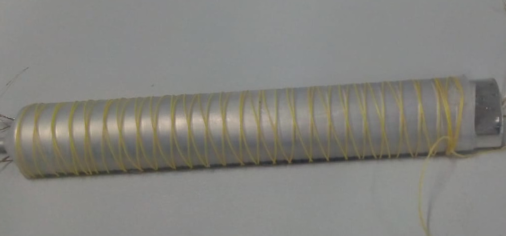

\maketitle
\tableofcontents
\pagebreak

# Introduction

## Manifesto

“Man has to perform an act of incarnation, for he is dis-embodied (désincarné) by his imagination. What comes to us from Satan is our imagination” [@weil_gravity_2002, p.54]. This intuition by French philosopher and political activist Simone Weil captures the core of this thesis and the underlying motives for the production of _Hitodama_ - A soft robot for a mediated incarnation. My guiding principle is, and has always been since I was discharged from my military duty, the use of cutting edge technology for social well-being. Throughout my evolution as a developer, I slowly drifted away from paths of algorithmic rationality and abstract, alienated coding and into questions of meaning and existence. Following my Bachelor's degree in Philosophy of mind and Neurobiology, I have sought ways to transcend my institutionalized role of a programmer and apply the knowledge I have gained to challenge pressing issues of our society, and in particular, my own society in Israel.

Ever since its formation, Israel has been divided between two nations, Jews and Palestinians. Due to the events of the 1967 “six day war”, and until this very day, most of the Palestinians reside under Israeli military occupation. Access restrictions enforced by the Israeli government prohibit the crossing of populations between the nations and inhibit the Palestinians’ mobility. A 700-kilometer-long concrete barrier surrounds the “Green line” that separates Israel from the West Bank – the area that currently holds the largest population of Palestinians within the former mandatory Palestine that lies between the Mediterranean sea and the Jordan river. While the crossing of Israelis to the other side is, at best, frowned upon, and at worst institutionalized and encouraged in the case of settlements; the Palestinians endure stricter restrictions, not only across the West Bank, but also within it. Multiple checkpoints divide different areas of the land and force the Palestinians to face military control on a daily basis. 

Growing up in a middle-class, liberal Israeli family, in Tel-Aviv of the 90s is a self-conflicting experience. The discourse oscillates constantly between hope for peace and prosperity to the despondence of war and carnage. The surrounding scenery changes quickly from a decadent lifestyle of beaches and high tech offices to a life amidst a war zone of missiles and suicide bombings. Throughout these changes, people are constantly immersed in media spectacles of tragedy that provoke our sensation of social unity; a sense that is reinforced by the nation wide military conscription and the omnipresent memory of the holocaust. From an Israeli liberal point of view, the conflict is associated both with guilt and resentment for the injustices toward the Palestinians, but also with necessity and a justification of self-defense against a lethal threat to the body of our nation. As a result of this strange mesh of emotions, one develops a self-contradictory and somewhat post traumatic image of the Palestinians: They represent, on one hand, a source of danger, and on the other, a marginalized and abused population. Their behavior is both condemned and justified, they are both terrorists and freedom fighters; they are to be reconciled with, but could not be fully trusted. 	

A phrase transition in my life occurred in the summer of 2012, when I landed on an opportunity to join a two-week conflict resolution workshop in Germany. The initiative, as started by an Israeli and a Palestinian who formed a relationship through mutual work, grouped young adults from both sides, carrying their hopes and doubts, to sit and talk together in one shared space. The participants in fact lived no more than a hundred kilometers away from each other, and yet, they were so infinitely apart in practical terms that the most reasonable place for them to meet was in a separate continent, 4000 kilometers away. Moreover, the two groups could not even meet during the journey to the Germany, because movement restrictions compelled the Palestinians in our group to take a detour through Jordan, rather than taking the shortest path through Israel’s airport. 

Since the conflict between the nations is very much situated in the land of Israel/Palestine, meeting at a relatively neutral and distant location was also constructive. As noted by Nietzsche [ -@nietzsche_gay_2001, p.134 ] : "Egoism is the perspectival law of feeling according to which what is closest appears large and heavy, while in the distance everything decreases in size and weight". Albeit Germany plays  significant role in the conflict with its great effect on the historical processes that lead to the formation of Israel as the home of the Jewish people, it was, nevertheless, easier for the parties to bridge the gaps without the unnerving presence of soldiers and the affect of this blood-soaked land. 

Up until then, the closest encounter I have had with a Palestinian was an occasional crossing with a nearby “Israeli-Arab”. This controversial term can be accounted for an attempt to sequester the national aspirations of the  Palestinians that ended up under Israeli jurisdiction during the 1948 war for its independence [@peleg_israels_2011, p.26]. To this day, the 1948 war marks both a national holiday for Israelis and a monumental catastrophe, or “al-Nakbah”, for Palestinians, due to hundreds of thousands of them being driven out from their homes and becoming refugees in the neighboring countries. As for 1967 Palestinians that found themselves out of Israel’s borders after its formation – they are currently living under either siege in Gaza or under military occupation in the West Bank. Naturally, my encounter with them has been strictly imaginative or digital – this was about to be my first physical encounter with the _Other_.

I remember the anticipation I felt as we arrived, in pouring rain, to our host institution "Jugendakademie Walberberg", a youth center and hostel in a remote village close to Cologne. The Palestinians were already waiting for us at the rendezvous point, waving their national flags, demonstrating unity. Upon meeting the embodied strangers face to face, I experienced what could be described not only as an emotional turmoil, but also to some extent a spiritual event.  A vertical motion in which transcendental forces and ideas sedimented within a body, only so that they can once more coil up within themselves, and transcend  along their historical contingency to emerge a true found _Logos_ – the  voice and ideas of the strangers in their corporeality. The _Other_ was no longer a fetishized stranger, but a verified existence - Weil’s intuition of incarnation was validated. After this event, I felt grounded, more open to difficult discussions and was able to obtain a sense of pain relief. It was as if the corporeal presence of the Palestinian in front of me had untangled and mended short-circuits that existed in my mind, and from then on, everything felt more natural.

At the end of the workshop in Germany, we were asked to think on how we can utilize what we had gained toward the upcoming future. At that moment, I felt a great sense of duty –  I was to use my software engineering skills to bring about this event that I experienced to a massive scale, to enable conflict resolution for the masses until a critical point of the nonlinear system that is society is reached, and the democratic process is shifted toward peace-making. I did not consider at first that corporeity as such, is a crucial ingredient for this process. I simply aimed toward a free and expressive virtual encounter between conflicted strangers; whether through games, music, chatting or other forms of online communication. Now, however, I would like to contend that the virtual reality is insufficient for a true determination of history, and for a true transformation of the individual. Through the Merleau-Ponty's phenomenology and post-colonial theories of Sarah Ahmed, I would argue that a biomimetic embodiment is necessary for intersubjective dialectics that determine the style of our social existence. The physical flesh of our subjectivity in time and space, and our physical interaction with the other, demarcates our being in this world and form our social identity. This realization led me to pursue the technological solution for an efficient, mobile and expressive re-embodiment, a _techno-flesh_; one that can cross borders, separation barriers and facilitate events of incarnation when a physical encounter is not possible. I found the answer in the form of a soft Robotic re-embodiment, a modern-day incarnation, an Avatar for pain relief. 

In this thesis, I establish a theorem regarding the importance of embodiment in social transformation; I then ask the question of whether a remote re-embodiment, a techno-flesh, could exhibit the same power for social dialectics as a direct encounter, and if not, how can we bring it as close as possible to the actual thing. I will outline my journey for constructing a telepresent soft robot that can serve as a mediator between subjects in conflict, knowing that I will first and foremost test it in the land of Israel and Palestine, but hoping that it can be applicable to any situation of conflict or other situations of social and physical gaps. The implementation is put to preliminary testing and is evaluated for future work. I invite the reader to join me on this journey of transcendent hope and corporeal suffering.

## Thesis goals and method 

The core question of this thesis is that of technological mediation. Despite the famous saying by post-phenomenoligst Don Ihde that "human activity from immemorial time and across the diversity of cultures has always been technologically embedded" [-@ihde_technology_1990, p.20], there is a vast spectrum of experiences that branch out of different technologies and different use cases of mediation. The saying is perhaps true in the broad sense of mediation, since we are always perceiving the world through matter, but it is not only the presence of the medium that matters, but also its style.

In any mediated interaction that is not a direct encounter in a shared physical space, a symmetry break occurs. The two conversing subjects are no longer sharing the same medium of communication as they would be if they were simply standing in front of each other; an experience gap is opened. The conditions of the two interlocutors could be quite similar, for example when two people are having a Skype call through their laptops, but in many other cases the situation can greatly vary, for example when one person is controlling a robot using their phone while the other is physically interacting with that robot. Thusly, if we want to consider the right medium for particular use case, we must look at the experience from three different perspectives: 1) In regards to the _receivers_  communication at any given moment, How do they experience the presence of the _transmitter_ with them in the same space? How much of the other side's corporeality is being perceived through the medium? For our use case, we would like the transmitter be incarnated, such that it could free the receiver of its fetish, prejudices and bias regarding the transmitter's body and identity. This aspect is discussed in the chapter titled **"Phenomenology of Incarnation"**. 2) In regards to _transmitters_ of communication at a given moment, how much do they feel present in the remote location in their flesh? Do they have a sense of agency and ownership of their actions and do they feel freedom to express their core values? For our use case, the transmitter should feel comfortable discussing more intimate and even conflicted subjects as to generate empathy and obtain relief. This aspect is discussed in the chapter **"Phenomenology of re-embodiment"**. 3) In regard to mutual perspective of intercorporeality and multimodal communication, are there sufficient ways of expression for a meaningful encounter? Are there mechanisms of interaction and dialog that allow the interlocutors to bypass the hurdles of the medium and flow freely into conversation? This aspect is discussed in the chapter **Intercorporeality"**. 

Once those aspects are determined, several choices of mediums are stacked up one against the other in a comparison chart, listing their advantages and disadvantages for the task from each of the research perspectives, finally explaining the selection of soft robotic telepresence as the medium of choice. In addition to the phenomenological analysis, more practical aspects such as accessibility and feasibility will be taken into account. With the chosen medium, the soft robotics research for _Hitodama_ is presented, outlining the design choices and the production method for head, face, neck and arms along with phenomenological reflections. Finally, the user test is analyzed and the aesthetic implications are discussed. 

# Phenomenology of Incarnation

## Stranger Fetishism and the Circulation of Emotions

We begin with a further investigation of the conditions that led to the above event of incarnation. As noted, prior to the encounter, I had nothing but an image of a Palestinian; the so called _Other_. An image that was fed by media, by conversations, by my own internal processes, none of which originated directly by a Palestinian, co-inhabiting my own time and space. I have developed a milieu of emotions toward this image that were by definition generalized and prejudiced, since they were oriented toward an abstract entity, a generalized identity. Moreover, these emotions tended to be posited on more extreme ends of the emotional spectrum, either being strongly negative or strongly positive. 

This phenomenon is symptomatic to what is described by Sara Ahmed as “Stranger Fetishism”. In her book _Strange encounters_  she defines it as “a fetishism of figures: it invests the figure of the stranger with a life of its own insofar as it cuts ‘the stranger’ off from the histories of its determination.” [@ahmed_strange_2000, p.5]. The epistemological gap of the stranger in its corporeality leaves an opening for an over-representation; a figure of our imagination that we endow with deep emotional value. Ahmed borrows the term “fetishism”, both from a Marxist perspective of “commodity fetishism” and from a Freudian perspective of a phantasmic substitution.

Let us first examine the Marxist perspective. In _Capital: Vol I_, Marx explains his notion of commodity fetishism [@marx_capital:_2015, p.47]. The fetishism lies in the Bourgeois's inability to discriminate between the commodity item's inherent and physical history - such as labor time, materiality and use, and its abstract value that is determined by the social relations of exchange: "A commodity is therefore a mysterious thing, simply because in it the social character of men’s labour appears to them as an objective character stamped upon the product of that labour" [@marx_capital:_2015, p.47]. When we assign a monetary value to a certain item, we in fact conceal the fact that this value is a result of a social and historical process, and it appears as if the value is an objective property of that item. Ahmed equates this process to the fetishization of the figure of the stranger. So in this case, the 'commodity object' that is tied to a material basis would be a corporeal person of some social identity, while the value that we assign to it is the abstract figure of the stranger. Much in the same way, we are prone to assign our prejudices, that are a product of social exchange, as actual qualities of a person. (TODO: Something about reification)

The Marxist analogy becomes even more interesting when we examine the economical circulation of emotions that are associated with the stranger. In her later book, _Cultural Politics of Emotion_, Ahmed identifies a relation between the circulation of abstract monetary value during commerce and the circulation of affect involving strangers in society [@ahmed_cultural_2014, p.45]. In his discussion about the general formula of capital [@marx_capital:_2015, p.104], Marx explains the importance of the transition from the more simple form of trade: Commodity-Money-Commodity (C-M-C), to the more modern form of Money-Commodity-Money (M-C-M). In the former, more simple form, money is used only as an abstract mediator between two objects that are grounded in their materiality and use-value. For example one would sell their produced crop of corn to obtain money, which would then be used to buy cloths. However, in the latter form of M-C-M, the accumulation of abstract value is the end goal of the transaction, and since the only use of the money is to further accrue it, the process is endless. Thus, value, or circulated capital "suddenly presents itself as an independent substance, endowed with a motion of its own, passing through a life-substance of its own, in which money and commodities are mere forms forms which it assumes and casts off in turn" [@marx_capital:_2015, p.107]. The same effect, Ahmed suggests, occurs when the imaginative figure of the stranger, and its associated emotions are circulated throughout society. Ahmed provides as an example the discourse surrounding asylum seekers in the UK. Leaders of the conservative party have created a frightening image of the asylum seeker, one that is not only "flooding" and "swamping" the nation, but is also disingenuous in their intention; faking the need for asylum in order to be able to reside in the country. This discourse is passed around, from speech to speech, from media report to office conversations, all while breathing life into the imaginative figure and accumulating affect, intensifying the associated negative emotions. The reason for this intensification is exactly that which enables the accumulation of capital; its disassociation with anything physical that can set its bounds. According to Ahmed "The impossibility of reducing hate to a particular body allows hate to circulate in an economic sense, working to differentiate some others from other others,
a differentiation that is never ‘over’, as it awaits others who have not yet
arrived. Such a discourse of ‘waiting for the bogus’ is what justifies the repetition of violence against the bodies of others in the name of protecting the nation" [@ahmed_cultural_2014, p.47]. She notes that her analogy to Marx is limited, since her "argument does not respect the important Marxian distinction between use value and exchange value" [@ahmed_cultural_2014, p. 45]", yet it is imperative to recognize the metaphysical similarity between the two notions of circulation. In both, a lack of access to the worldly _flesh_ of things, whether they are a stranger or a commodity, drives the emergence of an abstract image. The circulation of the image in society only intensifies its perceived reality, and the powers the projection of strong emotions toward that image.Once an individual of the targeted group, let us say a Muslim asylum seeker, is encountered, whether through media or in person, an event occurs which Ahmed refers to as "the ‘sticking’ of signs to bodies" [@ahmed_cultural_2014, p.13]. The accumulated imaginary value that was intensified by circulation _sticks_ to the body of the stranger and appears as if it is an inherent quality of that body.

The discussion on projection and stickiness leads us to the Freudian view of fetishism. Ahmed suggests that the "process of fetishisation involves, not only the displacement of social relations onto an object, but the transformation of fantasies into figures" [@ahmed_strange_2000, p.5], she slightly backtracks in the corresponding footnote [@ahmed_strange_2000, p.182], arguing that the Freudian model is less suitable, since it privileges the phallus (or lack thereof in women), as that which is being concealed and substituted by the fetishized object. It is however important to note that in Freud's account for fetishism, it is described as "habitually present in normal love, especially in those stages of it in which the normal sexual aim seems unattainable or its fulfilment prevented" [@freud_standard_1953, p.154]. Once more is the tendency to ascribe emotional value to an object, as a substitution for a physical state that is non-accessible. We can observe a similar notion at the other end of the emotional spectrum when dealing with the "uncanny". The term was first explored psychologically by Ernst Jentsch [-@jentsch_psychology_1997], defined as an uneasy feeling of "psychical uncertainty" [@jentsch_psychology_1997, p. 5] that arises when something unknown and foreign is encountered in correlation to something old and familiar, for example when we are uncertain if a certain character is a human person or an automaton. Freud expanded on that notion, claiming that the "uncanny is in reality nothing new or alien, but something which is familiar and old-established in the mind and which has become alienated from it only through the process of repression", citing examples of repressed phenomena such as "animism, magic and sorcery, the omnipotence of thoughts, man's attitude to death, involuntary repetition and the castration complex" [@freud_standard_1955, p.241-242]. Nevertheless, there is a resemblance between the uncanny and fetishism. In both cases, a certain inaccessibility to the true nature of an object, a certain gap, serves as an incubator for repressed desires or fears toward that object. The conviction that positive and negative emotions are in many occasions interchangeable is also supported by Ahmed [-@ahmed_cultural_2014, p.50]. She defines hate as a form of intimacy that is in fact predicated by love, citing Gordon W. Allport’s classic account _The Nature of Prejudice_: "a symbiosis and a loving relation always precede hate. There can, in fact, be no hatred until there has been long-continued frustration and disappointment” [@allport_nature_1954, p.215]. This is all the more supported by neuropsychological studies such as one performed by Zeki and Romaya [-@zeki_neural_2008], showing that hate and love share overlapping neuropsychological mechanisms. 

Whether it is fear, love, hate or any other emotion, the impossibility of truly knowing a subject may lead to figure abstraction and ultimately to fetishisation: an emotionally attached relation between us and an imaginative figure. Such a relation, as any highly emotional attachment, is prone to addiction and obsessiveness. Moreover, as we've seen, the figure can gain a life of its own and intensify once it takes part in social circulation. Surly, this effect is not simply triggered on any subject that is only partially known; it requires a starting point, an initial value, a birth of a figure. It could be a reported incident involving an asylum seeker, or a mysterious encounter with an attractive individual. If out relation to the abstract figure would remain in the transcendent realm, it wouldn't have been a major cause for concern, but the relation is naturally cast back into a living subject, resulting in peculiar behavior at best and violence at worst.  It remains to be asked, how does one "truly" know a subject? How do we "unfetishise" the stranger? As Marx's example suggests, there may exist a pivotal role to physicality, to corporeality. Thinking about today's virtual and digital methods of social interaction, how does a typical WhatsApp conversation contribute to social relations? It is well agreed upon (TODO: __REF__), that indications of the users' status such as "typing" or "seen message", create mystery and thus only incubate the fetishized figure, not to mention more enigmatic ways of knowing individuals such as through their social feeds. Yet it seems that even a direct Skype conversation is somewhat lacking (TODO: REF?). The exact cause is elusive, and perhaps only manifests unconsciously, but a virtual encounter always leaves some room for interpretations regarding individuals and our relation to them. Is it body language that we are missing? Some nuance of speech that is not transmitted accurately over the fiber optic cables? Or is it something even more fundamental? To illuminate the significance of the intercorporeal interaction, we turn to the phenomenology of Maurice Merleau-Ponty.

## Flesh and Intercorporeality

How is the physical different from the virtual? How is the real different from the imaginary? These kind of questions quickly evolve into the most fundamental questions of _being_ and Consciousness. Queries that have troubled man-kind in both east and west since the beginning of history. However, we are not simply looking for any perspective on the meaning of life and existence; we are looking for one that bestows special status to the physicality and embodiment of the human connection. One that investigates into the corporeality of the _Other_ as a medium and a foundation of affect and knowledge, that incorporates the _Other_ into _Being_. There is no better place to look than the phenomenology of Maurice Merleau-Ponty. 

Phenomenology is a discipline of philosophy that is firstly attributed to Edmund Husserl, but spans a wide range of thinkers and methods [@smith_phenomenology_2018]. Husserl defines it as a "science of essence", pertaining to the a priori intuitions of consciousness and experience [@husserl_general_1982, p.XXII]. The discipline of phenomenology can be seen as a historical development which stems from the intuitions of the greatest thinkers of western philosophy such as Descartes and Kant; the intuition that if we are to know anything about the world, it has to start with our conscious experience and its intuitive structures. Merleau-Ponty joins this project with his most widely acclaimed work _Phenomenology of Perception_ [@merleau-ponty_phenomenology_2013
]. In this work he reminds us that any pure conscious experience is nevertheless an act of the body, that perception is a bi-directional interaction of our body with the world, inhabiting time and space. This implies that "learning", and even "thinking" are all intentional bodily actions upon the world, and should be investigated as such. According to Merleau-Ponty, insofar as we develop as a body, the range of possibilities is gradually "sedimented" into our physiology, and we become habituated, adjusted to the world that surrounds us. This is not a solipsistic act, since we always co-develop our social identity in concordance with other inhabitants of the world. Despite being written in the 1940s, this approach is relevant today even in regards to modern neuroscience, especially to researchers that inspect the brain as a self-organized non-linear dynamic system that dissipates into the open environment. One of those researches was Walter J. Freeman, a scientist of _Neurodynamics_. In his book _How Brains Make Up their Mind_, Freeman argued that the brain operates as a self-organized complex system of nerve cells, that is arranging its "attractor landscape" in concordance with the outside world. Input from the outside environment triggers this dynamic system into a trajectory of patterns that determines our behavior. Freeman cites Merleau-Ponty numerous times, asserting his intuition of bodily perception and assimilation of the world's structures. [@freeman_how_2000, p.125-127]. An even more radical scientific manifestation of Merleau-Ponty's theories can be found in theories of _Quantum Neurodynamics_, that portray the brain as a dissipative quantum field that melds with the external world. Quantum neuroscience researcher Giuseppe Vitiello refers to the "openness of the brain to the external world" as dissipation [@vitiello_quantum_2007]; Merleau-Ponty uses very similar phrasings in his theories, maintaining his focus on the entire body, rather than just the brain. Such thought is linked to even more modern theories, for example regarding the roles that gut microbes play in shaping our behavior [@dinan_collective_2015]. The intuitive investigations of Merleau-Ponty are proven to be scientifically sound even decades after they were written. (TODO: Write about Enactivism).

In final published works of Merleau-Ponty: _The visible and the Invisible_ [-@merleau-ponty_visible_1968], a work that is incomplete due to his untimely death at the age of 53 and was published posthumously, and _Eye and Mind_ [-@merleau-ponty_primacy_1964, 159], an essay about aesthetics and metaphysics, Merleau-Ponty starts laying down his own ontology - the ontology of _flesh_. He critiques previous ontological interrogations of existence and begins to divulges his own theory, placing a great emphasis on how our relationship with the _Other_ is crucial to our understanding of metaphysics; after-all, it is the basis for our existence as social beings. The underlying question, however, is still one of _knowing_. What exists? What is true? How do we make the logical leap from being immersed in a vivid experience of life, to devising positive facts about our world, ourselves and others? Merleau is critical of "philosophies of reflection", primarily referring to those of Descartes and Kant that could be considered as forms of Idealism. The proverbial _Cogito_ - "I think there for I am", intuitively shifts our attention to the world of _thought_. We cannot directly know and access the world outside of our body, except through the mediator of thought. Through reflection and logical analysis, we deduce whether our experience is that of perceiving the real outside world, or that of imagining. By examining the consistency of change in our inner world, in relation to our actions and our body, we assert the geometrical rules of the world. Our interaction with the world is passive; we consume light that is coming from things, and organize it according to our logical structures. What does that suggest regarding our relation to others? "If then the others are thoughts, as such they are not behind their body which I see — they are, like myself, nowhere; they are, like myself, coextensive with being, and there is no problem of incarnation". Reflection is thus "the simple transposition of the incarnate subject into a transcendental subject and of the reality of the world into an ideality" [@merleau-ponty_visible_1968, p.31]. Hence, intuitively we disregard the others in their physicality: "there is no intermundane space, there is only a signification 'world'" [@merleau-ponty_visible_1968, p.53]. In _Eye and Mind_  Merleau-Ponty argues that painting is the ultimate manifestation of _Being_ in all its depth. A Cartesian view of vision however, is insufficient in its understanding of the world around us: "A Cartesian does not see himself in the mirror; he sees a dummy, an 'outside,' which, he has every reason to believe, other people see in the very same way but which, no more for himself than for others, is not a body in the flesh." [-@merleau-ponty_primacy_1964, 170]. From these writings it is clear that this form of idealism is perilous, because it encourages the reduction of individuals to thoughts, of actions to signs and of bodies to images. Such a view may lead Sarah Ahmed's notion of fetishisation of the _Other_.

Idealism has another fundamental flaw in its logic, and that is its circularity - the fact that the rules of perception and the relation between subject and object, are defined using the same logical constructs that they induce. How could we formulate the relation between ideas and things, when all we have is our pure experience that has no inherent logic of subject and object? What is the primal a priori basis for the notion of space? Who is the circumscribed "I" that thinks therefore it exists? These logical loops sprouted other philosophies of experience, such as _Being and Nothingness_, the title of Jean Paul Sartre's essay on ontology [@sartre_being_2012]. Sartre recognizes that our subjective experience is in fact all there is, this _Being_ that we endure encompasses everything and leaves no room for a subject or object. What then remains to our subjectivity is merely a vessel for _Being_ -  a _Nothing_, a negation of everything. We are solely a "a fissure that deepens in the exact measure that it is filled" [@merleau-ponty_visible_1968, 53]. Sartre states that "man is the being through whom nothingness comes to the world" [@sartre_being_2012, p. 24], referring in fact to our freedom of choice. The ability of the human consciousness to create a distance from the totality of _Being_, to "secrete a nothingness which isolates it" [@sartre_being_2012, p.24] and to act for itself, is Sartre's idea of freedom. Nevertheless, Merleau-Ponty reminds us that our concrete body, our thoughts, our subjectiveness, those are all still parts of a _Being_ that lies at a close distance to the nullified self. Where, then, is the place of the _Other_ in such _Being_? It is clear that if _Being_ is everything, then my body and situation share the same _Being_ as the _Other_'s body and situation, an intermundane space is emerging. But more than a cooperation, the interaction with the _Other_ is a vortex that drains into my nothingness: "The experience of the other's gaze upon me only prolongs my inward conviction of being nothing, of living only as a parasite on the world, of inhabiting a body and situation". [@merleau-ponty_visible_1968, 62]. The _Other_ is there, reaching me, touching me, but I cannot reach its essence, it is transcendent. For me, there is only one nothingness and that is my own, my own freedom. I can only view the _Other_ as a superficial clone of myself. This type of analysis, Merleau-Ponty states, "makes of the other an anonymous, faceless obsession, an other in general" [@merleau-ponty_visible_1968, 72]. As explained by Jack Reynolds [-@reynolds_understanding_2014, 134], Sartre is accused of ignoring "the way in which otherness is always intertwined with subjectivity". This inscrutable gap between the _Other_'s will and the flesh of the world pushes us once again into the chasm of fetishism. In one of the footnotes in _The Visible and the Invisible_ [@merleau-ponty_visible_1968, 81], Merleau-Ponty notes a more general problem in what he names "philosophies of the negative", such as the one posed by Sartre: they tend to refer to to the problem of _the_ other and not _an_ other; "a non-I in general". This generality is exactly the type of abstraction that Sarah Ahmed is problematizing in her work. The connecting thread between _Stranger Fetishism_ and the philosophical critique of Merleau-Ponty is our ability to view the _Other_ as a subjectivity in the flesh, as a body whose consciousness is interconnected to our body, perhaps only then we can truly respect the other's alterity, inspect its nuances and perceive our interactions without prejudice. Merleau-Ponty defines this as _intercorporeality"_.

The final chapter in _The Visible and the Invisible_, titled _The Intertwining-The Chiasm_, is Merleau-Ponty's last and only attempt to devise a positive ontology of the world, the ontology of _flesh_. Albeit the thoughts end abruptly, this chapter and its surrounding notes and essays lay a foundation to a vast array of contemporary philosophy. Ironically, as a prerequisite to the ontology Merleau-Ponty asks us to give away our primal need for absolute logical truth, for a _thesis_. To retreat the Bird's eye view of idealized logic, to live in the moment. Any attempt for logical truth would be sucked into an enveloping _Being_, leaving only a void _Nothingness_ at the core. Instead, he proposes a dialectic that is an endless interrogation, void of significations "We are not asking ourselves if the world exists; we are asking what it is for it to exist" [@merleau-ponty_visible_1968, 96]. It is futile to try and freeze the notion of _Being_, because we are an inseparable part of it. The world that we are trying to resolve is perceived only by us, a body that is part of that world. "The effective, present, ultimate and primary being...offer themselves therefore only to someone who wishes not to have them but to see them, not to hold them as with forceps, or to immobilize them as under the objective of a microscope, but to let them be and to witness their continued being" [-@merleau-ponty_visible_1968, 101].

Our recognition of the world stems from the fact that we are of it, the seer is also visible. Our body perceives under the same rules that the universe operates, all made of the same _flesh_. Of course, we maintain our _invisible_ state, our private experience of colors, sounds and feelings, but that experience is directly attached to the same flesh, and is a direct result of our body's openness to the world. Then, every action we take or idea we conceive is a physical response of our body to the world. The conception of an idea is nothing but "coiling up or redoubling" [-@merleau-ponty_visible_1968, 114] of the bodily experience. It is out body sensing, then modifying itself, learning something new, only to once again open up and interact with the physical world, whether it is by speaking out or any other act. This is a somewhat of a general abstraction to John Dewey's "Learning by Doing" [-@dewey_democracy_1923]: According to the theory of _flesh_, even reading a book would be an active physical movement upon the world in which our eyes touch the pages of the book as we sense reactive force with our entire body: "between my body looked at and my body looking, my body touched and my body touching, there is overlapping or encroachment, so that we must say that the things pass into us as well we into the things" [@merleau-ponty_visible_1968, p.123]. Could an increased exertion of the body lead to an increased capacity of learning? A 2012 study by the Finnish national board of education reviewed the recent research on the subject and concluded that this is indeed the case, noting that "motor and cognitive skills would appear to develop hand in hand, because the same mechanisms of the central nervous system are responsible for controlling both motor and cognitive skills in parallel" [@syvaoja_liikunta_2012]. We are interested, however, not only in the learning and assimilation of simple facts  such as Newton's law of mechanics, but also in the internalization of social meanings such as the image of the stranger or the acquisition of new behavioral patterns in society. 

For Merleau-Ponty, our interaction with another human being is what validates our existence in this world, in the _flesh_. It provides us the recognition that we are visible as much as we are seeing. This recognition is based, according to Merleau-Ponty on a primordial intuition that we all all of the same _flesh_ in the same universe, that our actions are undeniably seen by another as much they are seen by us.  He makes the bold statement that the subjective experience of another is not completely hidden from us, because it is physically manifested in our shared space: "it suffices that I look at a landscape, that I speak of it with someone. Then, through the concordant operation of his body and my own, what I see passes into him, this individual green of the meadow under my eyes invades his vision without quitting my own, I recognize in my green his green" [@merleau-ponty_visible_1968, p.142]. This recognition opens before us the entire universe of intersubjective being, since by transitivity we are all seen and touched by one another: "What is open to us, therefore, with the reversibility of the visible and the tangible, is— if not yet the incorporeal— at least an intercorporeal being, a presumptive domain of the visible and the tangible, which extends further than the things I touch and see at present." [@merleau-ponty_visible_1968, p.143].

This conviction could be interpreted in a weaker or a stronger sense. In the weaker sense, it lays the foundation to social aspects of contemporary cognitive science disciplines such as enactivism and embodied cognition, as well as philosophical concepts as Performativity. Research in those fields asserts that we define and express our social identity through bodily interactions with others - Through acting, reenacting and resonating to the physical actions of others. For example, the phenomenon of _mirror neurons_, although much more complex than the popularized interpretation of its name, is still being researched today and is exemplifying models of how the perception of bodily actions by another resonates within the correlating areas of our own motor cortex [@craighero_role_2014]. Another notable example comes from a phenomenon known as social rhythmic entrainment - It describes how people bond through synchronized movements, whether they are dancing together to the rhythm of music or or even walking at the same pace [@stupacher_synchrony_2017]. In the stronger sense, however, intercorporeality is not only our social, epistemic backbone, but our metaphysical one as well. It is constitutive to our sense of existence and our faculty of perceiving reality. This notion might explain why losing our social meaning may feel like a violation of our own existence. It also deepens role of physicality in our own subject of matter, the encounter with the fetishized stranger. If the bodily interaction with another is so significant that it reaches into the core of our being, it must be necessary for any kind of transformation to occur in our belief systems. In an interview with Dr. Yael Berda, an Israeli sociologist and political activist who focuses her work on the intrinsic social mechanisms of the West Bank occupation, she described her experience of crossing the separation barrier [@litman_haaretz_2018]. According to Dr Berda, in order to relieve ourselves from our instinctive fear of the Palestinians, we must undergo a physical experience of crossing to the other side, because the fear is in the body. This sentiment is affirmed by Sarah Ahmed, who analyzes fear as dynamics of shrinkage and expansion of bodies: "fear works to restrict some bodies through the movement or expansion of others." [@ahmed_cultural_2014, p. 69]. For Ahmed, fear has an element of demarcation, effectively determining which bodies pose a threat and which bodies are under threat. It is then no surprise that Dr Berda, and myself included experienced such a transformation and relief simply through physical movement. The movement in itself was an act of liberation.

Now that we have determined the importance of corporeity for a transformative and meaningful social encounter, we must ask the question of whether an event of incarnation, i.e the physical grounding of an encounter with a body that previously existed only as a fetishized image of the stranger, can be mediated using technology. Such a mediation would clearly cause attenuation - A reduction and an abstraction of the subject's corporeality into a different set of signals. On the flip side, it would allow us to increase the accessibility of encounters, to perform them on larger scales and perhaps even to grant more freedom to the interlocutors as a result of the mediating layer serving as a protective shield. In essence, we wish to try and replicate as much as possible of Merleau-Ponty's concept of _flesh_ when it is mediated by technology. The term _techno-flesh_ was coined by Peter-Paul Verbeek, one of the pioneers of postphenomenology, as part a keynote he presented at Tel Aviv university [@verbeek_techno-flesh:_2016]. Postphenomenology, a discipline originally founded by American philosopher Don Ihde, seeks to explore the relations between humans and technology from a phenomenological perspective. We would turn our focus now to research in this field that may help in our quest for achieving techno-flesh.

## Postphenomenology and techno flesh

In a work by Aud Sissel Hoel and Annamaria Carusi Merleau-Ponty's writings are analyzed in an attempt to extract his views on technology in relation to his ontology of flesh [@rosenberger_postphenomenological_2015, p. 73]. According to Hoel and Carusi, the basis for Merleau-Ponty's view on technology lies within his general critique of what he refers to as an operationalist view on science, as outlined in "Eye and Mind" [@merleau-ponty_primacy_1964]. Merleau-Ponty denotes the mistake in viewing the products of science as a representational reality, external to the things themselves and isolated from the bodily perceptive processes that conceived them. He compares that to painting, which he asserts is a direct manifestation of our intertwined experience of perception. The incorrect view on science is traced back to Descartes "whose theory of vision fails to recognize the internal complicity between vision and world" [@rosenberger_postphenomenological_2015, p.78]. However, Merleau-Ponty does not criticize Descartes' theory of a virtual mathematical space in itself, but only the operational way of thinking about that space as an ontological truth. His solution through flesh, according to Hoel and Carusi, is what differentiates the theory postulated in _Phenomenology of Perception_ and his later writings. In _Phenomenology of Perception_ Merleau-Ponty articulated the role of the body in raw sensory perception, but was unable to account for the creation of conceptual meanings, leaving us with a withstanding dualism of body and thought. With flesh, however, ideas, concepts, perception and matter are all of acting under the same fleshy medium. For this, Hoel and Carusi have "coined the term the “measuring body”
to emphasize the “in-each-otherness” (Ineinander) of the material and ideational aspects of mediation" [@rosenberger_postphenomenological_2015, p. 79]. A measuring body is anything that participates in a system of interaction in the common space of our universe. Since it operates within the same flesh, it exhibits what Merleau-Ponty refers to as a general style of being [@merleau-ponty_visible_1968, p.109] that can be recognized by any and intertwined with any fleshy agency. This includes both perception and ideation, but it is accentuated that in accordance with Jakob von Uexküll’s notion of _Umwelt_ [@von_uexkull_theory_1982], one that was also favored my Merleau-Ponty, each measuring body exists operates and transforms under its own world of meaning while still participating as a part of a bigger whole _interworld_ [@hoel_merleau-ponty_2018, p.16]. The metaphor of _circuit_ is also used to describe the "space of mutual and co-constitutive interactions" [@hoel_merleau-ponty_2018, p.11]. 

How do tools and technologies participate in this fleshy circuit? Hoel and Carusi refer us to Merleau-Ponty's discussion on 'technical objects' in _Eye and Mind_ [@hoel_merleau-ponty_2018, p.20]. While Merleau-Ponty's discussion focuses on the mediating and reflexive properties of paintings, he mentions them to be at the same category of tools and other techniques of the body that "outline and amplify the metaphysical structure of our flesh" [@merleau-ponty_primacy_1964, p.168]. For Merleau-Ponty, a painting is unlike a thing of all things that is observed passively by a viewer. A painting contains the embedded carnality of the painter and is constantly enacting the private experience of its creator in a dialog with the viewer. Nevertheless, we cannot overlook the fact the creator's body is seen as a point of origin, albeit being an ever-changing body schema that is in dialog with its environment, it is still recognized is the agency of the painting. It is there where Sissel and Carusi wish to take it further: "We further develop his idea of the body as a ‘measure’ of things by granting symbolisms and tools the status of ‘measures’ in their own right, that is, as ‘agencies’ with their own relative autonomy" [@hoel_merleau-ponty_2018, p.23]. Technology is seen as a "generative mediator" operating within and producing its own contingent dimensions: "For each modification new dimensions of the world open up, new ranges of possible modes
of measuring and being measured" [@hoel_merleau-ponty_2018, p.21]. Thus, this goes beyond the decentralization of agency and into the decentralization of observation; the tools and technologies we create  manipulate a shared space of perception. Sissel and Carusi recognize this approach resonates with contemporary posthumanist and new materialist approaches such as those of Karen Barad [-@barad_meeting_2007] and Rosi Braidotti [-@braidotti_posthuman_2017]. Such approaches open up the possibility of a mediated flesh, insofar as they recognize the interconnectedness of bodies and thoughts and the capacity for corporeality, and thus also intercorporeality, to be manifested remotely. However, they also risk the flattening of any experience to one variation in flesh, losing the meaning of a difference in form and function. We require a deeper investigation into mediation to determine its nature in social interactions.

Let us take a step back from the expanded conclusion regarding measuring bodies and focus on our scenario of mediated encounters between people. Clearly, not all mediations are one and the same and not all technological tools are utilized in a similar fashion. We are looking for a solution to a re-embodiment of the fetishized stranger; an incarnation that could carry the fleshy nature of the subject's body, along with its own mediating measures, and facilitate a relief from prejudice through communication. It would be worthwhile to return to Merleau-Ponty's analysis of painting in _Eye and Mind_, since this would be his most highly regarded example of mediated corporeality. Merleau-Ponty refers to an epitomizing discussion with French artist Auguste Rodin [@auguste_rodin_rodin_2012, p.34], analyzing the movement of a galloping horse in a painting by Théodore Géricault (see [@fig:derby]).

{#fig:derby}

Merleau-Ponty asks the following question: "When a horse is photographed at that
instant when he is completely off the ground, with his legs almost folded under him—an instant, therefore, when he must be moving—why does he look as if he were leaping in place? Then why do Géricault's horses really run on canvas, in a posture impossible for a real horse at the gallop?" [@merleau-ponty_primacy_1964, p.185]. The answer if provided by Rodin: "It is the artist who is truthful, while the photograph is mendacious; for, in reality, time never stops cold". Even though the horse is painted in a position that is illogical, the movement is well transmitted from the artist's expression into the painting. Not only the movement, but the also the intention of the artist; Merleau-Ponty concludes: "Painting searches not for the outside of movement but for
its secret ciphers, of which there are some still more subtle than those of which Rodin spoke. All flesh, and even that of the world, radiates beyond itself" [@merleau-ponty_primacy_1964, p.186]. It becomes clearer that an accurate mediation of flesh should embody not only the source's movements, but also their inner intentions, their creation and experience of the world. For example, compare a Skype call to a collaborative music jam. The Skype video transmission undeniably incorporates communicative features of the transmitter such as their voice and facial expressions, but it also loses part of the flesh. One difference between a digitally sensed representation and a painting or a musical composition is the passivity of the medium. With a camera, the transmitters are not actively involved in the creation of the resulting image, they are sensed by it, but the image forms on its own. It does not emerge from their flesh. Indeed, from a perspective of new materialism and measuring bodies, the camera sensor is very much intertwined with the source's flesh and should capture all of its qualities, but the difference lies in what Hoel and Carusi ascribe to flesh as "its formative role as productive negativity", alluding to Sartre's notion of secreted nothingness. Productive negativity is the reversible quality of flesh - the power to shift between phases as when one hand is touching the other and we shift between the perception of touching and the perception of being touched. The gestalt effect of our consciousness as a willful phase shift occurs and makes Noboyuki Kayahara's spinning dancer change direction [@parker-pope_truth_2008]. In short, it is the emergence of meaning that is actively created by a subject.

In this moment we are faced with a crossroads - We need to choose one of two strategies. Do we a) Focus on producing better and greater sensors, that are able to not only catch the most intrinsic and subtle fleshy qualities of the subject, but also represent them in an authentic manner, or b) Create more expressive tools that allow the subject to consciously and willfully express their own flesh, as artists do with painting. Granted, option (b) requires more effort from the interlocutors to be in touch with their inner qualities and to learn new and creative forms of expression, while option (a) defers the work to the technology, allowing the users to be more passive in communication. _Mindfulness_ is a form of inner-self connection that could be used to improve self-expression. Numerous researchers have shown that mindfulness could have health and social benefits such as stress reduction [@grossman_mindfulness-based_2004], greater empathy [@walker_exploration_2016] and success in education [@leland_mindfulness_2015]. It is then apparent that opting for (b) could be beneficial for society while option (a) has a risk of doing the opposite. Moreover, in (b) the expressing subjects have a direct and controlled connection to the communication medium, allowing them learn and adapt to it, while in (a) there is an inherent barrier between the productive negativity of the subject and the medium, making adaption harder and more reliant on the technology. With this in mind we can move forward to considerations of the materiality and form for the medium of incarnation.

## Materiality of Flesh
Merleau-Ponty describes flesh as "a certain manner of being" [-@merleau-ponty_visible_1968, p.115], as well as an essence or style of existence in time and space. This does not refer to some objective science of the universe such as the laws of quantum physics and general relativity. Instead, it is the essence of nature as it appears through our bodies; the laws of the universe as they are experienced, only later to be abstracted and induced through the ideation of math and physics, a pronounced physical act on its own right. In the previous chapter we have determined that an optimal medium for the transfer of a corporeality has to be expressive, but what about the materiality of that medium? While a painting may be best for capturing the visual corporeity of a subject, it is clear that Merleau-Ponty's concept of flesh encapsulates other senses as well, and in fact he sees vision and all other senses as a particular type of touching: "We must habituate ourselves to think that every visible is cut out in the tangible, every tactile being in some manner promised to visibility, and that there is encroachment, infringement, not only between the touched and the touching, but also between the tangible and the visible" [-@merleau-ponty_visible_1968, p.134]. Nevertheless, in his description of flesh, and in particular the description of intercorporeality, Merleau-Ponty assigns a special status to tactile sensing. When describing the reversibility of flesh, the power to shift our attention from touching and being touched, and when describing our body's relation to things that exists beyond it. Merleau-Ponty articulates the difference between touching a thing, experiencing it from the standpoint of our body, and touching another, which we pre-reflectively recognize to be another sensing body: "For the first time also, my movements no longer proceed unto the things to be seen, to be touched, or unto my own body occupied in seeing and touching them, but they address themselves to the body in general and for itself (whether it be my own or that of another)...the body no longer couples itself up with the world, it clasps another body, applying [itself to it] carefully with its whole extension, forming tirelessly with its hands the strange statue which in its turn gives everything it receives" [-@merleau-ponty_visible_1968, p.144].

There is a special and immediate reciprocity that is associated with touch and bodily gestures; it is when our actions and intentions toward another are met with a direct response, when are physical presence and its affect on other bodies is most accentuated. Numerous researches have shown great correlation between physical contact and the cognitive development of sociality. It was shown that maternal-newborn contact has a long-term effect over a child's physiological organization and cognition [@feldman_maternal-preterm_2014] and that tactile interactions are constitutive to all of our social bonds [@goodwin_haptic_2017]. However, before going deeper into the intercorporeality of touch, let us consider its materiality. In our context, the term _materiality_ is in accordance with N. Katherine Hayle's definition of “the physical qualities that present themselves to us” [TODO: ref]. We cam regard materiality as phenomenological, rather than a scientific, analysis on the properties of matter. Archaeologist Lambros Malafouris follows the footsteps of phenomenology and new materialism, and with his vocational perspective, introduces a comprehensive framework for a body and matter based cognition dubbed the "Material Engagement Theory" or MET [@malafouris_how_2013]. While Malafouris does not directly address notions such as telepresence and re-embodiment, he does refer to the essential role of material properties in the emergence of meaning when using tools, focusing on activities such as clay making and knapping: "form is not imposed from the
outside; it is, rather, brought forth or revealed from the inside. What we call "form" exists as a surface property rather than a static mental event. It exists where the projective mind meets the material at hand (stone, clay, or metal). More important, "form" is always "informed" by the properties of the material to which it gives shape." [-@malafouris_how_2013, p.177]. This view on tools and technology bodes well with postphenomenology, and indeed Malafouris and Don Ihde have produced a joint publication discussing the role of material cognition in creative processes [@ihde_homo_2018].   

Despite the intuitive interface between MET and postphenomenology, a scant amount of research in those disciplines was dedicated to the understanding of how different material properties in modern technologies affect our cognition and modes of engagement. Perhaps this is due to the fact that the vast majority of our engagement with contemporary technologies of mediation involves gazing on flat display and interacting with them using limited touch gestures. One study by Blazquez Cano et al [-@blazquez_cano_influence_2017] found increased user engagement on a touch display when shopping for fashion, but there have not been extensive inquiries into the dialectics between the human body and our devices for daily use. However, when seeking a technologically mediated experience that is more physical, and involves ample material engagement, it is apparent that the field of robotics could provide an answer. Robots come in different shapes, forms and materials, and our interaction with them has more physical depth. When considering the difference between the Cartesian view on reality and the richer, more corporeal notion of flesh, it is clear that interactive display fall in the former category while robotics have the potential to deliver a flesh experience of mediation. It is left to inquire about the various materialities of robots and their efficacy for a medium of incarnation. 

While in industrial roots, the only consideration for material properties has been the capacity of the material to perform a desired function, three emerging technological fields are placing more emphasis on materiality. Firstly, the field of _wearable electronics_, consisting of functional garments, clothes and accessories that blend textile-based materials with electronic circuits, secondly, the field of _social robots_, that aspires to conduct intimate and harmonious interaction between humans and robots, and thirdly, the field of _bio robotics_ that uses robotic actuators to perform medical operations on the human or animal body. As emphasized by Fortunati [-@fortunati_real_2003] and Katz [-@katz_machines_2017], the underlying thread between these two trends is an attempt to unify the human body with information and communication technologies, or ICTs; to bring them closer and closer until the borderlines between the artificial and the organic vanish completely. As an umbrella term for robotics that use soft materials, the term _soft robotics_ is now widely accepted [TODO: ref]. Elda Danese studies the cultural implications of the appearance of such "soft machines" [TODO: ref]. She notes how the elasticity of wearable electronics allows them to conform and adjust to underlying structures, granting the capability of the machines to adapt to the environment and the human body. She also notes how the use of soft materials in android robots is "altering their metallic and geometric qualities to achieve more empathetic, naturalistic form" [-@danese_fashion_2015, p.130]. Interestingly, soft material technologies are being used not only to produce devices that try to mimic biological mechanisms and appear organic, but they are also producing futuristic forms, that while exhibiting flexible properties, still carry a post-human or non-human form. This is  apparent not only in fashion-tech as noted by Danese [@danese_fashion_2015, p.137], but also in media art, as exemplified by Jonas Jørgensen, who both studies and utilizes soft robotic technology for artistic purposes. He notes that "soft robots are more
often bio-inspired than biomimetic. That is, rather than being copies or technical remediations of biological mechanisms aimed at exact replication they extrapolate these,following their virtual lines of flight" [-@jorgensen_prolegomena_2017, p.5].

Thinking about soft robots through the perspective of flesh, it is evident that soft materials have a better capacity to interact and synchronize with the human body and the environment. They are ontologically closer to the material properties of the human body and are more receptive of its intentionality and expression. Further more, there is another important quality of soft materials that should not be overlooked, especially in the context of flesh, and that is their style of movement. In a paper by Guy Hoffman of the Media Innovation Lab at IDC, Israel [-@hoffman_designing_2014], a convincing argument is outlined as to why we should pay more attention to movement, rather than just form, where designing robots, citing a body of research concerning non verbal acts and gestures in humans. From the point of view of phenomenology, this argument appears natural, as movement of the body is at the core of perception and in some cases even consciousness [TODO: Ref?]. We would dedicate more thought to matters of body language in the chapter about intercorporeality, but let us consider the role of materiality in movement.   

Why is it that some materials seem to move in a style that appears more organic and more lifelike than others? We might think that an organic substance simply has more degrees of freedom, more plausible conformations and states of movement. But yet, some machines have an astoundingly complex inner mechanism with countless degrees of freedom [TODO: ref some clockwork thing?], yet on our view they do not portray the same materiality as organic entities. The answer may present itself when we consider the _linearity_ of movement. If there is one repeating quality in natural processes, it is the self-organization of fractal-like patterns that emerge out of a complex dynamic of inter-connections [TODO: ref, strogatz!]. If there is one quality that defines those patterns, it is their nonlinearity. Organic substances and systems move in a style that is at the same time deterministic and predictable, but also non linear [TODO: examples]. As for animal movement, the neuromuscular system itself exhibits nonlinear properties [TODO: Ref]. In the world of robots, even if an anroid's arm is covered with a soft material, when the android moves its joints, the linearity of the underlying servo motor is apparent. The software could even try to imitate nonlinearity by shifting the speed of the motor between steps, but the underlying discrete and linear materiality would uncover itself from beneath the flesh. That is not the case with soft robots made of silicone rubbers, textiles and other stretchable materials. Those materials have an inherent nonlinear dynamic style of movement. Even the most basic form of soft movement, a pneumatic system controlling the inflation of a party balloon, the movement seems more organic than that of the most expensive android robot. We have determined the importance of soft materials for an engagement with the flesh of a perceiving body, we can now summarize the logos of incarnation.

TODO: Can organic material be not uncanny.

## The Logos of Incarnation
TODO: Positive incarnation VS negative reification / fetishim  - Tulpa?
TODO: Ranciere logos
TODO: Form and fetish for robot
TODO: The logic of incarnation

# Phenomenology of Re-embodiment

## Agency and Ownership
The term _re-embodiment_ is used by postphenomenoligists such as Besmer [@rosenberger_postphenomenological_2015, p. 55] and Dolezal [-@dolezal_remote_2009] to denote a mediated experience in which a subject assumes another body, physical or virtual, in a remote location. A previous term used for similar experiences was _telepresence_, first coined by in 1980 by Marvin Minsky, who applied it to remote object manipulation applications and their teleoperation systems [@campanella_eden_2000]. However, as Dolezal notes, telepresence is normally used to describe a functional scenario in which the remotely manipulated environment is real and does not apply to virtual environments. Insofar as the experiences of virtual reality, avatar gaming and robotic telepresence have a common phenomenological nature of assuming control over another body, they can be grouped together under the term of re-embodiment. How about a Skype conversation? We would be inclined to assume that this is not a form of re-embodiment, since although the users assume a form in a remote location (on somebody else's computer screen), they have no control over that environment and cannot manipulate it; they have no _agency_. But is that true? Imagine I was to shout so loudly during a Skype call that my voice broke a wine glass in a remote location, or that time the creators of South Park had trolled everyone's Alexa devices using remove TV screens [@lockett_last_2017]. A sense of agency could be achieved even with a minimal effect on the remote environment. A more clear example of a Skype call that adds agency would be wheel based telepresence robots such as the ones produced by Beam [@patel_benefits_nodate]. In a virtual reality game, despite the fact that the environment I am manipulating is completely virtual, I still have sense of agency in that environment which contains my remote body.

The nuances of re-embodiment become more apparent when considering not only the notion of agency, but also that of _ownership_. Galagher [@gallagher_philosophical_2000, p.15] distinguishes between agency and ownership such that agency is the "sense that I am one who is causing or generating an action, for example, the sense that I am the one who is causing something to move", while ownership is "sense that I am the one who is undergoing an experience". A lack of ownership could have moral implications on re-embodiment. According to Dolezal "Dissociation from ownership, induced by a lack of presence, has many ethical and epistemological implications and, furthermore, has phenomenological consequences in which the subject feels alienated from the actions he or she is performing" [-@dolezal_remote_2009, p.218]. Dolezal denotes an artwork titles "Legeal Tender" [@paulos_legal_1996] as the "first publicly accessible telerobotic website, where users, after agreeing to take full responsibility for their actions, could destroy or deface two allegedly real 100USD notes." [-@dolezal_remote_2009, p.210]. This action is criminal act in the United States, yet In a study done by Dreyfus it was found that "most participants in the experiment responded that they did not believe that the notes and the experiment were real, and hence did not feel as though they were placing themselves under any risk" [@dreyfus_telepistemology:_2000]. This poses major concerns for more serious telepresence applications such as telesurgery, where a doctor uses a remotely controlled robot to operate on a patient's body. If a doctor does not feel present during the operation, their sense of accountability could be hindered, risking the patient's health [@dolezal_remote_2009, p.211]. An even more terrifying example comes from the world of remotely operated war drones. One study of drone killing in Pakistan between the years 2004 and 2009 found an usual amount of civilians that were killed by drones, citing the emotional and physical distance as one cause: "A 20-something Christian Air Force pilot living with her two children in suburban Las Vegas who views a monitor to locate her targets would seem to be as distant as a one can be from targets in rural, Muslim Pakistan. Television and YouTube video of drone pilots on the job reveal a set-up that looks very much like video game. These factors and others likely contribute to the high death rate among unintended targets" [@oconnell_unlawful_2009, p. 9].

According to Dolezal, the key factor that enables a sense of ownership is _proprioception_: the "kinesthetic and somatic sensations that permeate the body and give information regarding position, posture and movement" [-@dolezal_remote_2009, p.219]. Proprioception constitutes our _body schema_, a pre-reflective subconscious mapping of our body that allows us to act in the environment without explicitly thinking of each step and being aware of every movement. An emblematic highlighting the significance of proprioception is the case of IW, a man who has lost his of proprioceptive feedback due to injury [@gallagher_body_1995]. Despite the loss of this inner sense of the body, IW was not paralyzed and was able to re-learn how to operate in the world, however this learning was in a painstaking process in which IW had to forcefully map his intentions to the changes in his body; he had "lost the experience of body invisibility, which characterizes the normal and healthy experience of movement" [@dolezal_remote_2009, p. 219]. Such an experience naturally entails a sense of detachment and alienation from ones own actions.

Phenomenoligists have shown how in the normal situation when the proprioceptive system intact, tools and technology could also be incorporated directly into our body schema.  Merleau-Ponty's famous example of the blind man's stick defines the stick as "an extension of the bodily synthesis" [@merleau-ponty_phenomenology_2013, p.176] and Don Ihde provides the examples of the eyeglasses - a relation in which "the technology becomes maximally 'transparent.' It is, as it were, taken into my own perceptual-bodily self experience thus: (I-glasses)-world" [@ihde_technology_1990, p.73]. However, as enunciated by postphenomenoligists, the experiences of telerobotics, avatar-based gaming and virtual reality are notably different from closely integrated tools and technologies such as the blind man's stick and eyeglasses. Firstly, it is a matter of feedback - in order for the tools to be integrated into our body schema, there needs to be an immediate and consistent sensory feedback between the actions of our 'original' body and the mediated environment. Dolezal argues that the "coincidence of proprioceptive sensations to visual feedback of motion is the mechanism that induces a sense of ownership of action" [-@dolezal_remote_2009, p. 219], citing research by Martin [-@martin_bodily_1995] and an experiment by Cole, Sacks and Waterman [-@cole_immunity_2000]. In the latter experiment, participants were controlling a robot from the driver's seat in a mixed reality environment at the Johnson Space Center in Texas, experiencing immersive visual feedback to their actions from the robot's camera. At one point the sense of ownership was sufficiently high to make participants worry when a heavy object was about to fall on the robot's leg [@cole_immunity_2000, p.167].

While visual feedback that is concomitant to bodily proprioception is important for a sense of ownership, it may not be enough. Besmer argues the following regarding the transparent withdrawal of the controlling interface in robotic re-embodiment: "this second withdrawal is distantly different from the way in which bodily co-located tools and equipment—such as the blind man’s cane—recede from focal awareness to become integrated into the body schema. There is a decisive difference here, for bodily co-located tools become integrated into the body schema by offering robust tactile feedback and thereby participating in somatic proprioception. This is often not the case
with remote robotic machinery" [@rosenberger_postphenomenological_2015, p.61]. Besmer suggests that the experience of robotic re-embodiment is more similar to IW's case of a lack of proprioception than to the usage of blind man's stick. Besmer argues that the same problem applies for virtual avatars in a simulated game - While the controlling technology may become transparent, especially in immersive environments, without proper haptic feedback that sufficiently transmits the sense of tactile nature of the remote environment, the avatar would always be at an infinite distance from the body.

Let us assume that mixed reality and telerobotics technology would eventually advance to a degree that they could transmit a high resolution experience to all senses of the controller. Dolezal's intuition is that "even the most seamless experience of high-fidelity telepresence will remain qualitatively different from that of engagement with one’s immediate surroundings" [-@dolezal_remote_2009, p.221]. However, delving deeper into the difference between mediums, it is apparent that there is still a fundamental gap between a completely virtual reality experience and a telepresence in a remote environment. If we consider the possibility of techno flesh, there is an incommensurable difference in the dialog between the remote body and the environment. In the case of of a virtual environment, the environment is entirely simulated by software, while in the case of remote presence the environment is of this world. Notwithstanding the fact that the effect of the environment is eventually sensed and transmitted by an apparatus, a sensor that is placed in the world is still more far immersed in the flesh than a simulation. Having said that, there have been arguments, most notably the one by Bostrom [@bostrom_are_2003], that we are likely to already be living in a universe that is simulated, but insofar as scientists are still struggling to grapple with the question in light of infinite micro and macro scale of the universe [@beane_constraints_2014], and insofar as we might not even be capable of dealing with that question because we are subjected to our own cognition of the world, the gap between the universe and our current knowledge of simulation holds firmly. A virtual reality experience takes us one step closer to the dualistic Cartesian-Lockian model of representational knowledge that is separated from our body, and such a model would have a greater risk of reifying our contrived images of one another, turning them into reality.

TODO: Ownership and how it is easy to press the virtual buttons even if it hurts the robot

TODO: Materiality paragraph

## Re-embodied imagery
In Donna Haraway's seminal work _A manifesto for cyborgs, science and technology_ [-@haraway_cyborg_2006], she depicts a utopic techno-feminist vision of cyborgs - machine/organism hybrids that are freed not only of their military-capitalist creators, but also from sociological and biological constraints such as gender, race, sex and a need for reproduction. She wants us to transition from _body imagery_ - An embodied conceptual cage that determines our world view and our political language, into _cyborg imagery_ - A reconstitution of bodies and discourse "on the basis of seizing the tools to mark the world that marked them as other" [-@haraway_cyborg_2006, 33]. Nowadays, one might say that this vision is slowly realizing, with the advent of of social media as the de facto form of communication, virtual realities as a standard space for gatherings and technological modifications for the body becoming more and more prevalent. However, as Haraway noted, the confusion of boundaries with the help of technology calls for a skillful responsibility in their reconstitution: "is it not just that science and technology are possible means of great human satisfaction, as well as a matrix of complex dominations [-@haraway_cyborg_2006, p.39]. Phenomenons such as cyber-bullying, public-shaming and virtual sexual harassment [TODO: ref?] prove that point exactly.  We can now start to think not only about body imagery, but on _re-embodied_ imagery: The effect that re-embodiment has on our world view and dispositions. This effect could be divided into two main categories: a) The effect on our social cognition that is due to the disassociation of agency and ownership. b) The effect of avatar's nature on our image of self and in turn our cognition. 

As the previous chapter suggests, and as most likely any one of us has experienced, a reduced ownership in re-embodiment allows us to not feel as accountable for our actions as in face-to-face communication. This leads to two outcomes, a positive and a negative: a) responsible

TODO: Gender Neutral voice
TODO: My cognitive science presentation. 
TODO: Also about the visual appearance in VR anecdote in Dolezal.

# Intercorporeality

## Multimodality and Social Semiotics
We would not be doing justice to phenomenology if we analyzed the experience of technological mediation between humans merely from the fixed perspectives of each side. While it may be true that every communication act ultimately funnels into the individual, subjective experience of the interlocutors, some aspects of the experience cannot be defined by a simple one-directional relation between the environment and the subject. Instead, it is a dialectical process in which the final experience emerges from the modes of dyadic interaction. In face to face communication, the majority of meanings are created using common language and through bodily gestures. When using a technological medium, however, some modes are of communication are no longer available, some morph into different styles, while other completely new modes of interaction appear. An analytical framework that is useful for investigating various modes of communication and their role in social meaning-making is the framework of _multimodality_, particularly in the light of social semiotics. As defined by Gunther Kress [-@kress_multimodality:_2009], multimodality analyzes the different modes of interaction that are in play, while social semiotics deals with the specific meanings that emerge in specific situations. In-line with phenomenology, Kress suggests that we move away from more virtual definitions of communication such as language and grammar and focus on the materiality of meaning making - the specific modes and affordances of our body and senses: "the focus on on materiality offers the possibility of seeing meaning making as embodied - as in our bodies: a means of getting beyond separations of those other abstractions, mind and body, or affect and cognition" [-@kress_multimodality:_2009, p.83].

However, the robustness of mediated and re-embodied intercorporeal relations and their potential to exist through technology has been doubted by researches such as Dolezal [-@dolezal_remote_2009, p.222], Dreyfus [-@dreyfus_telepistemology:_2000] and Stone [-@stone_will_1991]. Insofar as the experience one feels when communicating with a remote or incarnated medium is that of disassociation and alienation, that feeling becomes two-fold when applied to the most delicate and significant aspects of intercorporeality. Dolezal argues that "Physical contact and proximity between human subjects constitutes an important qualitative aspect of intersubjective relations that may never be obviated by technological mediums" [-@dolezal_remote_2009, p.222]. Dreyfus makes an even stronger argument, declaring "tele-intimacy" as an oxymoron - "because any sense of intimacy must draw on the sense of security and well being each of us presumably experienced as babies in our caretaker’s arms. If so, even the most sophisticated forms of telepresence may well seem remote and abstract if they are not in some way connected with our sense of the warm, embodied nearness of a flesh-and-blood human being" [-@dreyfus_telepistemology:_2000, 16]. Both Dreyfus and Stone [-@stone_will_1991, p.13] refer to fact that a re-embodied body does not withstand physical risk to its composition, and therefore loses depth in the mediated interaction.

There indeed is no denying the potency of an immediate and imminent physical interaction, but we should also try to avoid  romanticism, and without forgetting the Cartesian risk of losing our bodies in virtual flatness, consider the multimodalities of mediated intercorporeality and the affordances of various mediums.

## Verbal Langauge

Elizabeth Keating has studied various groups that are using different forms of telepresence as their daily means of communication [TODO: REF]. She met with engineers who had to cooperate with people living in different locations around the world to achieve a single task, and also with gamers who were actually sitting together in one physical space, but were operating in a separate virtual environment where the avatars only shared an inter-virtual space, as opposed to the intermundane.

One key aspect in communication is that of language its own modalities of verbal content, tone of voice and bodily movement. In a seminal research by Albert Mehrabian in 1971 [TODO: REF], it was stated that in determining the credibility of a particular person during verbal interaction, only 5% of the impression is accounted to the actual content that is uttered by that person; 55 percent is accounted to body language and 38 percent is accounted to the tone of voice. While this paradigm has since been challenged by researches such as Phillip Yaffe [TODO: REF], the important role of bodily signals during verbal communication is unquestionable. As Keating notes, in situations where interlocutors are mediated by a technology "no shared metalanguage exists for them to talk about the role of bodies and how they mean in interaction (the engineers use the short hand descriptor “face-face” to mean the whole body). The movement and contrastive properties of eyes, the flexibility of the face to convey attitudes and emotions, the mobility of the hands to organize talk and manipulate objects, the sense of touch, the seemingly “natural” attitudinal displays of the limbs, and the body’s relation to others’ bodies" [-@keating_challenges_2017 p.305]. However, technology also opens up new modalities and possibilities of communication, some of which may be used to mediate over the gaps that were initially opened in exchange for the increased range and mobility.

In Keating's study of the engineers group, she found that they adapted to the lack of bodily interaction by "shifting to other modalities...they used spoken or written language instead of embodied signals" [-@keating_challenges_2017, p.313]. However, the use of language was not always constructive; when the engineers used language to describe more of their internal and logical state, such as the sentence "Are you ready to start", or "Do you want", more clashes and misunderstandings emerged, but when they used language in a more descriptive matter as in "I've got it open" the conversation flowed more easily. Additionally, when the engineers used language to query for feedback that is normally captured by gestures such as nodding, gaze and facial expressions, as in asking the other engineers by name whether they were following the discussion, they were able to facilitate better [-@keating_challenges_2017, p.315]. In the case of the gamers, similar adaptions were observed by Keating, despite the fact the mediated environment was completely virtual. The gamers adapted to technological challenges by "carrying on a constant narration to others about aspects of embodied behaviors happening on screen that can't be seen by all players" [-@keating_challenges_2017, p.316]. Using a constant flow of action-perception utterances such as "I see it", "I hear it" and "I'm doing it", as well as more specific descriptions of bodily states such as "I'm asleep" or "I'm immobilized". Albeit the situation of the gamers is qualitatively different than that of the engineers, insofar as the gamers were using language to describe their own mediated subjective state in a virtual environment, the shared element between the two scenarios is the use of different modalities through technology to make up for ones that are lost. While we may assume that nothing could beat the directness of the gaze and the touch, it is not to be ruled out that other active, expressive modalities as a substitute.

As the power of language in mediated situations is now stated, we could examine the current modalities of language and voice that are enabled by contemporary technology. In regards to speech, there are three main scenarios in which a synthesized speech could be beneficial in a dyadic conversation where no autonomous artificial intelligence entities are involved: a) As previously mentioned, voice alteration technologies allow us to alter our embodied imagery, such as having a gender-neutral voice or an alternative avatar from a fantasy world, b) Speech synthesis allows a person to be able to speak even in cases when a certain physical impairment hinders their natural voice, or c) Real time translation technology allows us to speak in languages that we never acquired. In cases (b) and (c) where we might opt for maintaining the original characteristics of our voice but augment it with certain capabilities, technology has the capacity to learn and mimic a personalized voice using recording data [@mills_towards_2014]. In case(a) we might opt for a completely new and fresh voice, and in that field companies are now competing on creating the most expressive and natural sounding artificial voice [@xue_comparison_2018]. Most of the contemporary technologies for speech synthesis now use deep neural networks in one way or another, a technology that is growing rapidly, accelerating the development of speech synthesis to unimaginable levels. 

### Emojis
A more recent modality that is associated with language is the use of _Emojis_. Emojis are a set of icons for the use of text based communication, standardized by the unicode consortium [@noauthor_unicode_2019].  They allow us to express certain emotions or situations in text, adapting over the aforementioned gaps in mediated expression. Emojis were found to correlate with human sentiment [@novak_sentiment_2015], are studied by psychologists to analyze human behavior [@kaye_emojis:_2017] and are even suggested to be used in scientific literature to add additional expressiveness to academic texts [@oreilly-shah_is_2018] 😲. The use of emojis is an accessible and open method for expressing elaborate meanings just by using text messaging; the medium could then translate the emoji to other modalities, whether by just displaying it on a screen, or by appropriating sound, movement and other physical elements. 

## Emotional expression
TODO: Darwin

## Body Langauge
An emphatically meaningful, yet highly elusive element of intercorporeality comes from our body language: Meaningful because despite Merleau-Ponty's claim that speech and even ideation are acts of the body, the directness of bodily gestures provide a clear connection between social identity and the flesh that envelopes them, elusive because a large number of these acts are picked up only by our subconscious and because the line between the authentic and the uncanny is sometimes invisibly thin.

Interestingly [as cited in @keating_challenges_2017], blah

One area where body language and its affects on our psychology has been studied extensively is dance choreography, in particularly that of modern dance. Dance appears as an attempt to extract elements of bodily interaction from our daily social lives, and present them in an accentuated, distilled form. Sevdalis and Keller summarize a range of research papers articulating the connections between modern dance movements and our social cognition [-@sevdalis_captured_2011].

TODO: Keating face to face focus on the lower part, and more highlights about body/gaze

ody/gaze.

TODO: From the end of Dolezal
TODO: Recap Meyer / Keating
TODO: Dialogism?
TODO: Laban style
TODO: Hapticl sociality
TODO: Ruth Feldman

# Mediation chart
The following chart blah

+---------------+---------------+-----------------+-------------+-------------+
| Medium        | Incarnation   | Re-embodiment   | Accesbility | Feasibility | 
+===============+===============+=================+=============+=============+
| Bananas       | 2.0           |  4.0            | 2.0         | 5.0         |
|               |               |                 |             |             |
+---------------+---------------+-----------------+-------------+-------------+
| Apples        | 3.0           |  1.0            | 3.0         | 5.0         |
|               |               |                 |             |             |
+---------------+---------------+-----------------+-------------+-------------+
| Oranges       | 3.0           |  1.0            | 3.0         | 5.0         |
|               |               |                 |             |             |
+---------------+---------------+-----------------+-------------+-------------+
| Melons        | 3.0           |  1.0            | 3.0         | 5.0         |
|               |               |                 |             |             |
+---------------+---------------+-----------------+-------------+-------------+
| Plumes        | 3.0           |  1.0            | 3.0         | 5.0         |
|               |               |                 |             |             |
+---------------+---------------+-----------------+-------------+-------------+

# Caveats

## Technological bias

# HITODAMA : Overview

The word "Hitodama" is Japanese for "Human spirit". HITODAMA is a post-humanoid, soft robotic avatar designed to contain a remotely controlling human consciousness and re-embody it in a non-human form while still maintaining some anthropomorphic features. The main use case for HITODAMA is mediation between distant and/or conflicted cultures that normally do not encounter one another, such as the idiosyncratic case of Israel and Palestine.

The design of HITODAMA has undergone several iterations and modifications before reaching its final form (see [@fig:form;@fig:final]). The goal was to create a soft telerobot that can put the outlined philosophical theory to the test, providing an intercorporeal experience and enabling multiple modalities, all while using a modular and flexible software and hardware platform. Working with limited resources, a modular approach ensures that as much knowledge and products could be reused later for future iterations and ensuing research. This chapter outlines the primary inspirations and aesthetic references for the design as well as an analysis of related work, followed by an overview of the main features: its physical properties and logical subsystems.

It is important to note that although HITODAMA's design includes a moving and sensing tail, it was **not implemented** for this Master's thesis due to time and resource limitation. The tail is nevertheless shown here on the design specification in order to visualized the complete form of the conceived prototype.

{#fig:form width=50%}

{#fig:final width=100%}

## Related works

## Aesthetic references

### Shape - Hitodama - 人魂
The Kanji combination of the word hitodama is comprised of 1) 人 - Human and 2) 魂 - Soul or spirit. The term comes from ancient Japanese folk as part of Japan's vast folk culture of supernatural spirits and demons, also dubbed Yōkai (妖怪) [@goodman_ideology_1992, p.83]. The hitodama is the soul of a human as it leaves the body, much like re-embodiment could be seen as an act in which the human soul departs from its body and is then resituated in a new, robotic vessel.

The image of hitodama frequently appears in Japanese culture, ranging from 18th century art in Toriyama Seiken's book of demons: _Konjaku Gazu Zoku Hyakki_ to the Nintendo game series _Yo-kai Watch_ that features fighter cats equipped with supernatural powers and bearing hitodama symbols (see [@fig:hitodama-folk]). The hitodama shape resembles a cloud-like fire and is accompanied by a swirling tail. It is believed that the source for this form could have come from observations of shooting stars or of gas clouds that emerge out of human corpses. The swirling, fluid shape of hitodama spirits suits the curling and nonlinear nature of soft robotics, thus HITODAMA's shape is also inspired by this entity. A free vector icon of Hitodama by TopeconHeroes[-@topeconheroes_fire_2019] was chosen as the logo of the project (see [@fig:hitodama-icon]).
\
\

{#fig:hitodama-folk}

{#fig:hitodama-icon width=40%}

### Face - Kodama (木魅)
The Kodama is another form of Yōkai from old Japanese folk, described as a divine spirit that inhabits trees once they become more than a hundred years old [@papp_anime_2010, p.14]. The spirits may reside inside the tree without being seen, but may also present themselves in particular forms when encountered, such as the form of an old man in Toriyama Seiken's book of Yōkai (see [@fig:seiken-kodama]). In the Japanese classic _Tale of Genji_, the body of the princes Ukifune who attempted to drown herself, magically appears in the forest and is likened to a Kodama by the prelate of Yokawa [@caddeau_tree_2004, p.11]. In modern Japan, old trees that are said to contain Kodamas are revered and must not be cut down. A ceremonial rope known as _shimenawa_ is tied around the tree to mark the presence of the spirit [@bigelow_technologies_2009, p.61]. 

{#fig:seiken-kodama width=100%}

\
\

Kodama was popularized, however, by anime director Hayao Miyazaki. In the feature film _Princess Mononoke_ [-@miyazaki_hayao_princess_1997], the protagonists encounter a group of small forest spirits with glowing white skin and grey eyes. The style diverges from the original depictions, but according to Papp "Miyazaki’s Kodama is a derivative of the yōkai Ninmenju (ே人面樹, Face Sap), which is another form of a tree spirit"  (see [@fig:jinmenju]). The Ninmenju (sometimes referred to as jinmenju) "do not talk but they tend to laugh and when they do, they fall off the tree" [-@papp_anime_2010, p. 14]. 

An interesting characteristic of Kodama is the blend between the human, the natural and the supernatural. Miyazaki's Kodama are abstract nonhuman beings, yet they possess a human-like face, making them more relatable than a completely nonhuman entity. The intertwining of tree, spirit and human is an epitome to the Japanese culture of blending the human life force with nature. In one of the folk tales about Kodama, the tree spirit takes on a human form in order to meet a human it fell in love with [@katsumi_4_1990 p.335, as cited in Wikipedia]. This blend is something to be sought after when designing an avatar. Finding the balance between the posthuman freedom (or the cyborg imagery as Haraway puts it) and Merleau-Ponty's pre-reflective relatedness to another human is the challenge HITODAMA attempts to tackle. Thus, the design of HITODAMA's face is mainly inspired by Miyazaki's kodama.

{#fig:jinmenju}

### Axolotl

The axolotl is a Salamander, native only to the freshwater lakes of Chalco and Xochimilco in Mexico and is considered an endangered species. It lives inside water, not above, and is characterized by short limbs, a somewhat anthropomorphic face and a unique set of fiery red-orange gills on its head (see [@fig:axolotl]). The axolotl is extensively studied by scientists due to its rare and exceptional biology: According to research the axolotl lives "perpetually in the embryonic state, a phenomenon called neoteny. It remains in the larval form even as it becomes a sexually mature adult. For this reason, it consists of embryonic cells that are capable of regenerating a foot, a limb, and even parts of its brain or
spine. It does this without the production of scar tissue" [@tate_axolotl_2010].

{#fig:axolotl width=80%}

The axolotl is also a part of Aztec mythology in stories about the god Xolotl: the canine twin of Quetzalcoatl, the serpent god of wind and air [@tate_axolotl_2010, p.518]. Aptly, the story of the axolotl involves Xolotl's failed attempt to escape death. After it was decided that Xolotl and other gods would have to sacrifice themselves to bestow movement upon the sun, Xolotl tried to escape by transforming himself into different entities: First into types of canes and plants and finally into an axolotl, but all of the attempts failed and Xolotl died. It is unclear what information the Aztec had on the axolotl, but it is likely that they knew about its special regenerative abilities. It is also possible that the Aztec falsely believed the axolotl transforms itself into a tiger salamander because of their similar features, or because they were actually able to artificially induce the transformation as an extreme stress reaction (otherwise it does not happen) [@tate_axolotl_2010, p.514].

Undoubtedly, the axolotl was used as a symbol for the flow of life between different organisms on earth and the earth itself and its motifs such as the gill stalk seem to appear in various arts and crafts as early as the Ayotla phase of the Tlatilco culture of ancient Mexico in 1200BC [@tate_axolotl_2010, p. 524]. Even more so, Tate suggests that the ancient people of the Ayotla phase cleverly identified the connection between the regenerative, eternal larva form of the axolotl and the multipotent nature of the human embryo. Some symbols of the two co-appear in various crafts [-@tate_axolotl_2010, p.528] and it is believed the Olmec people have studied embryonic evolution through observations of human gestation [@tate_knowledge_2008]. Thanks to the theory of evolution, we now know that humans share plenty of genetic traits with other organisms, including amphibians, and that the early embryonic forms and larva embody those similarities insofar as they are visible before later differentiating into species-specific organs.

HITODAMA's body was not initially inspired by the axolotl, and was designed solely according to the aforementioned Japanese cultural tropes of spirits and ghosts. However, once the first prototype came out, people began likening it to the axolotl which motivated further research. Indeed, the properties and cultural heritage of the axolotl were found to be suitable for re-embodiment. The regenerative, almost immortal aspects of the axolotl allude to the eternal and transformative nature of a robotic re-embodiment. Furthermore, the resemblance of the axolotl to the human embryo as well as to Kodama suggests that a key enabler to the creation of a neutral yet anthropomorphic avatar may lie within the earlier stages of evolution, where some human traits are already developed and recognizable, but some are not yet visible. Donna Haraway completes the final piece of the puzzle when she discusses the regenerative aspects of cyborgs: "I would suggest that cyborgs have more to do with regeneration and are suspicious of the reproductive matrix and of most birthing. For salamanders, regeneration after injury, such as the loss of a limb, involves regrowth of structure and restoration of function with the constant possibility of twinning or other odd topographical productions at the site of former injury. The regrown limb can be monstrous, duplicated, potent. We have all been injured, profoundly. We require regeneration, rebirth, and the possibilities for our reconstitution include the utopian dream of the hope for a monstrous world without gender" [@haraway_cyborg_2006, p.38].

TODO: Ishiguro's telenoids are embryos?

## Material principles
HITODAMA is a soft robot made mostly from silicone. Silicone was chosen as the main soft element due to its robustness in movement, durability, nonlinear actuation and organic feel. However, HITODAMA also contains rigid materials such as a plastic backbone and metal screws. The material choices follow a simple governing principle: Any element of the body that **actuates movement** or **participates in tactile interaction** must be made from **soft materials**; movement and touch are the most critical modalities for an experience of intercorporeality. Other elements that act only as **structural support** are **made of plastic** and are connected either mechanically or with metal screws.

For the process of silicone casting, molds were experimented with a variety of materials: including PLA, polyurethane, metal, metal, acrylic and machineable wax. The molding materials are specified in the detail in the corresponding sections for each component.

### Soft silicone
 Two types of silicone are used following a simple principle:

1. _Smooth-On Ecoflex 00-30_ [@smooth-on_ecoflex_2019]: This softer material is used as outer skin that feel natural to touch and flexes easily. It is also used for actuation of facial expressions since they are based on simple surface level balloon-like inflation.
2. _Smooth-On Dragon Skin 30_ [@smooth-on_dragon_2019]: This material is more rigid and offers higher kinetic performance for pneumatic actuation while still maintaining silicone's organic nonlinear style. It is used to create the underlying artificial muscles in HITODAMA's body.

Additionally, the Smooth-On Sil-Poxy silicone glue [@smooth-on_sil-poxy_2019] was used for securing silicone tubes to actuators  
and fixing occasional wounds.

### Plastics
3D printed components were printed with PLA on consumer grade printers from Ultimaker and Lulzbot, while some components were printed with resin on a Formlab printer. Lasercut components used standard Acrylic glass.

## Subsystems

HITODAMA's features can be divided into three separate subsystems: 1) Motor subsystem. 2) Sensor subsystem. 3) Digital I/O subsystem. 

### Motor subsystem
HITODAMA is pneumatic soft robot based on inflation of silicone actuators. Table [@tbl:actuators] provides an overview of the different actuators and their function, accompanied by a visual mapping of the actuators (see [@fig:hitodama-motor]). A more detailed specification of each actuation will be specified in dedicated sections.

+-----------+--------------------------------------+----------------------------+
| Body part | Type of actuator                     | Function                   |
+===========+======================================+============================+
| Neck      | Fiber reinforced : linearly extending  | Head yaw to the right      |
+-----------+--------------------------------------+----------------------------+
| Neck      | Fiber reinforced : linearly extending  | Head yaw to the left       | 
+-----------+--------------------------------------+----------------------------+
| Neck      | Fiber reinforced : linearly extending  | Head pitch upwards         | 
+-----------+--------------------------------------+----------------------------+
| Eyes      | Mounted air chamber X 2 **           | Face inflation above eyes  |
+-----------+--------------------------------------+----------------------------+
| Cheeks    | Mounted air chamber X 2 **           | Face inflation below eyes  |
+-----------+--------------------------------------+----------------------------+
| Mouth     | Mounted air chamber                  | Face inflation in mouth    |
+-----------+--------------------------------------+----------------------------+
| Arms      | Fiber reinforced : bending X 2 **    | Arm bicep bend upwards     |
+-----------+--------------------------------------+----------------------------+
| Tail*     | Fiber reinforced : bending           | Tail curve upwards         |
+-----------+-------------------------------------------------------------------+

: Actuators in HITODAMA's motor subsystem {#tbl:actuators}

\* The tail was not fully implemented and was not incorporated into the final prototype.

\** Two separate chambers are joined by a single air tube.
\

{#fig:hitodama-motor width=30%}

### Sensor subsystem
HITODAMA uses pressure sensing embedded into the silicone body on three different locations (see [@fig:hitodama-sensor]): .

1. Left palm.
2. Right palm. 
3. Tip of the tail*

\* The tail actuator was not fully implemented and was not incorporated into the final prototype.
\

The sensor are able to detect when the body is being squeezed, as well as the amount of pressure exerted.

{#fig:hitodama-sensor width=30%}

### Digital I/O subsystem
HITODAMA employs web based digital i/o components that provide additional interaction functionality (see [@fig:hitodama-io]). They include:

1. Camera: vision input.
2. Touch display*: visual output.
3. Microphone: audio input.
4. Speaker: audio output.

\* The touch functionally of the display was not used in the final prototype.
\

{#fig:hitodama-io width=30%}

# Face and head

## Design

### Appearance

Based on the face of Kodama, HITODAMA's head was designed with the help of Anderson Sudario in Kyushu University, Tomimatsu group (see [@fig:face-maya]).

{#fig:face-maya width=50%}

### Plastic Backbone

Following the general material principle, the head is supported by a plastic backbone (See [@fig:face-backbone]) that houses two types of soft components: 1) Facial skin that stretches along the circumference of the head. 2) Facial expression actuators that are housed inside the expression system. 

{#fig:face-backbone width=70%}

### Modular expression system
For the purpose of researching and testing bio-inspired and organically actuating facial expressions, a novel system is presented. The system consists of a base rigid structure with multiple modular extensions that enclose the soft pneumatic actuators (see [@fig:expression-system]). The enclosures can be freely added, removed and rotated within the upper 180 degree range of the face until the desired expression is achieved. Once inflated, the actuators are restricted by the enclosures such that they expand only toward the face and protrude a part of the skin, creating a facial expression (see [@fig:expression-example]). 

Additionally, an enclosure for a mouth actuator is added into the structure. The enclosure is printed using NinjaFlex flexible filament [@ninjatek_ninjatek_2019] to further refine the movement of the mouth.

{#fig:expression-system width=70%}

{#fig:expression-example width=70%}

## Method

### Face skin
Casting of the skin was performed by 3D printing a PLA mold consisting of both the negative and positive forms of the face, and pouring Ecoflex 00-30 silicone in between the two parts (see [@fig:face-mold]). The parts were then clamped together, allowing excess silicone to escape through the margins (see [@fig:face-mold-clamp]). Upon releasing the cured silicone, the mold had to be broken, possibly due to insufficient use of release agents during casting.

{#fig:face-mold width=70%}

{#fig:face-mold-clamp width=70%}

### Face actuators
Two types of face actuators were developed: 1) Modular actuator: an inflatable shaped that can be freely attached, detached and rotated around the face. 2) Mouth actuator: an actuator that fits distinctively into the mouth area. Molds were printed for both types using PLA (see [fig:face-actuators]). 

The actuators were then attached into the 3d printed head backbone; two actuators above the eyes, two below the eyes and one mouth actuator. The location of the modular actuators was continuously tested and refined to achieve different expressions. 

{#fig:face-actuators width=70%}

## Actuation

The face actuators were connected to the pneumatic system while having the two actuators above the eyes sharing an inlet, as well as the two actuators below the eyes. All together three different inlets were used for face actuation in the final prototype, namely "eyes", "cheeks" and "mouth".

# Neck

## Design

### Movement
The neck is designed to grant four degrees of freedom (pitch and yaw) to HITODAMA's head and was designed with the help of Joaquin Aldunate. The neck also provides structural support for the head, making sure it does not spontaneously tip or tilt over when idle. The movement is carried out by three linearly extending silicone actuators that are positioned in a triangular structure. The actuators are gripped by the rigid backbone support structure, shifting it as they extend (see [@fig:neck-actuators]). When the right actuator extends, the head moves in the bottom-left direction, when the left actuator extends, the head moves in the bottom-right direction and when the bottom actuator extends, the head moves upwards. The combination of these triangular movements is sufficient for obtaining four degrees of freedom.

{#fig:neck-actuators width=70%}

### Plastic backbone
The neck backbone is made out of four triangular grippers that enclose the silicone actuators. The grippers are loosely connected to one another, allowing them to freely move in all directions, dictated by the extension of the actuators, without tipping over completely. The final gripper contains a handle that is attached to HITODAMA's head (see [@fig:neck-to-head]).

{#fig:neck-to-head width=70%}

## Method

### Fiber reinforced actuators
The linearly extending actuators are largely based on the work of Kevin C. Galloway of the Wyss institute in Harvard university [-@galloway_mechanically_2013], but fiber-reinforced actuators have been around since the early 90s, when they were presented by soft robotics pioneer Koichi Suzumori [-@suzumori_development_1991], now head of the Suzumori-Endo lab at the Tokyo institute of technology. The method was later disseminated by Harvard through the open source online toolkit: "Soft Robotics Toolkit" [@soft_robotics_toolkit_fiber-reinforced_2019], contributing a great deal to the popularity and accessibility of soft robotics. Several changes were made in the neck actuators compared the original method by the Wyss institute, mainly: 1) The shape of actuator has changed to a whole cylinder instead of a half-cylinder to increase the structural stability of the neck. 2) The molds were modified for easier release, as well as designed for an injection casting method instead of pouring, for a minimizing the amount of bubbles.

The casting process follows a standard three primary step procedure:

1. Casting a Dragon Skin 30 muscle actuator tube around a metal cylinder. The spiral markings on the mold produce guiding notches for wrapping the fiber on the next step. 
2. Wrapping the cured muscle with expansion restricting kevlar fiber in a double helical form and casting an Ecoflex 00-30 soft skin around the muscle.
3. Removing the metal cylinder, capping the actuator and inserting an air tube reinforced with silicone glue.

A customized mold set was designed and 3d printed for the procedure and a metal cylinder was prepared using a lathe machine. One mold creates a 1mm thick layer of Dragon Skin 30 around the metal cylinder (see [@fig:neck-mold-1]), while the second mold creates a 1mm thick layer of Ecoflex 00-30 around the Dragon Skin 30 tube (see [@fig:neck-mold-2]). The molds were designed with several mechanisms that aid in the release process. First, notches on both ends allow the insertion of a screwdriver to separate the parts. Second, holes for screws at the top enable the use of screws to pull out the top part.

{#fig:neck-mold-1 width=70%}

{#fig:neck-mold-2 width=70%}

For the casting procedure, two more holes were built into the molds, one on each side. The silicone is injected using a syringe, from bottom to top, while the mold is tilted upwards (see [@fig:neck-injection]). This allows the bubbles to escape from the upper hole, leaving the remaining silicone bubble free. For this method it is important to always prepare about two times as much silicone as the mold require, insofar as the excess silicone is used drive the bubbles outside of the mold.

{#fig:neck-injection width=50%}

Once the second step is done and the outer skin silicone cures, the metal cylinder can be removed. As shown on the soft robotics toolkit [@soft_robotics_toolkit_35_2018], the best method is to have One edge of the cylinder held in a clamp while Isopropyl alcohol is injected between the silicone and the cylinder; then the silicone can be smoothly removed from the rod by pulling it away gently. 

The final step is capping both ends of the actuator by placing the silicone tube inside a cup filled with 20g of Dragon Skin 30. The inserted edge is wrapped around in gaffer tape to prevent excess silicone from sticking to the edge of the tube. Once both ends are capped, one end is punctured using a screwdriver or drill-bit, a silicone tube is inserted and glued with Sil-Poxy silicone.

### Backbone
The backbone grippers are 3d printed, fit together and then reinforced using zip-ties (see [@fig:neck-zip-ties]). One zip tie goes through the center of all grippers to reinforce the adhesion of one gripper to another, then each gripping handle is fit with zip-tie to grab a hold of the actuator. 

{#fig:neck-zip-ties width=70%}

The backbone is then attached to head using the built in connection. The neck does not hold by itself, extended forward without being connected to a body structure that pulls the weight back. The body structure is detailed in the final section.

## Actuation
The actuators all have separate inlets and are operated individually (see [@fig:neck-test]). The rate and style of turn is controlled using control parameters to the release and inflation of air; this is detailed further in the section regarding the pneumatic system. A double spiral wrapping on the actuators with no restriction in the axial expansion direction ensures that the actuators only elongate, without changing their tubular form. 

{#fig:neck-test width=70%}

# Arms - Standard method for sensing soft body parts.

## Design

### Towards a standard method
The creation of HITODAMA's arms includes lessons learned from two years of experimenting with soft robotics, and is an attempt to standardize the creation of high performing, durable, cost efficient and environmental friendly soft body parts that are also touch and pressure sensitive. The method was designed with the help of Joaquin Aldunate.

The design builds upon the three step process used for the neck's fiber reinforced linearly extending actuators: 1) Casting of an elastic artificial muscle tube with high performance silicone (Dragon Skin 30), 2) Wrapping the tube with restraining fibers and casting a soft skin around it (Ecoflex 00-30), and 3) Capping the actuator and attaching a silicone tube air inlet. However, the new design offers considerable improvements over the previous line of actuators: Firstly, the molds are now synthesized using subtractive manufacturing with CNC milling rather than 3d printed additive manufacturing. 3d printed molds that are produced layer by layer, however thin the layers may be and whatever coating materials are used, are unable to reach the level of surface smoothness that one may get in subtractive synthesis. A non-smooth mold surface results in a non-smooth product that is difficult to release and vulnerable to injury. Secondly, the skin mold now supports any custom shape, as long as it is not too big to be actuated by the inner muscle. This allows us to design the form of the soft body part independently of the actuating muscle.   Thirdly, the design takes into account the requirement of pressure sensitive sensing built into the actuators and offers a simple method to embed pressure sensors into silicone. Finally, the designs aims for cost efficiency and sustainability by opting for a custom machineable wax material rather than expensive and potentially toxic rigid plastics.

### Movement

HITODAMA's arms act as the main physical control interface between the controller and interlocutor; the signal is sent by squeezing the hands of the arms and can be used on a variety of applications.The soft movement offered by the arms is that of bending, giving the impression that the robot body is opening its arms toward the user or closing them in a way that the control becomes inaccessible (see [@fig:hitodama-arm-bend]). This gives the controllers some power over the interaction, allowing them to decide when the interface can or cannot be touched. 

{#fig:hitodama-arm-bend width=40%}

### Sensing
The sensing is centered on the arm's palm, allowing users to squeeze it to pass a signal (see [@fig:hitodama-arm-press]). Different signals can be passed when both palms are squeezed  simultaneously or individually, and depending on the time pressed. Additionally, the amount of pressure exerted on the palm can be measured, allowing refined control over variable reactions. 

{#fig:hitodama-arm-press width=80%}

## Method

### Machineable wax

The method for producing machineable wax follows the one posted online by the Leeds hackerspace [@leeds_hackerspace_making_nodate]: paraffin wax is mixed with recycled LDPE plastic pellets in a 1:4 ration; four parts of plastic per one part of wax. The parts are mixed together in a consumer grade deep fryer and wax based crayon color is added for appearance (see [@fig:wax-mixing]). 

{#fig:wax-mixing width=80%}

Once the mixture is uniform, it is poured into a metal pan and left to cool and dry for the day (see [@fig:wax-cooling]). It can then be removed from the mold and used to on the CNC milling machine (see [@fig:wax-ready;@fig:wax-molds]).

{#fig:wax-cooling width=80%}

{#fig:wax-ready width=80%}

{#fig:wax-molds width=60%}

While the machineable wax didn't exhibit top-grade surface finish levels like those of expensive polyurethane compounds, it was certainly smoother than 3d printed parts and was very easy to mill. Machineable wax is more environmentally friendly than polyurethane since it is not only produced from recycled plastics, it can also be recycled on its own: Once the molds are no longer of use, the wax can be melted back and cast into the pan for re-use. If the CNC machine is equipped with a vacuum that sucks off the scrap while cutting the part, close to zero-waste manufacturing can be achieved. 

For making the arm, the first set of molds was milled from machineable wax. After a round of testing and fixes, the final molds were milled from polyurethane to ensure the highest quality product.

### Step 1 mold: Artificial muscle actuator
The casting of the muscle actuator is the first step of the casting process. The mold for the muscle (see [@fig:arm-steps]) is composed of the following parts:

1. Main mold for producing the muscle tube (CNC milled).
2. Half-cylindrical metal piece for producing the air chamber (made using lathe).
3. Modular base piece for securing the metal part (CNC milled).
4. Bottom piece space filler (3d printed).
5. Transparent acrylic cover (laser-cut).

{#fig:arm-steps width=100%}

The CNC parts were milled from machineable wax while prototyping, and from polyurethane after achieving the final form. The mold is put together by inserting the metal piece into the bottom piece along with a small 3d printed filler and attaching the bottom piece to the main piece. A filler is required insofar as the same base pieces are used in both in step 1 and 2 , with the second step requiring extra space on the bottom piece for securing the sensor cable. 

Dragon Skin 30 is injected to the molds using a syringe from bottom the top while the mold are clamped in an upright position and fastened with gaffer tape (see [fig:step1-casting]). By virtue of the transparent acrylic cover, it is possible to see any air bubbles forming during the injection process and follow their path as they departure from the top of the mold into the open air. The mold is designed in such way that a small reservoir pool of silicone remains at the top after injection; this pool maintains that if a small amount of silicone leaks out after injection, it is replaced from the reservoir pool and no material is lost in the final form.

{#fig:step1-casting width=100%}

### Step 2 mold: Artificial arm 

Once the first step is cured, the result is released from the mold. Before wrapping the kevlar fiber in a double helical form, a restricting layer should be added on one side to induce a bending motion instead of axial expansion. Usually this is done by gluing non stretchable fabric to the flat side of the half cylinder. Fabric bends very easily but does not stretch axially, causing the actuator to bend instead of elongating when inflated. In our case, however, a six-end flat ribbon cable is used as the restrictive layer. The ribbon cable is glued to flat side of the half-cylinder using Sil-Poxy glue; it conducts the sensing signal from the palm of the hand to the other end, while at the same time restricting the axial expansion of the silicone. The kevlar fiber is then wrapped around the actuator, laying on top of the ribbon cable (see [@fig:wrapped-fiber;fig:step2-casting]).Once the mold is ready and situated, Ecoflex 30 silicone is injected, covering the muscle tube and creating the shape of the arm, while the ends of the ribbon cable are protected by the mold so that the sensor and micro controller could be connected later. Overall the second step mold contains the following parts (see [@fig:arm-steps]):

1. Main mold for producing the arm shaped skin (CNC milled).
2. A sensor box, reserving space for the sensor and protecting one end of the ribbon cable.
3. Modular base piece for securing the muscle tube and for protecting the other end of the ribbon cable(CNC milled).
4. Transparent acrylic cover (laser-cut).

As with the first step, the mold is taped and clamped upright and the silicone is injected from bottom to top as the bubbles are monitored through the acrylic glass (see [@fig:step2-casting]). Likewise with the first step mold, the second step also contains a reservoir pool to protect from small leakages.

{#fig:wrapped-fiber width=70%}

{#fig:step2-casting width=80%}

### Barometric pressure sensor
The sensing approach in the arm follows the research done by Tenzer, Jentoft & Howe [-@tenzer_feel_2014]. In their search for tactile sensors that could easily be embedded in robotic arms, and specifically organs made out of soft polymers, they found that low cost MEMS based barometric pressure sensors have the highest value. Those kind of sensors are cheap, easy to install and provide much better readings than other low-cost solutions such as Flexi-Force sensors that "often provide limited accuracy and significant hysteresis" [-@tenzer_feel_2014, p.89]. Barometic MEMS sensors also work digitally via SPI or I2C and do not require analog to digital conversions and amplifications. The sensor chosen for the arms was BME280 by Bosch Sensortec [@bosch_bme280_2019]. 

Once the product of the second step is cured, the sensor is installed into the gap in the palm that was left due to the designated box protecting the area from silicone. The sensor is then soldered into the ribbon cable while the other end of the cable is soldered into an extension cable that would be connected to a microcontroller. It is important to note that the SPI protocol works over limited distances and may introduce noise when more than one device is connected over more than one meter.

The arm is then capped with Dragon Skin 30 on both ends, having one end dipped into a cup with 20g of silicone and the other end resting flat while Dragon Skin 30 is poured on top of the sensor (see [@fig:arm-capping]).

{#fig:arm-capping width=80%}

## Actuation and sensing
Once attached to the control board and mounted on HITODAMA's body backbone, the arms could be individually actuated with separate inlets for a wide range of arm expressions. However, for the final HITODAMA prototype the arms shared a single inlet since they were always operating in sync. An inflation to the arms causes them bend upwards in what appears to be a curling bicep motion.

The ribbon cable that comes out of the arm connects to the control board and sends a numeric signal for the amount of pressure being exerted on the palm. These figures are later manually processed by the software and function as pressure sensitive buttons.

# Body

## Design
The body backbone of HITODAMA was designed rapidly with the help of Joaquin Aldunate in order to make the tight deadlines required by the prototyping and testing process of this Master's thesis. The backbone is entirely rigid and its sole purpose is to provide structural support for other elements, primarily the head, arms and electronic components (see [@fig:hitodama-body] ). Due to time constraints and a handful of failed attempts, the plan to produce a soft tail as part of HITODAMA's body had to be abandoned, as well as any plan for soft skin that would envelop the rigid body.

{#fig:hitodama-body width=100%}

The main features of the body include:

1. A slit in which the neck is attached and adjusted into the right angle.
2. Two ports holding the arms in place.
3. A window where a 5 inch display is inserted, allocating enough space at the back for a Raspberry Pi and connection cables.

## Method
The body structure is composed both of laser-cut and 3d printed parts. The parts consisting the primary frame are laser-cut, while the connector pieces are 3d printed. Metal screws are used for fastening the connections. The connection to the neck is supported by a plastic arc that can be moved in order to adjust the angle of the neck (see [@fig:hitodama-body]). Once the desired angle is found, the screws are tightened.

The arms are inserted into the ports, allowing the cables to flow through the back and are then secured by the top frame which is also screwed into place. The 5-inch display screws into the designated window. The plastic frame contains enough holes to be able to pass all of the pneumatic and electronic cables through it; therefore it consolidates all of the that go in and out of the robot (see [@fig:body-assembled]).

{#fig:body-assembled  width=100%}

# Pneumatic control board

## Design
The pneumatic control board drives HITODAMA's motor subsystem. As described in [@tbl:actuators], a total of seven inlet/outlet air chambers are individually controlled, driving a total of ten silicone actuators (the arms, eyes and cheeks all have two actuators that are fed by one inlet). For the entirety of the pneumatic system, only one pump motor is used. Using the inlet and outlet valves, the air is routed from the single pump into the desired actuators. A custom modular PCB array was designed for controlling the actuators, consisting of 3 types of boards: 1) Valve / motor board. 2) Intermediate board. 3) Teensy breakout board. The summary of the boards used is described in [@tbl:pcbs].

+---------------------+--------------------------------------------------------+-------------------------+
|PCB type             | Function                                               | Quantity                |
+=====================+========================================================+=========================+
| Valve / Motor       | Control two valves (inlet & outlet) or pumps.          | 8 (7 inlets + 1 pump)   |
+---------------------+--------------------------------------------------------+-------------------------+
| Intermediate        | Bridge between the teensy breakout and 3 valve boards  | 3                       | 
+---------------------+--------------------------------------------------------+-------------------------+
| Controller breakout | Connect the teensy to 3 intermediate boards            | 1                       |    
+---------------------+--------------------------------------------------------+-------------------------+

: PCB boards in the pneumatic control board {#tbl:pcbs}

The main unit that controls an actuator is the valve board, which provisions two main functions: 1) PWM control of two 12V motors / solenoids. 2) Reading air pressure values. Essentially it used to control an inlet valve and an outlet valve for every air chamber that needs to be individually inflated or deflated. Additionally, since the board is able to control any 12v motor, it is also used to control to the single pump that drives the pneumatic system.

The operating principle for using the valve board is described in [@fig:valve-board-diagram] and [@tbl:actuator-states]. As mentioned, two valves are controlled using the board: An inlet valve and an outlet valve. The valves could be open, closed or partially open using low PWM values; this controls the state of the actuator. [@Tbl:actuator-states] lists the different states of the actuator in relation to the state of the valve.

+-----------------+---------------------+-------------------------------------------------------+
|Inlet valve      | Outlet valve        | Actuator state                                        |
+=================+=====================+=======================================================+
| Closed          | Closed              | Idle. Pressure does not drop or rise.                 |
+-----------------+---------------------+-------------------------------------------------------+
| Open            | Closed              | Inflating when pump is open, pressure rises.          | 
+-----------------+---------------------+-------------------------------------------------------+
| Closed          | Open                | Deflating at full speed, pressure drops.              |    
+-----------------+---------------------+-------------------------------------------------------+
| Closed          | Partially open      | Deflating at a slower speed, depending on PWM value.  |    
+-----------------+---------------------+-------------------------------------------------------+
| Partially open  | Closed              | Inflating at a slower speed, depnding on PWM value.*  |
+-----------------+---------------------+-------------------------------------------------------+

: Actuator states in relation to valve states {#tbl:actuator-states}

Each valve is a two way linear solenoid, meaning it has an in-port and out-port and it controls the flow of air between them. The in-port of the inlet valve is connected to the pump in a hub like manner, along with all of the other inlet valves of the system. The out-port of the inlet valve is connected to a 4-way splitter leading to: 1) The actuator itself. 2) The outlet valve, 3) the pressure sensor which is housed back at the valve board. The outlet valve is not connected to anything on its out-port, meaning that the air escapes completely when the valve is open.

\* Was not used in the final prototype.

{#fig:valve-board-diagram width=100%}

{#fig:board-connection-diagram width=100%}

The connection between a valve and its control voltage goes through three boards: 1) The valve board. 2) The intermediate board. 3) The controller breakout board. There are several advantages for this separation of concerns: Firstly, having a modular approach allows us to theoretically add as many actuators as needed without changing most of the design. Currently, every intermediate board can host three valve boards and the main controller board hosts three intermediate board, i.e the controller board supports up to nine valve boards. If in the future we would like to support nine more, only the controller board needs to accommodate to the increased amount; the valve boards naturally remain the same and the intermediates have no logic other than forwarding the valve boards to the main controller. Secondly, having intermediate boards allows to easily distribute the physical space between the valve boards without having an overly sized controller board. Insofar as air tubes are going into each valve board, they require some space around them to accommodate the tubes. In this design, the intermediate connects to the controller breakout board by a ribbon cable, while the valve boards ease into the intermediate board using an edge connector mechanism. 

# HITODAMA - Software Implementation

## Rust engine
## Arduino controller
## WPE Webkit platform

# Production reflections

# User test
## Test application
## Participants
## Results
## Discussion

# Orthogonal Aesthetics

# Discussion

# Conclusion

## 
# Orthogonal Aesthetics

# References

